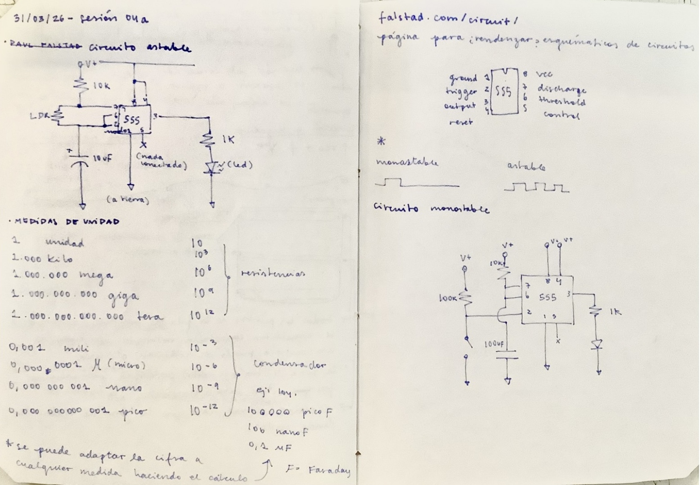
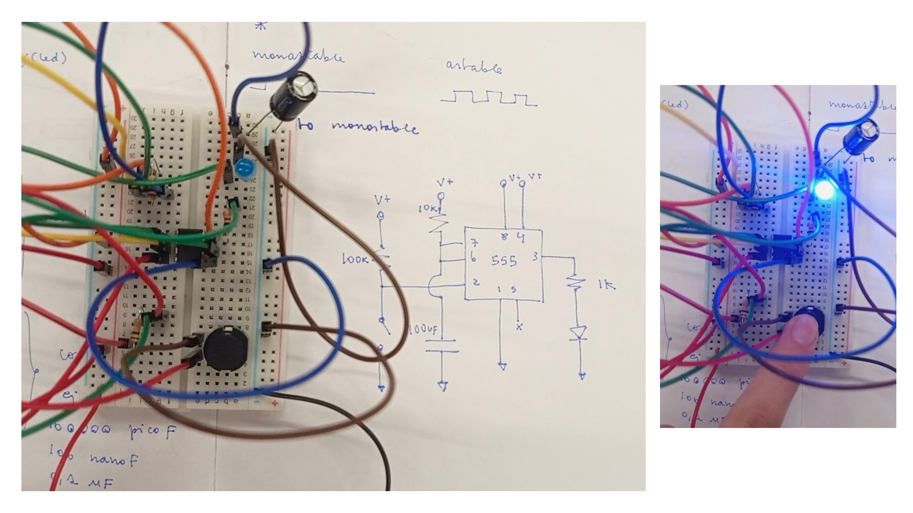
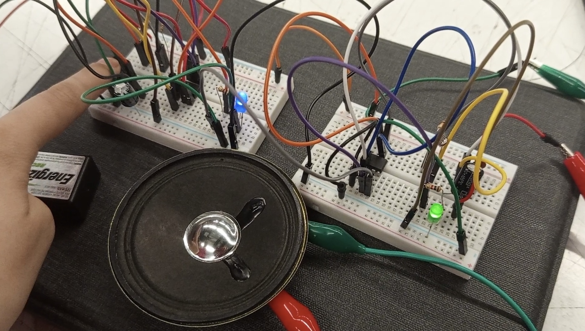
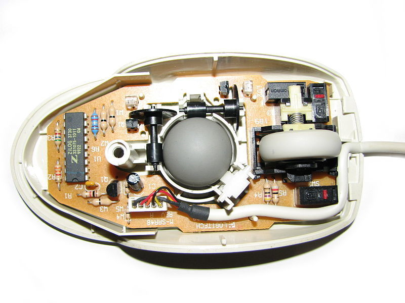

# sesion-04a
_31.03.26_

## apuntes de la clase

### circuito monostable hecho

el primero que hago sin preguntar, se logró!!

### circuito monostable y astable conectados

# encargo

No pude encontrar cosas en mal estado para romper así que pillé una fotos e hice mi interpretación:

veo un mouse antiguo con una esfera al medio, puedo reconocer resistencias y chips, una placa, creo que así suelen llamarla, también un cable que conecta desde lo incomprensible a nuestra mano que hace clicks.

ese chip grande pareciera ser el padre de cualquier operación, mientras las resistencias lo cuidan de que no vaya a trabajar demás hasta hacerse explotar. 

el mecanismo central me llama la atención, haciendo lo posible por girar. mientras que, la placa destaca con filas y columnas, sin nada diagonal. un mundo secreto que trabaja sin cesar. los electrones se convierten en movimientos, gracias a esa pequeña familia que trabaja dentro de un ratón, camuflada pa no verse jamás; una familia humilde, que muy pocos saben que está.
