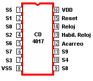

# sesion-05b

## apuntes de la clase:

### secuenciadores:

un secuenciador va activando las salidas una por una, lo que permite generar patrones de luces o sonido.

**para entender mejor llegué a una página que lo explicaba muy en profundidad:**
https://electronicmusic.fandom.com/wiki/Sequencer

"Un dispositivo que genera señales de control que le dicen a un sintetizador qué notas tocar y cuándo tocarlas. El término se utiliza para aplicarse a tres entidades diferentes. En orden de invención:

- **01. en el contexto de sintetizadores modulares**

  un secuenciador genera una serie de controlar voltajes y puerta señales, **generalmente destinadas a hacer que el sintetizador reproduzca una serie repetida de notas.** (En esta aplicación, el voltaje de control se dirige a a oscilador controlado por voltaje para controlar su frecuencia, y la señal de la puerta se enruta a un generador de envolvente controlar el sonido y la dinámica de las notas.) **El secuenciador típico de un sintetizador modular es capaz de realizar 8 o 16 pasos, todas cuyas salidas están vinculadas a un bus de salida común.** Cada paso tiene una perilla que determina el voltaje de control y la duración de la señal de puerta que genera. Un contador determina qué paso tiene el control del bus de salida en un momento dado; el contador avanza mediante una señal de reloj aplicada, que determina el tempo de las notas tocadas. **Este tipo de secuenciador apareció por primera vez en la década de 1960;** eran bestias caras y temperamentales, y poco flexibles. La tecnología ha mejorado, pero el diseño básico sigue siendo el mismo. El uso de este tipo de secuenciador se limita principalmente al uso con sintetizadores modulares.

- **02. secuenciadores con digital**

  **la memoria apareció por primera vez en la década de 1970** (el ejemplo canónico fue el EMS Synti-AKS con su secuenciador controlado por microprocesador integrado en la tapa de la caja), y estos evolucionaron rápidamente para poder almacenar patrones más largos y complejos, así como información de rendimiento adicional. **En la década de 1980, los fabricantes de sintetizadores comenzaron a incluir secuenciadores en algunos de sus diseños de sintetizadores. y equiparlos con MIDI salidas para que un secuenciador pueda controlar fácilmente varios dispositivos.** Ya que se usaban con mucha frecuencia para controlar cajas de ritmos, c**omenzaron a aparecer modelos que incorporaban tanto la caja de ritmos como el secuenciador en un solo dispositivo.** _Hoy en día, los secuenciadores digitales independientes son mucho menos comunes que los secuenciadores integrados en cajas de ritmos o estación de trabajo teclados._

- **03. las interfaces MIDI**

   **comenzaron a aparecer en las computadoras casi tan pronto como se adoptó el estándar inicial en 1983.** En 1985, el Voyetra la empresa presentó el primer software de secuenciación para IBM PC, lanzando una tercera categoría de secuenciadores: los implementados exclusivamente en software que se ejecuta en una computadora personal.**A partir de este punto, los secuenciadores de software evolucionaron mucho más allá del simple recuerdo de patrones.** La primera innovación fue grabar y reproducir MIDI datos como si fuera audio grabado por una máquina de cinta. Pronto aparecieron capacidades gráficas de visualización y edición, utilizando el conocido notación de rollo de piano mostrar paradigma. Pronto, habilidades adicionales como SMPTE sincronizare cu mașini de cinta, grabación en disco duro y mezcla, y capacidad de carga parches y se agregaron configuraciones de parámetros en secuenciadores. **A partir de 2014, este uso del término "secuenciador" se está volviendo obsoleto, ya que se han incorporado en gran medida funciones de secuenciador de software DAW software pacxkages.**

### chip 4017

es un contador de décadas. tiene 10 salidas y las va activando secuencialmente cada vez que recibe un pulso de reloj.

### clock

para que el chip anterior funcione, debe tener un clock, que es una señal que marca el ritmo. se puede lograr con 555 o 4093.

### esquemático de la clase

