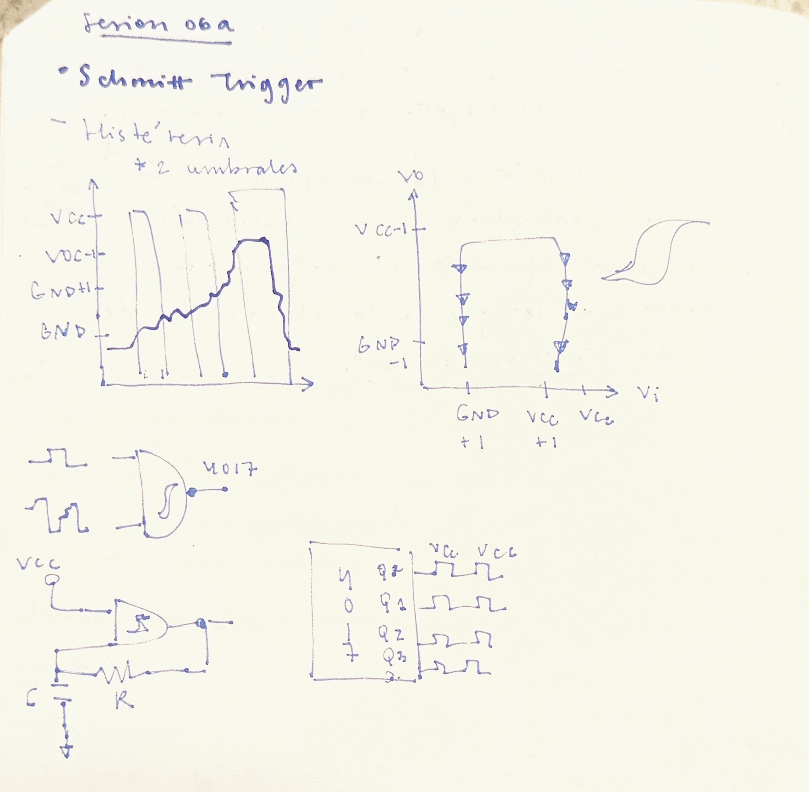

# sesion-06a

_Completé con los apuntes de mis compañeras de grupo: Antonella Aguilar y Yaira Ruiz_

## Apuntes de la clase:

 

El **Schmitt Trigger** limpia las señales con ruido, evita los cambios rápidos e indeseados en la salida y genera transiciones más estabñes entre "alto" y "bajo".

### Histéresis

Significa que el circuito no cambia de estado en un solo punto, sino en dos:

- Umbral Superior (UTP): La salida cambia de bajo a alto solo cuando la señal supera este nivel.
- Umbral Inferior (LTP): La salida cambia de alto a bajo solo cuando la señal baja de este nivel
- Zona intermedia (zona muerta): Entre ambos valores, el circuito mantiene su estado e ignora pequeñas variaciones.

La importancia de la histéresis recae en que en las señales reales siempre hay pequeñas fluctuaciones (ruido). Sin histéresis, la salida podría cambiar muchas veces rápidamente sin control. El Schmitt Trigger evita eso y entrega una señal clara y estable.

_No me quedó muy claro de todo, así que a partir del modo IA de Google, profundicé en la definición:_

"Este comportamiento se utiliza principalmente para estabilizar circuitos y evitar conmutaciones erráticas causadas por el ruido eléctrico. Sin histéresis, una señal con ruido que oscile cerca de un umbral único haría que la salida cambie de estado constantemente ("rebote")"

  _Fuentes: https://www.tme.eu/es/news/library-articles/page/73512/histeresis-en-electronica-e-ingenieria-electrica/ y https://www.youtube.com/watch?v=VmCCc9AHJAY&t=4s_

## Avance proyecto-01

Nos dividimos el trabajo en tres partes:

1. Clock: hecho por mí
2. Secuenciador: Antonella
3. Sintetizador: Yaira

Cada una hizo su parte y luego intentamos unirlo, pero nos dimos cuenta que nos faltaba espacio, por lo que decidimos comprar dos protoboards para trabajar más cómodas.

Dentro del avance del proyecto, se nos presentó un error entre los chips 555 y 4017 que no sabíamos reconocer qué era lo que estaba pasando, y se debía a que las patitas del potenciómetro con el 555 no estaban bien conectadas. Esta confusión pasó porque este componente estaba puesto al revés, a diferencia de cómo lo solemos hacer (mirando hacia uno mismo), haciendo que fuera más confuso. Aaron nos recomendó seguir el orden del esquématico también en físico, y recuerdo que una vez una compañera también me lo comentó cuando se me presentó un error, así que lección aprendida!! (finalmente).

El segundo error que tuvimos fue que en Step 2, el led no encendía. Cambiamos la resistencia, el cable y el led, y seguía así, así que la solución final fue cambiar el chip y con eso logró funcionar.

   
