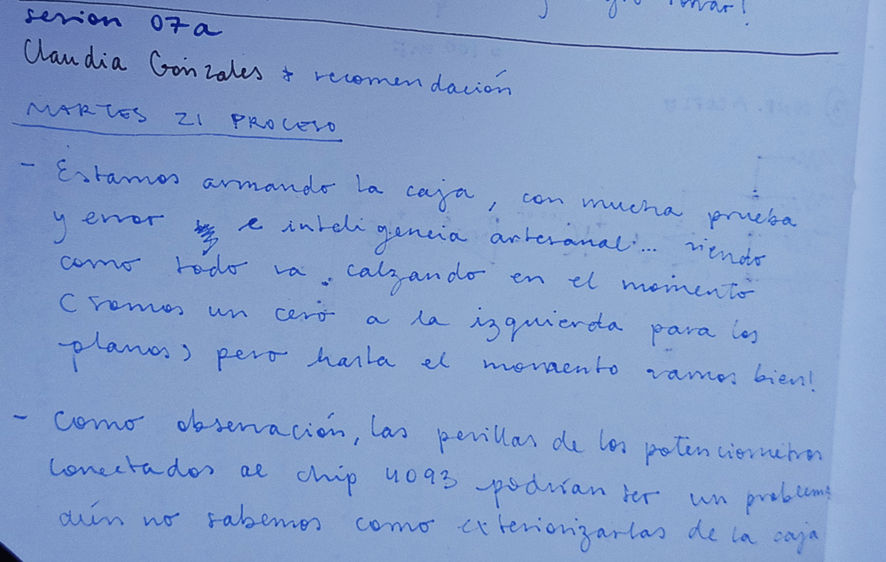
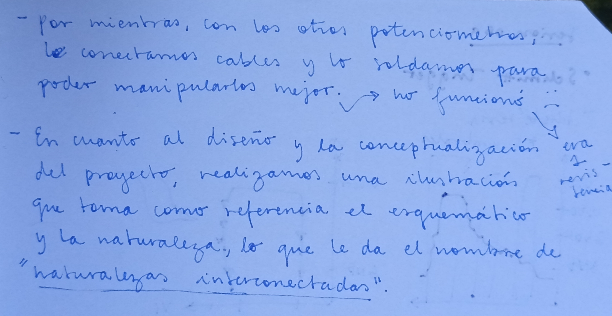
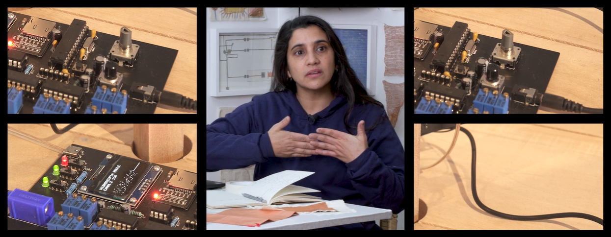
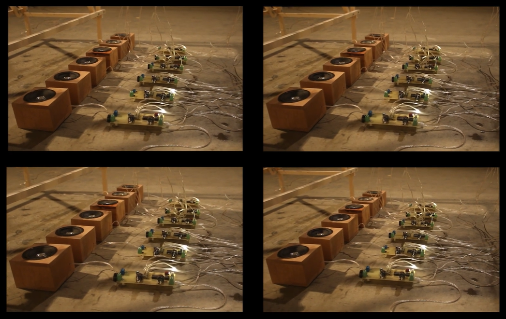
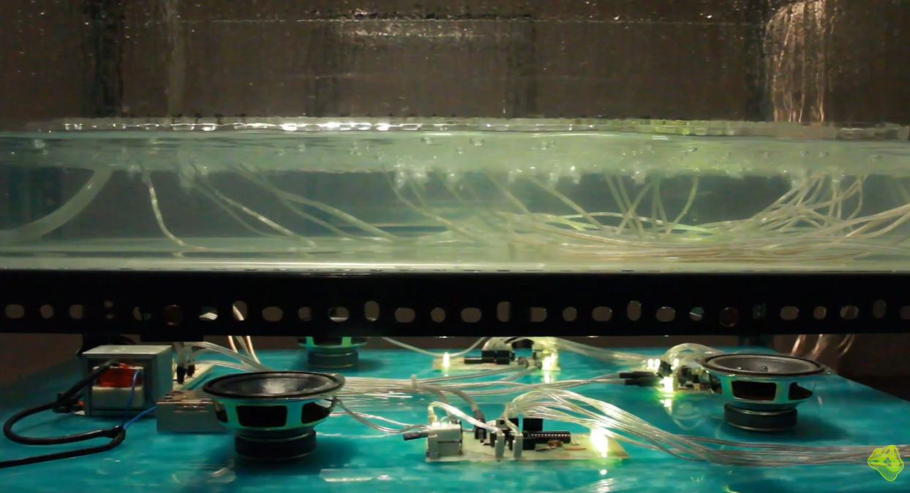
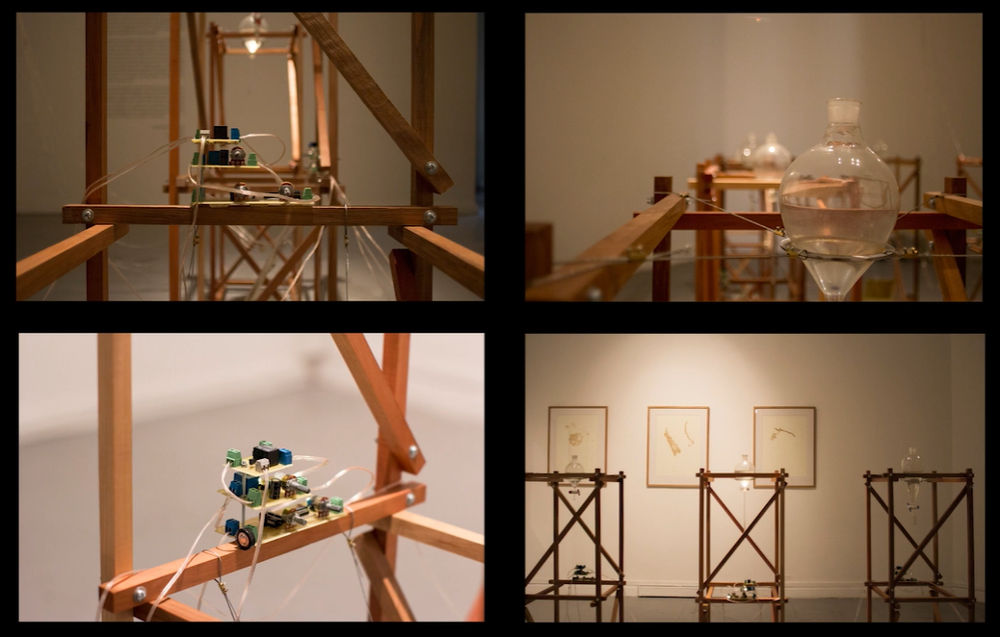

# sesion-07a

## ✶ apuntes de la clase

## ✶ post - clase

Tenía ganas de revisar una serie-documental de arte medial que al verla me gustó mucho y que iba recordenado pedacitos de ella al ir avanzando clase a clase. Me llegaba el recuerdo, ya que reconocí que lo que estábamos haciendo en cuanto al sintetizador, tenía relación con una de las obras que ví, pero no podía terminar de visualizar qué era, así que la quise ver otra vez. Me topé con que el primer capítulo era sobre Claudia González, a quien nos recomendaron investigar, y tenía todo el sentido del mundo al ver que era la obra de ella la que recordaba.

Me llama mucho la atención su sensibilidad para exponer de manera conceptual temas complejos, como lo es la crisis hídrica. Tiene una trilogía de obras, donde la caída del agua se conecta a un sintetizador. Cuando caen las gotas, se van produciendo melodías. Es una forma interesante de cambiar de forma a algo que a simple vista no se ve, o mejor dicho, no se siente (la pérdida de distintos cuerpos de agua), y que se logra a través del sonido. 

Recomiendo mucho la serie completa, la primera temporada está llena de referentes mujeres y chilenas. Se puede encontrar acá: _https://www.mediales.art_ y aquí el capítulo sobre Claudia González: _https://www.youtube.com/watch?v=nxo48alDvwc&t=14s_
