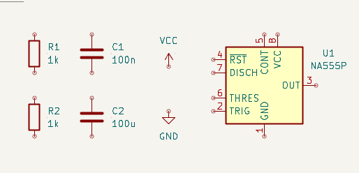
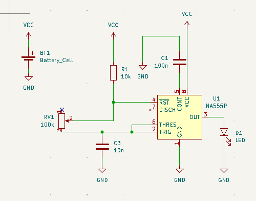
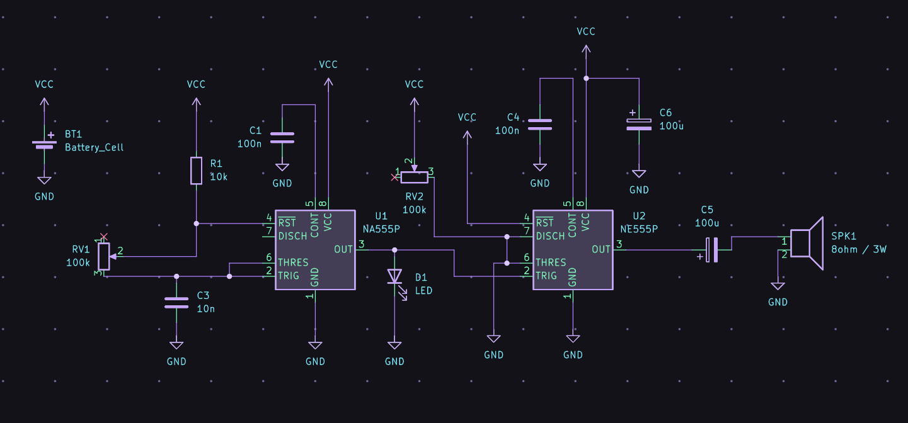

# sesion-08a

28.04.26

## KiCad:

1. Dibujar esquemático (.kicad_sch)
2. Asociar huellas a símbolos. Huellas: patitas componentes.
3. Abrir PCB new (para crear la PCB), intérprete del esquemático
4. Definir tamaño de las pistas
5. Repartir componentes físicamente
6. Rutear componentes
7. Ornamentar y exportar fabricación
- Quizás tengo que crear/descargar mis propias huellas y símbolos

**Comandos y más:**

- A: color componentes
- V: colocar valor a componentes
- M: mover ; para soltar, un click.
- X: dar vuelta textos
- R: rotar componentes
- E: abrir panel propiedades componente
- Para buscar componentes:
    - R: resistencias
    - C: condensador
    - LED
    - P_Potenciometer: potenciometro
    - Battery_Cell: batería

**Huellas**

- Doble click: huella > librería > buscar
- Asignar huellas: copiar y pegar en los mismos componentes.
1. Capacitor_THT:C_Disc_D3.8mm_W2.6mm_P2.50mm
2. Resistor_THT:R_Axial_DIN0207_L6.3mm_D2.5mm_P10.16mm_Horizontal

recordatorio:

- n: medida común condensador no polarizado
- u: medida común condesador polarizado
- separaciones entre pines: pitch

- Poner cables: agarrar desde el circulito rojo, seleccionar, soltar y hacer la conexión al otro círculo rojo.
- El punto de conexión se hace solo.

_Las imágenes también son pensamientos y modos de pensar._ gracias kidcad por darle forma a las ideas de manera más linda.

NOTA: Tengo que actualizar el esquemático porque no puse bien el orden y quedó algo enredado.

_probando el visualizador web que recomendaron, muy lindos los colores_
