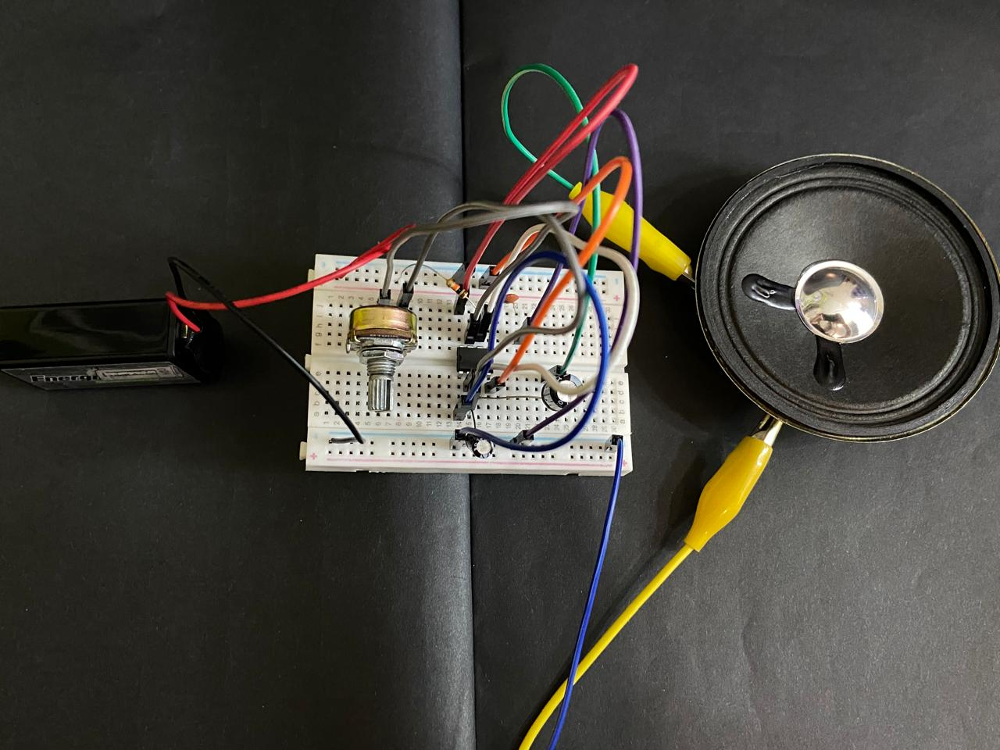
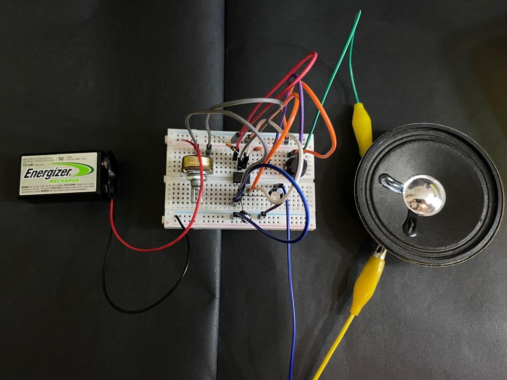
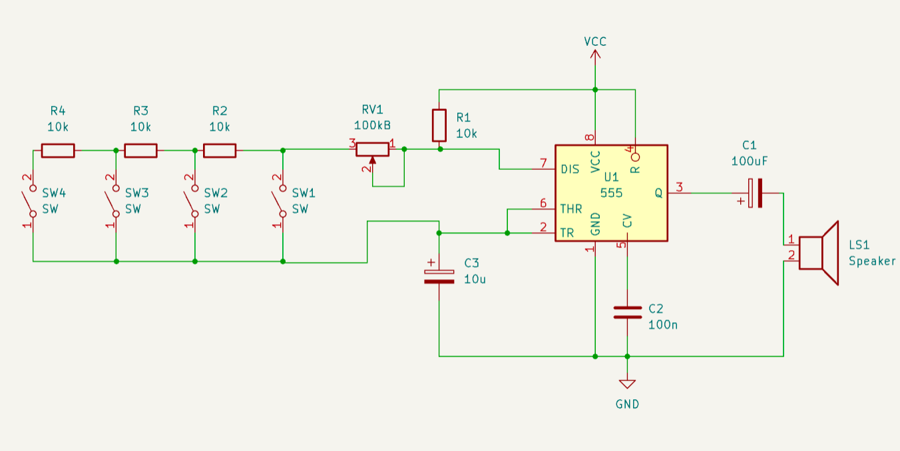
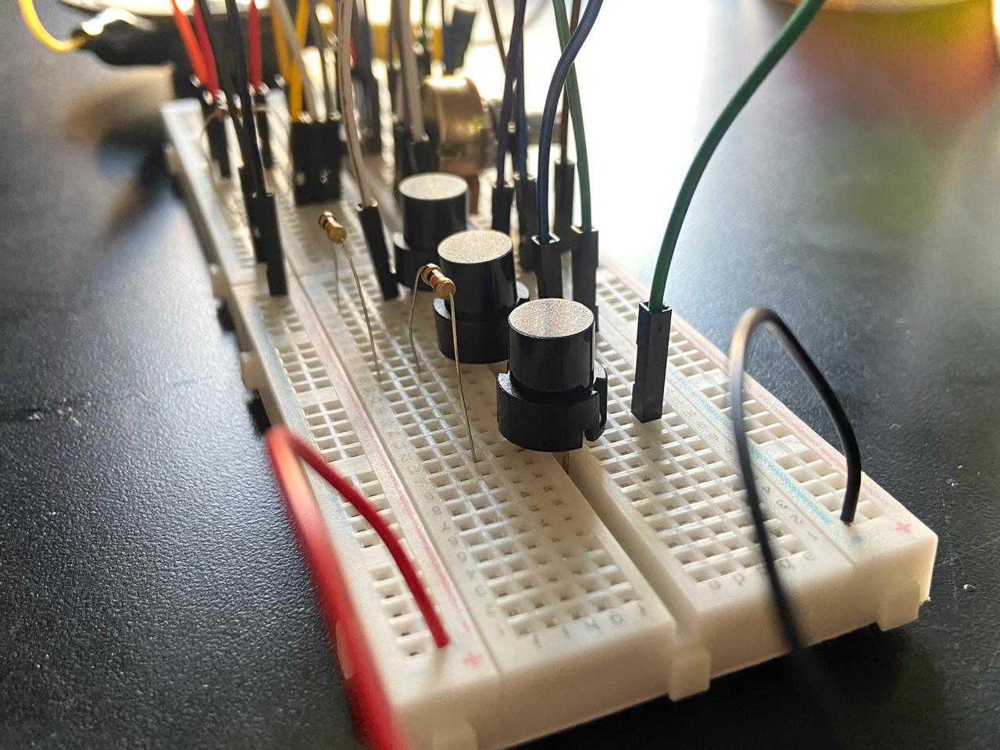

# sesion-03a

La clase comenzó armando el circuito utilizado en la clase anterior con potenciometro, pero esta vez reemplazamos el diodo por el speaker (LS1).
Y el r3 es cambiado por un capacitor de 100 uf.
Para esto usamos nuevos componentes: caimanes, utilizados para conectar el lado positivo con el lado negativo del parlante.
Este fue nuestro primer circuito con sonido, honestamente estaba muy ansiosa por llegar a esta parte:)

Luego al circuito agregamos un nuevo componente: interruptor de tipo pulsador.
Este a diferencia de los fijos que se mantienen encendidos incluso después de soltar, si presionas el interruptor el sonido aparece y se mantiene pero se apaga en el momento en el que se deja de presionar. 

---

## Encargo:
Para esto hicimos grupo de 3 y utilizamos los 3 interruptores que nos dieron.

### Observaciones:

Aquí los interruptores (SW1, SW2, SW3) están conectados en serie con las resistencias (R2, R3).

El SW3 pareciera sonar con una menor frecuencia que SW1, y SW2 es el intermedio entre ambos.
Por lo tanto también se escucha SW3 con un tono más grave que SW2 Y SW1, me imagino que por la cantidad de resistencias que colocamos en serie entre los interruptores (hay más resistencia llegando al sw3 y menos en el sw1).

El potenciometro tambien cambia la tonalidad del sonido para todos.

Cabe mencionar que al momento de presionar dos o tres interruptores solo se escucha el sonido del último interruptor que se presionó, o es lo que al menos nosotras percibimos:)

---

## Análisis: Documental "Variaciones Espectrales"
Este documental se inspira en el trabajo y vida de José Vicente Asuar, ingeniero, músico chileno y creador del COMDASUAR (Computador Musical Digital Analógico, primer computador chileno para realizar música) que enfocó su carrera en la música electroacústica. 

Todo parte explicando cómo se ha hecho la música normalmente: a través de instrumentos de cuerda, percusión o viento, que son los clásicos que se enseñan en la academia. Mientras en otras partes del mundo ya se hacía música electrónica, en Chile estaba ocurriendo lo mismo, aunque no se veía tanto. Hoy esto se ha podido visibilizar más gracias a la escena electroacústica y a los festivales, que han llevado el trabajo que se hacía en Chile a un público más amplio.

La mirada de Asuar es una que aprecia los sonidos de la naturaleza. Esto lo llevó a entender cómo conceptualizarlos, abstraerlos y traducirlos a su propio lenguaje musical. Al igual que en otros documentales que hemos visto, se nota que la música electrónica se ha dado solo en contextos específicos, como el arte y las vanguardias. Es ahí donde se puede experimentar, porque en la academia ya existen estructuras definidas que limitan bastante ese espacio.
Todo esto se desarrollaba en un contexto íntimo y abstracto que resultaba difícil de comprender para un público masivo sin una indagación previa sobre la base del sonido.

La visión de Asuar tanto como de músico y como ingeniero lo ayudó explorar y trabajar en el resultado de su propio trabajo electrónico, Asuar creaba la música y también creó el medio para trabajar en esta. Sin saberlo, trabajó con sistemas que anticiparon estándares actuales, como la norma MIDI, integró procesos que hoy en día son herramientas cotidianas para cualquier músico.

Finalmente, el documental relata cómo Asuar continuó su labor de forma personal y casi privada, utilizando sintetizadores y computadores comerciales. Este repliegue hacia la intimidad se debió, en parte, a un contexto nacional donde el interés por su trabajo no creció al ritmo de la tecnología. Irónicamente, a medida que el avance tecnológico se aceleraba, la figura de Asuar quedaba relegada, evidenciando una falta de valoración institucional frente a un hombre que iba décadas adelante de su entorno.

### Referencia:

dereojoCL. (2016, diciembre 22). Variaciones espectrales [Video]. YouTube. https://www.youtube.com/watch?v=sJ9EZWBZee8
