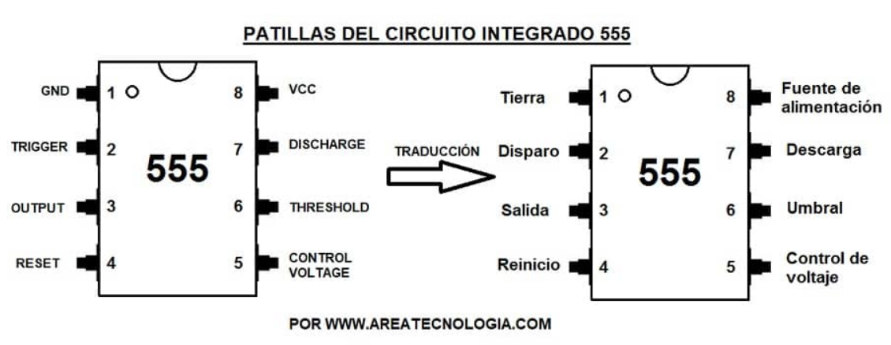
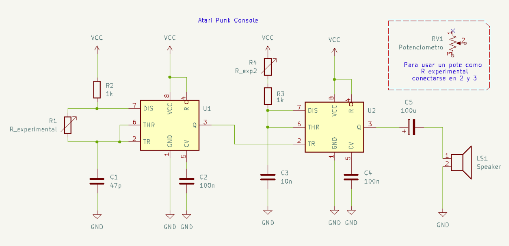
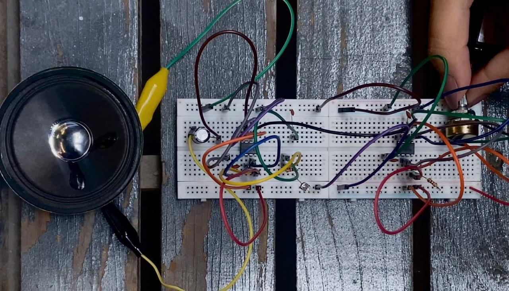

# sesion-03b

## Apuntes clase 27 de marzo, 2026.

El 555, que ya hemos visto y usado, es un temporizador (timer) que puede funcionar como un "reloj" para otros circuitos o como un interruptor automático. Se le llama "555" porque internamente tiene tres resistencias en serie de 5k-Ohmios que sirven para establecer los voltajes de referencia.
Cada una de sus patillas tiene una función.

Sus dos estados principales
1. Modo Monoestable (Un solo estado estable)
En este modo, el 555 funciona como un temporizador de un solo disparo.

El circuito está en reposo ("apagado"). Cuando recibe un pulso de disparo, la salida se activa ("encendido") durante un tiempo determinado y luego vuelve a apagarse por sí solo.

2. Modo Astable (Sin estado estable)
Aquí el 555 se convierte en un oscilador.

No se queda quieto en ningún estado. Cambia constantemente de encendido a apagado, creando una "onda cuadrada". La velocidad del parpadeo depende de las resistencias y condensadores que le conectes.

---

En esta clase realizamos nuestra primera Atari Punk Console!!

La Atari Punk Console (o APC) es uno de los circuitos más famosos, genera un sonido similar a los de las máquinas de arcade de los años 80.

Aquí podemos ver una dualidad entre los estados vistos anteriormente:

+ El primer 555 se encuentra en Modo Astable: Funciona como un oscilador que crea un ritmo constante. Controla la frecuencia (qué tan rápido se repite el sonido).

+ El segundo 555 está en Modo Monoestable: Este recibe la señal del primero y la "estira" o la "acorta". Controla el ancho del pulso (el timbre o tono del sonido).

Para poder tener suficiente espacio y no enredarse entre tantos cables hicimos pareja (Isidora Álvarez y yo). Unimos nuestras protoboards y en cada una de las proto dejamos cada chip con su respectiva conexión. Primero probamos con mi chip conectando el parlante a ver si es que funcionaba antes de generar la otra conexión completa y sí lo hacía.

Al momento de unir ambos, nos percatamos de que hacía ruido, pero era nada a comparación de los sonidos que emitían todos los otros circuitos. Entonces nos pusimos a revisar cable por cable, componente por componente. No dimos a nada hasta que comenzamos a comparar con otra pareja: su circuito era el más ruidoso (a eso queríamos llegar), aún así no llegamos al mismo resultado a pesar de que todas las conexiones eran visiblemente correctas (ERROR DE NOSOTRAS). Nos fijamos solo en lo que veíamos que podía estar mal, muy superficialmente. Aaron anteriormente me dijo que desconfiaramos hasta del chip y adivinen... Sí era el chip.
Al momento de conectar otro chip 555, finalmente emitió el ruido que estabamos esperando a que apareciera. Para nada afinado, muy agresivo, y Con el potenciómetro ibamos regulando y haciendo cambios en el sonido.

Es probablemente lo más ruidoso que hemos hecho hasta el momento (me encanta).
