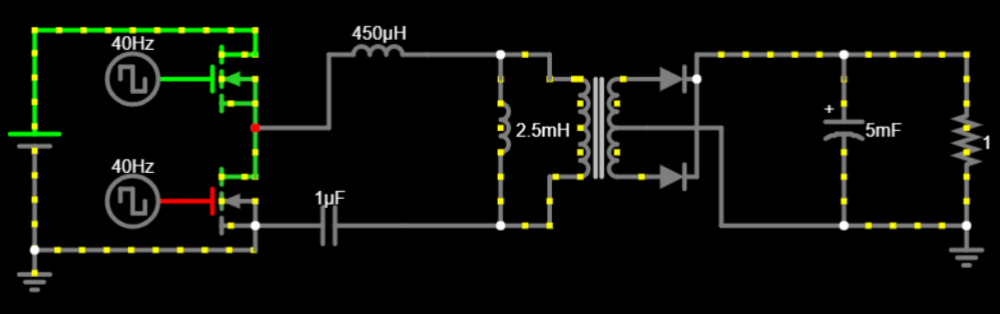
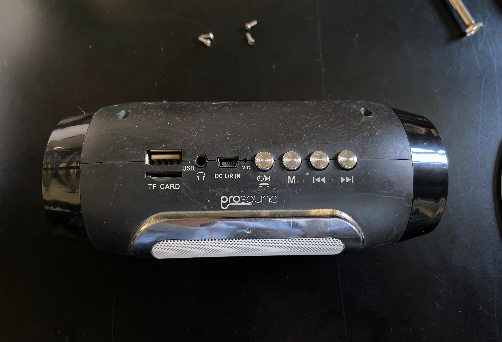
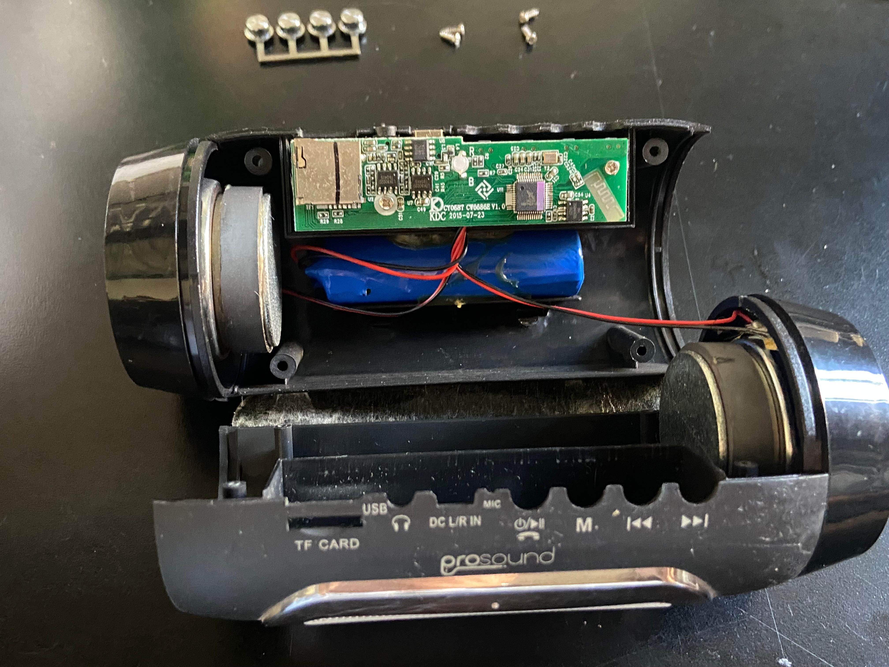
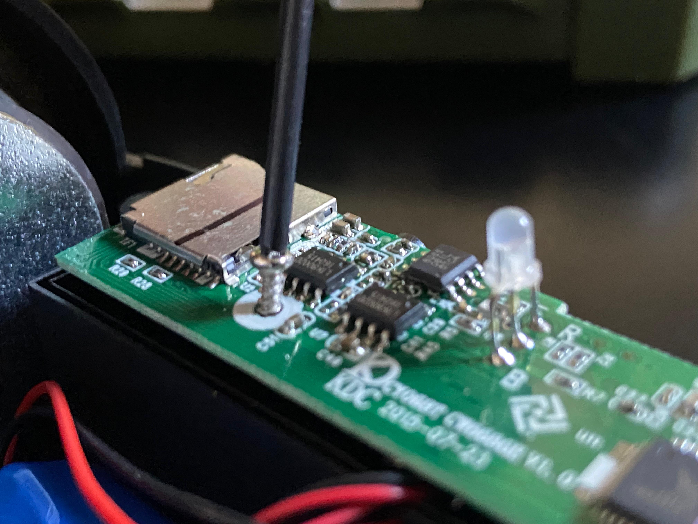
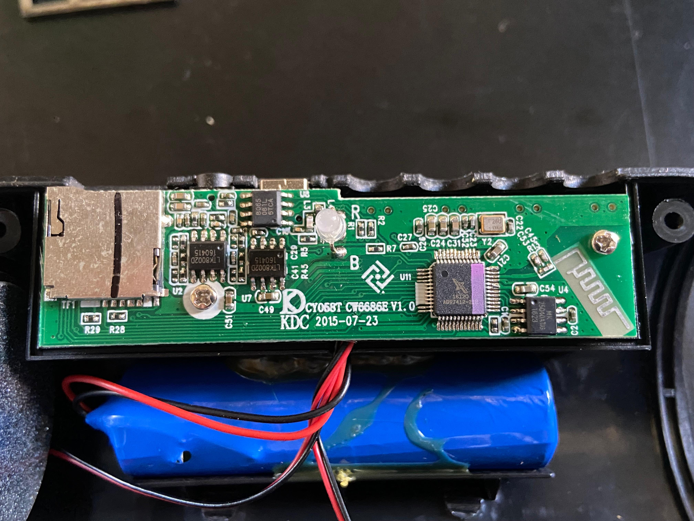
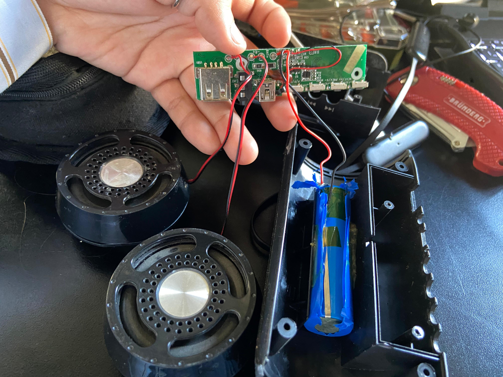
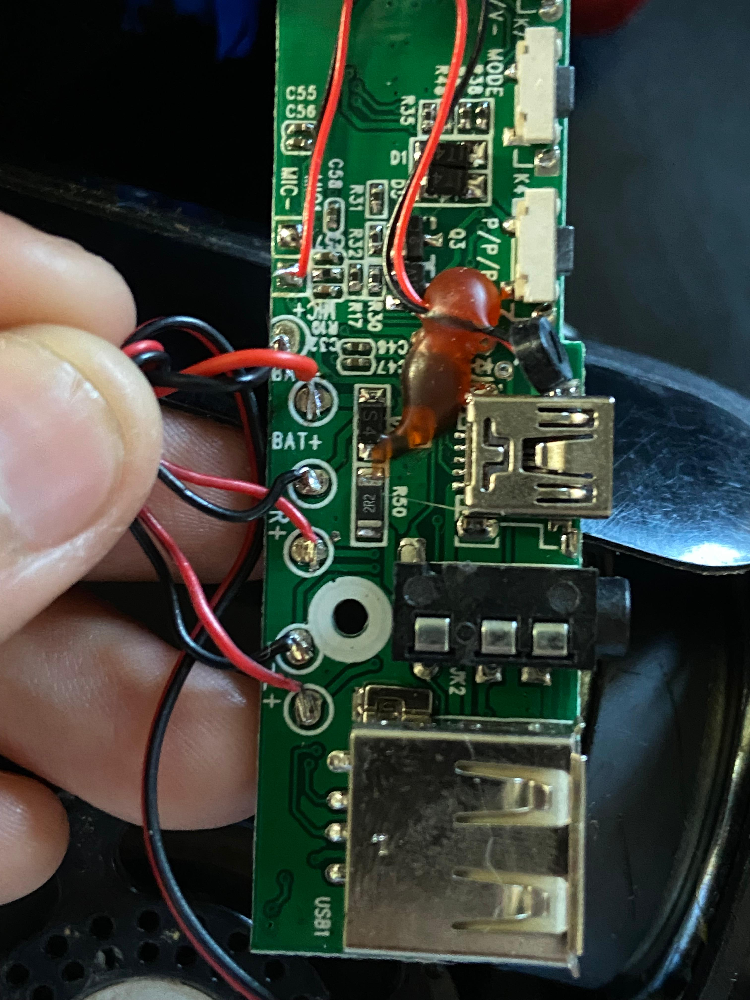
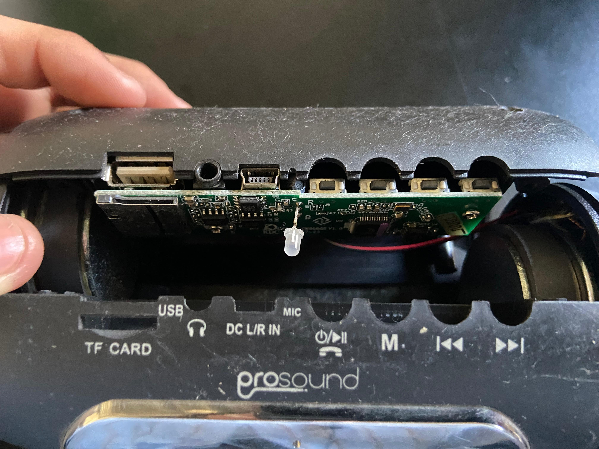

# sesion-04a

## Apuntes de la clase del 31 de marzo, 2026

Partimos armando el circuito con el 555.
Sucede que con los capacitores y resistencias tenemos la mala costumbre de colocarle prefijos incorrectos.

Existe una tabla que nos puede ayudar con eso.
Potencias de 10 y sus prefijos: Lo que hacen es que simplifican la notación de números muy grandes o muy pequeños.

También armamos nuevamente el atari console punk en parejas, yo hice el circuito monoestable e Isidora el astable.
Por el pin de salida se conectó un potenciómetro para lograr subir y bajar el volumen.

Además nos mostraron una herramienta digital, online y GRATIS (gratis? sii viva! viva!) llamada Falstad Circuit Simulator, donde podemos diseñar circuitos eléctricos y simula literalmente todo el funcionamiento, incluso como pasan los electrones por medio del circuito.
https://www.falstad.com/circuit/

---

## Encargo 

El dispositivo electrónico que desarmé fue un parlante Bluetooth viejito que tenía de la marca Prosound.

A simple vista se pueden identificar 4 elementos principales en su interior:

- Una PCB
- Una batería de la cual desconozco su voltaje
- Dos parlantes (bocinas)

Al acercarnos un poco más a la PCB podemos visualizar que está sujeta con pequeños tornillos.
Los retiro (quiero ver todo)

Primero por el frente: ¿que identifico?

Por lo que puedo identificar hay 5 chips, uno de esos tiene pinta de ser el circuito integrado principal (el de color negro y morado). Veo un led que está soldado a la PCB al igual que muchos componentes pequeños y grandes que no logro identificar. Veo letras conocidas > **R**, al parecer son esos recuadros pequeñitos negros después de cada R hay un número (veo numeros bien altos, ¿tantas resistencias tiene?). También **C**, puedo ver capaciores que tienen hasta el número 51. Desconozco que sea la letra U, la placa cuadrada metálica que está a la izquiera o la línea en forma de zigzag que hay en la derecha.

Ahora por detrás:

Hay una reunión ahí de cables, interruptores y entradas de carga y de audio. Más resistencias, capacitores y componentes que aún no conozco.

Esta reunión de cables la desenrollamos y notamos que salen hacia los dos parlantes y batería con sus respectivas conexiones hacia negativo y positivo.

Por último esta es la forma en la que está organizada la relación carcasa-PCB.

Especulo que el funcionamiento de este parlante es como una ciudad muy transcurrida y ruidosa.
Los chips son los grandes edificios que manejan cosas importantes en la ciudad. Hay muchas calles, avenidas, allí veo las resistencias, controlando el paso de los electrones como semáforos, los capacitores como tanques o postes que distribuyen la energía por toda la ciudad.

El circuito integrado principal es la municipalidad haciendo **bien** su trabajo, como se debería, manteniendo la organización de toda la ciudad.
Están las carreteras, como los cables, nos llevarán fuera de la ciudad, transportando provisiones hacia fuera y dentro de la ciudad, las entradas USB, SD, etc., como las estaciones de tren.

Los parlantes son el anuncio al exterior de la existencia de la ciudad, traduciendo todo su funcionamiento, demostrando lo bien que se maneja de manera armoniosa y fuerte.
