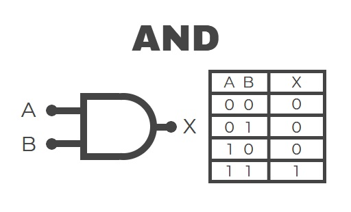

# sesion-05a

Apuntes clase 07 de Abril, 2026.

VCV Rack Free
Un sintetizador modular virtual, ES GRATIS (sii, de nuevo, bendito internet!!).

En esta herramienta Matias nos mostrò como funciona el VCO, VCA, VCF Y LFO.
+ VCO: GENERA LA ONDA
+ VCF: FILTRA ESA ONDA
+ VCA: CONTROLA LA AMPLITUD
+ LFO: CONTROLA CICLICA Y REPETITIVAMENTE UN PARÁMETRO (como volumen o tono).

## Lógica combinacional
### Tabla de verdad
> muestra el valor de verdad de una proposición compuesta

Compuertas lógicas: **AND** se representa con * (signo multiplicar) y **OR** con + (signo más) son dispositivos electrónicos básicos que procesar entradas binarias: 0 y 1.

#### AND

#### OR

#### NAND
¿Que hace NAND? si tiene dos entradas no funciona, no prende.

