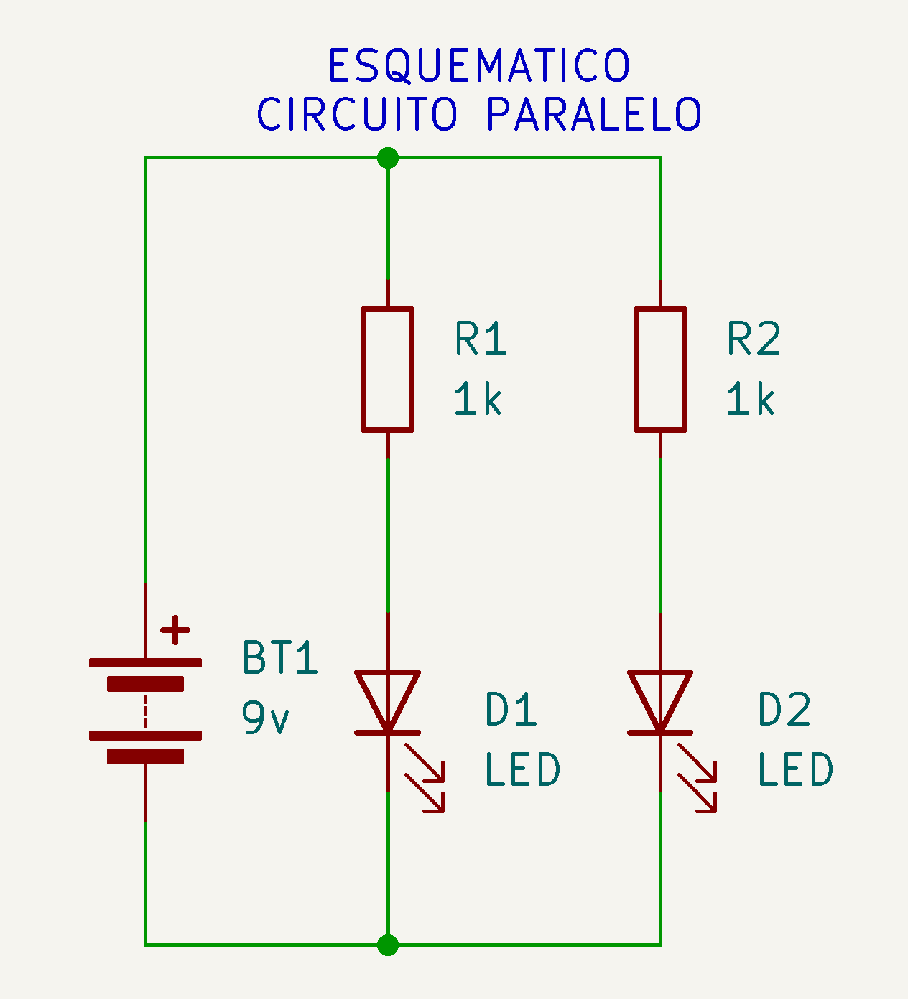
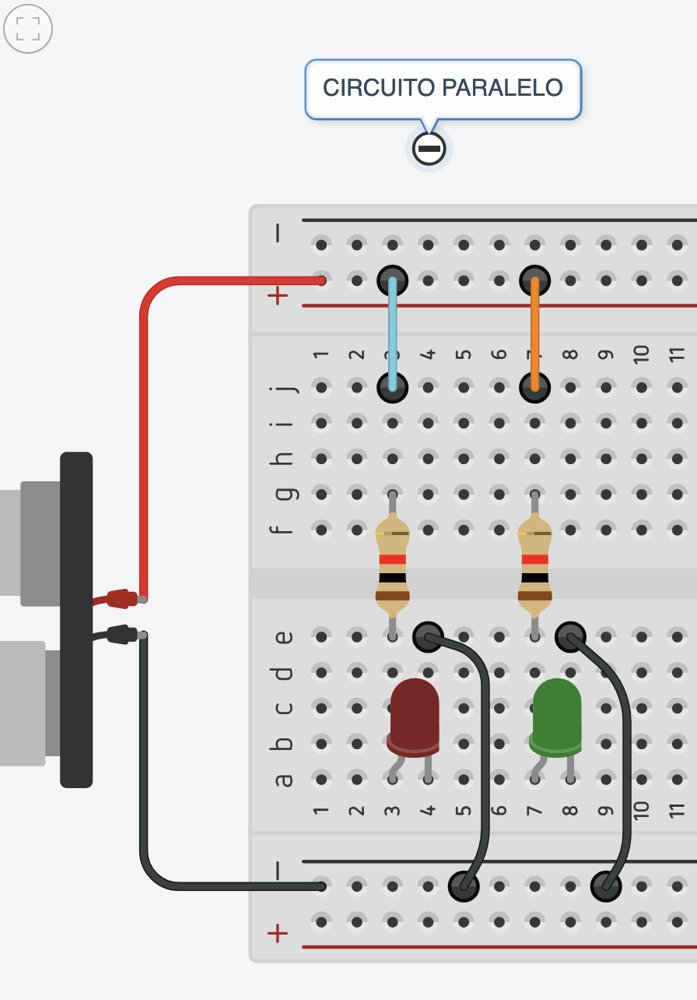
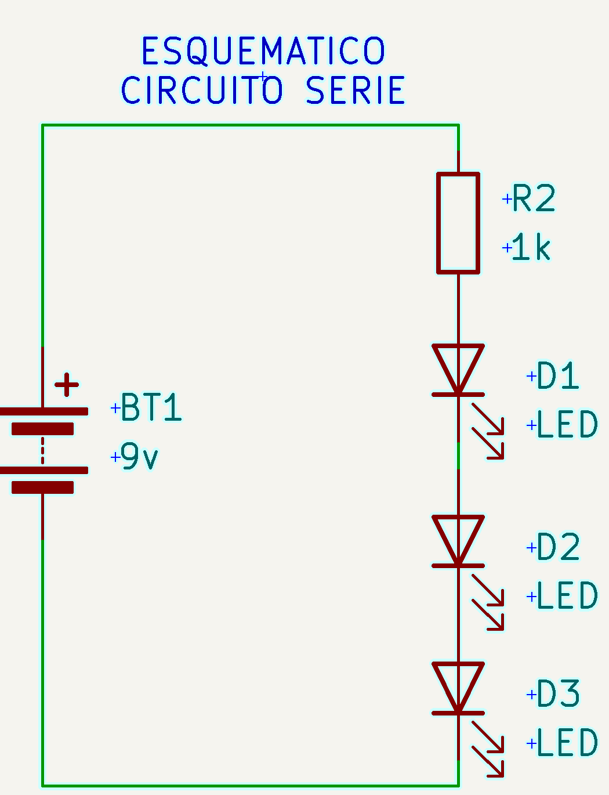
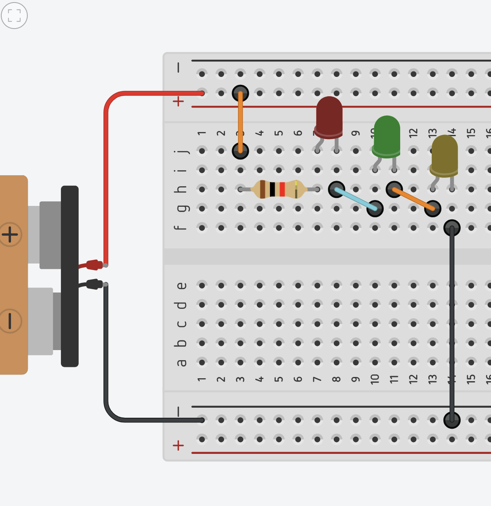
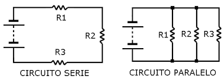

# sesion-02a 17.03

## Materiales

- **Potenciómetro B100k:** Mide la potencia. Según gemini es una resistencia variable de 100kΩ (100.000 ohmios) con un comportamiento lineal. La letra "B" indica que el cambio de resistencia es **constante y proporcional al giro de la perilla**, ideal para controlar voltajes en circuitos de Arduino, intensidad de luz o tono, con 3 pines de conexión.

- **Chip ic:** Se ponen entorno al eje céntrico de la proto (tiene transistores dentro). Empieza donde tiene la mordida.

- **Chip CD4017BE:** Según gemini es un circuito integrado CMOS de 16 pines que funciona como c**ontador divisor de décadas** (contador Johnson) con 10 salidas decodificadas. Es muy popular en electrónica para secuenciar luces, sintetizadores y aplicaciones de conteo, contando cada pulso de reloj y activando sus salidas secuencialmente de la **Q0 a la Q9.**

- **Resistencias:** Es la oposición que presenta un material al flujo de corriente (electrones) en un circuito. Se mide en ohmios (Ω) y depende de la resistividad del material, la longitud del conductor y su área transversal.**A mayor resistencia, menor corriente pasa**, generando calor como efecto secundario. - **Cobre:** 0,075, **Carbón:** 100-1000, **Oro:** 0,022

  _Voltaje es igual a corriente por resistencia_
  
  _corriente es igual a voltaje dividido por resistencia_
  

[Calculadora de colores de resistencias](https://www.digikey.com/es/resources/conversion-calculators/conversion-calculator-resistor-color-code)

| Color 1 | Color 2 | Color 3  | Color 4 | Resultado |
| ------------- | ------------- |------------- | ------------- | ------------- |
| Rojo: 2 | Rojo: 2  | Café: 1| Dorado: Tolerancia | 22 0} 1 cero  |
| Café: 1 | Negro: 0 | Rojo: 2 | Dorado: 5% | 10 00} 2 ceros  |
| Amarillo: 4 | Violeta: 7 | Naranja: 3| Dorado| 47 000} 3 ceros  |

## diferentes circuitos

**Circuito eléctrico:** Lazo cerrado que pasa por elementos resistivos

- **Circuito paralelo:** Son indepencientes. Según Gemini es una configuración donde los componentes (resistencias, bombillas) comparten los mismos nodos de entrada y salida, creando caminos independientes para la corriente. El voltaje es igual en todos los componentes, mientras que la corriente total se divide entre las ramas. Si uno falla, los demás siguen funcionando.

- **Circuito en serie:** Según gemini es una configuración eléctrica donde los componentes (resistencias, bombillas, etc.) se conectan uno tras otro, creando un único camino para la corriente eléctrica. La intensidad de corriente es constante en todo el circuito, mientras que el voltaje total se distribuye entre los componentes y la resistencia total es la suma de las individuales.

## Encargo: LQXTLC

Armar estos esquemáticos en su protoboard. Documentar que pasa con cada D si retiro cada R. Nombra el apagado como "0" y el encendido como "1".

Ejemplo: Si quito "R5", solo se apaga "D3". El resto se mantiene encendida.

### Ejercicio 1

| reesistencias  | D1    | D2    | D3    | D4    |
| ---                   | ---   | ---   | ---   | ---   |
| R1                    |    0  |   0   |    0  |    0  |
| R3                    |    1  |   1   |    1  |   0   |
| R4                    |    1  |   1   |   1   |  0    |
| R2                    |    0  |   1   |  1    |   0   |
| R5                    |    0  |   1   |  1    |   0   |

### Ejercicio 2

| resistencias | D1 | D2 | D3 |
| -------------------- | -- | -- | -- |
| R1                   |  1 |  0 |   1|
| R2                   |  1 | 1  |  1 |
| R3                   | 1  | 0  |  1 |
| R4                   | 1  |  0 |  1 |
| R5                   |  0 |  1 |  1 |
| R6                   | 1  |  1 |  1 |
| R7                   | 1  | 1  |  1 |
| R8                   | 1  |  1 |  0 |

### Ejercicio 3

| resistencias | D1 | D2 | D3 | D4 |
| -------------------- | -- | -- | -- | -- |
| R1                   |  1 | 1  | 1  |  1 |
| R2                   |  1 |  1 |1   |  1 |
| R3                   | 1  |  1 |  1 |  0 |
| R4                   |  1 |  0 |  1 |  1 |
| R5                   | 1  |  1 |  1 | 1  |
| R6                   |  1 |  1 |  1 |  1 |

#### Encargo

1. hacer los ejercicios anteriores y documentar los resultados.
2. elegir un disco particular de Kraftwerk, investigar avances de esa era, contexto de grabación, revisar presentaciones en vivo de esa época y contrastar con actuales. explicar qué escuchas en el disco, qué te llama la atención, describir en largo, no en corto.
3. lo mismo que 2 pero con un disco de LCD Soundsystem.

#### Análisis artistas

#### LCD Soundsystem
Me sorprendió caleta que me haya gustado. No era lo que esperaba para nada, sobre todo porque es música electrónica, y pensé que iba a ser más fría.

Siento que tiene una onda bien ochentera, como medio nostálgica. Escuché el disco American Dream de LCD Soundsystem, y leí que lo hicieron después de separarse, lo que lo hace más interesante porque se siente más cargado emocionalmente.

**Contexto y avances de la época:** Este disco salió en 2017, cuando la música digital ya está full desarrollada. Existen programas como Ableton o Pro Tools que permiten producir con mucha libertad, mezclar sonidos digitales con análogos y editar todo con mucha precisión.

**En sus shows:** antes ya tocaban como banda, ahora siguen igual, pero con mejor sonido y visuales más trabajados. No hay un cambio tan extremo,se siente más como concierto que como show tecnológico(?

**Qué me gustó:** Me gustó mucho siendo sincera jaja. Repiten harto, pero no aburre, y eso fue lo que más me llamó la atención. Van sumando sonidos de a poco, entonces la canción crece sin que te des cuenta.

Mi canción favorita fue “American Dream”, la encontré súper relajante, muy en la onda de música que me gusta escuchar. No esperaba eso de la electrónica.

Lo único que no me gustó tanto fue la portada, siento que no le hace justicia a lo bacán que es el álbum.

#### Kraftwerk
Con Kraftwerk me pasó distinto. Al principio no me gustaron tanto como LCD Soundsystem, pero igual se nota altiro que son unos secos y que saben demasiado lo que hacen.

Escuché el disco 3-D The Catalogue, y entendí que es como una recopilación de su carrera, pero reinterpretada con tecnología más actual.

**Contexto y avances (antes vs ahora):** Kraftwerk partió en los 70, cuando la música electrónica recién estaba empezando. Usaban sintetizadores analógicos, máquinas básicas y muchas cosas hechas por ellos mismos.

No existían las herramientas digitales de hoy, entonces todo era más limitado, pero igual lograban un sonido súper definido.

En este disco (3-D The Catalogue), toman toda esa música antigua y la actualizan con tecnología moderna:

* sonido más limpio
* visuales digitales
* shows mucho más producidos

**En vivo** (antes vs ahora)

Antes:
* casi no se movían
* todo súper rígido
* estética minimalista

Ahora:
* usan visuales en 3D
* todo está sincronizado (audio + imagen)
* sigue siendo frío, pero más “espectáculo”
* 
Es como pasar de algo muy simple a algo mucho más inmersivo.

#### Qué me llamó la atención

* las voces como de robot
* la repetición constante
* Siento que es mucho menos emocional que LCD. Es más mecánico, más frío.

Igual lo encontré interesante, sobre todo por cómo mezclan lo visual con lo musical, pero no es algo que escucharía por gusto.

#### Fuentes

* https://indiehoy.com/videos/lcd-soundsystem-all-my-friends-hecho-de-legos
* https://es.wikipedia.org/wiki/American_Dream
* https://es.wikipedia.org/wiki/Música_electrónica
