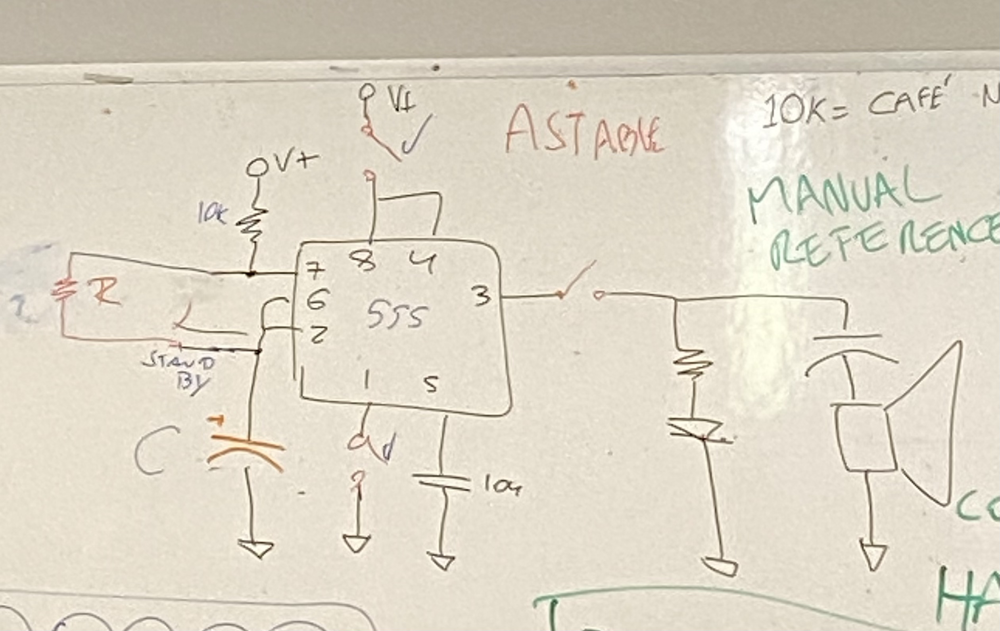
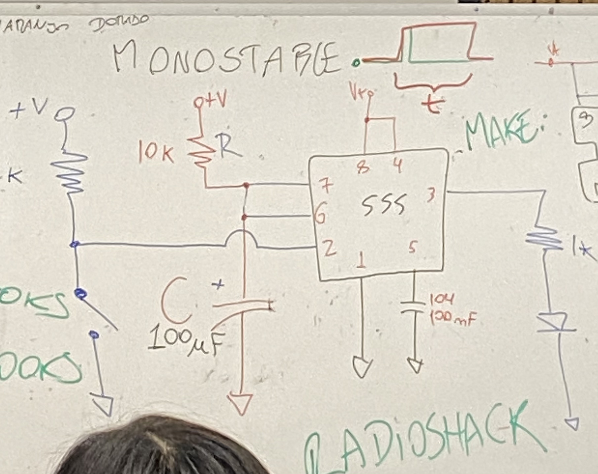

# sesion-03b

## Circuito Astable

Según Gemini es un oscilador de libre funcionamiento que genera una señal de onda cuadrada continua en su salida (pin 3), alternando entre niveles altos y bajos sin intervención externa. Es un montaje básico que utiliza dos resistencias y un condensador para determinar la frecuencia y el ciclo de trabajo, ideal para parpadeo de LEDs, generación de tonos y relojes. 

## Circuito MONOESTABLE

Según gemini es un temporizador de "un solo disparo" que genera un único pulso de salida en nivel alto (on) por un tiempo determinado al recibir un pulso de activación tras el tiempo programado, vuelve automáticamente a su estado estable bajo (off).

## Ejercicios

Circuito monostable:

La luz se apaga lento luego de apretar el botón.

### Atari-Punk

El fotoresistor no funcionaba así que lo cambiamos por un potenciómetro (tampoco funcionó).

Primer atari con capacito de 100uf al parlante, sonaba como nave espacial disparando jaja xd.

Luego quisimos cambiar ese capacitor por uno de 10uf, sonaba mucho mas agudo, me gustó más.

### comprar

Para comprar cosas en barrio San Diego, donde todo se compra presencial.
* Electronica Ibarra es la más barata si pagan en efectivo
* Electronica Hobby es la más grande, pero a veces tiene filas largas
* Electronica ORFALI tiene la señora más amable, pero a veces es un poco cara
* Electronica MINY tiene componentes más extraños
* Dentro de Galería SUR se encuentran desarmadurías donde encuentran componentes más exóticos aún.

#### Recomendaciones

* Radioshack
* Make:
* Manual reference
* Robert Rorrest
* CookBooks
* HandBooks
