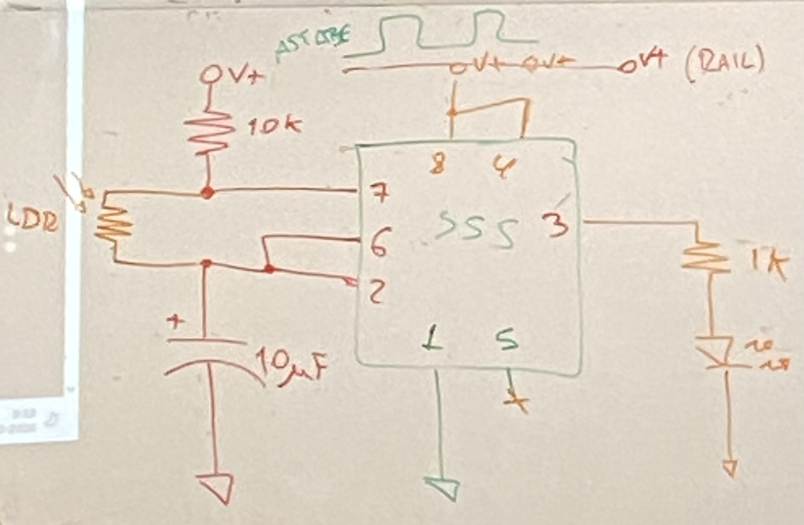
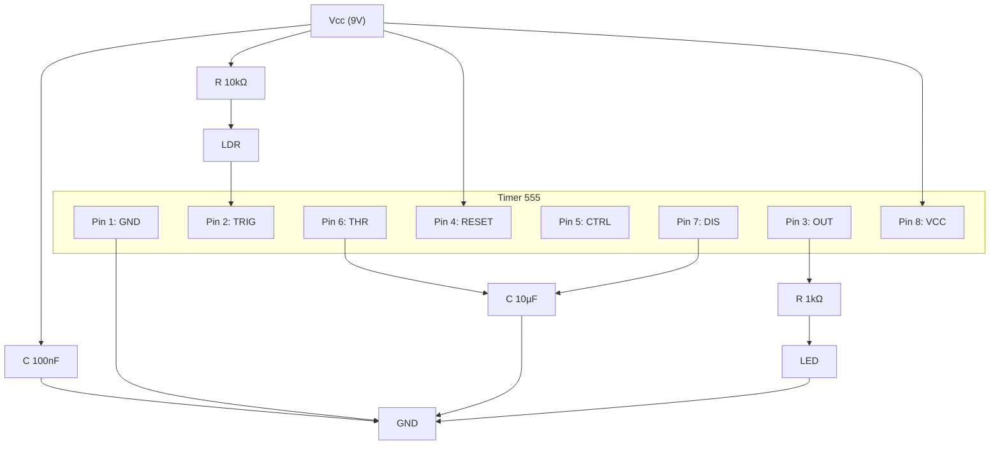
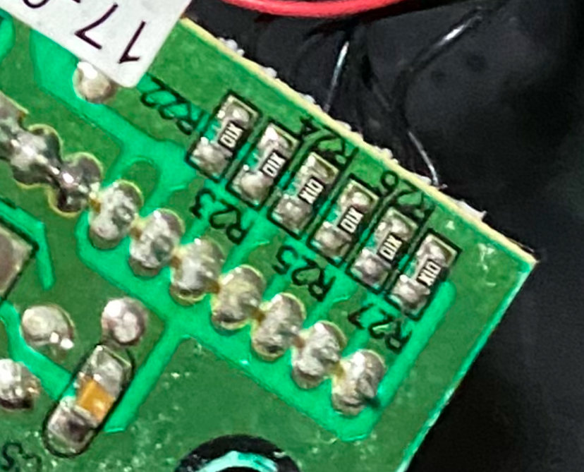
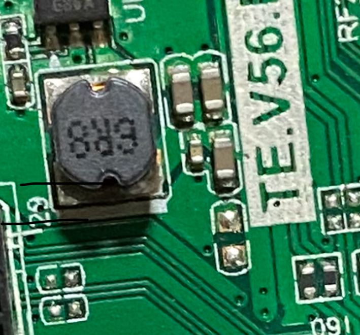

# sesion-04a 31.03

Izquierda afinaciones <- -> Derecha salidas

## Escalas y unidades electrónicas

### Prefijos de baja magnitud (usados en capacitores)

| Valor decimal     | Prefijo | Símbolo | Nombre |
| ----------------- | ------- | ------- | ------ |
| 0,000.000.000.001 | pico    | p       | Pico   |
| 0,000.000.001     | nano    | n       | Nano   |
| 0,000.001         | micro   | µ       | Micro  |
| 0,001             | mili    | m       | Mili   |

### Prefijos de alta magnitud (usados en resistencias)

| Valor numérico    | Prefijo | Símbolo | Nombre     |
| ----------------- | ------- | ------- | ---------- |
| 1                 | unidad  | —       | Unidad     |
| 1.000             | kilo    | k       | Kilo (ohm) |
| 1.000.000         | mega    | M       | Mega       |
| 1.000.000.000     | giga    | G       | Giga       |
| 1.000.000.000.000 | tera    | T       | Tera       |

10.000 picoF -> 100 nanoF -> 0,1 microF

(F)araday: según gemini: Representa la cantidad de electricidad transportada por 1 mol de electrones, derivada de la carga de un solo electrón multiplicada por el número de Avogadro.

### Falstad
<https://www.falstad.com/circuit/>

Mi circuito:

### Ejercicio en clase

No nos funcionó a la primera porque no conectamos las tierras (tood el circuito tiene solo una tierra (GND)

Cambiamos el fotoresistor por un potenciometro para probar cosas ;))))

Luego conectamos un potenciometro para controlar el volumen:

Hola Aarón soy vania desde mi visual studio code slay.

### encargo-04a

1. destripar un dispositvo electrónico, documentar con texto e imagen el proceso, distinguir los elementos de la PCB que hemos estudiado como R y C y chips.
2. documentar las conexiones entre la PCB y los componentes en la carcasa.
3. escribir un texto de 3 párrafos explicando de forma poética imaginaria el funcionamiento especulativo del dispositivo electrónica, usando metáforas y analogías para describir el flujo de electricidad y la interacción de los componentes. el texto debe ser creativo y evocador, transmitiendo la esencia del dispositivo sin ser técnico, ni tampoco necesariamente real.

### Documentación de Despiece | Televisión portátil de pantalla pequeña.

### 1. Descripción general

El dispositivo analizado es una televisión portátil.

El proceso de despiece permitió abrir completamente la carcasa plástica y observar el interior: placas (PCB), componentes electrónicos y las conexiones entre la placa principal y elementos como la pantalla, parlante y botones

### 2. Pasos del desarmado

| Paso | Descripción                                                             |
| ---- | ----------------------------------------------------------------------- |
| 1    | Retiro de tornillos en la parte trasera (aprox. 8 tornillos) |
| 2    | Separación de la carcasa con ayuda de mi papá                   |
| 3    | Identificación de cables y conectores internos                          |
| 4    | Extracción de las PCB para revisión                         |

### 3. Identificación de componentes en la PCB

Una PCB es una placa donde se conectan y organizan los componentes electrónicos mediante pistas de cobre. Sobre esta superficie se montan y sueldan los elementos que permiten que el dispositivo funcione.

#### 3.1 Resistencias (R)

Componentes que limitan el paso de corriente.

* resistencias tipo SMD (marcadas como R-Nº)
* Función: regular corriente, dividir voltaje, proteger componentes

#### 3.2 Capacitores (C)

Componentes que almacenan y liberan energía.

* Tipos observados:

  * Polarizados, de distintas UF.
  * Cerámicos. (creo que son)
* Función: filtrar(? la energía.

#### 3.3 Circuitos integrados (IC)

Chips que procesan información.

* Chip principal y chips secundarios
* Tipos de chips vistos: 33166S, winbond 1614, 1117 B, 16zzHUG.

#### 3.5 Tabla resumen

 | Tipo                       | Función estimada         |
 | -------------------------- | ------------------------ |
 | Resistencias          | Regulación de corriente  |
 | Capacitores polarizados y cerámicos | filtrado, estabilización de energía |
 | Chip principal y secundarios    | cerebro y sistema nervioso de la tele |

## 4. Conexiones entre PCB y componentes

La PCB funciona como centro del sistema, conectándose con todos los elementos visibles del dispositivo.

#### 4.1 Pantalla

* Tipo: cables
* Función: transmite imagen y energía

#### 4.2 Parlante

* Tipo: cable 
* Colores: rojo (+) y negro (-)
* Función: salida de audio amplificado

#### 4.3 Botonera

* Tipo: cable 
* Función: enviar señales de control (encendido, volumen, etc.)

## 5. Funcionamiento especulativo

Dentro del televisor todo se activa cuando entra la energía. No es algo ordenado ni visible, pero cuando entra se siente como un sistema que despierta de golpe. La corriente empieza a caminar por la placa, encontrando caminos, pasando por zonas donde se frena un poco y otras donde avanza más rápido.

Hay partes que retienen a la energía por un momento, como si la guardaran antes de soltarla. Otras partes la desvían o la reparten, haciendo que llegue a distintos lugares al mismo tiempo. 

Al final, todo ese recorrido se traduce en la pantalla (y sus componentes). La imagen y sonido aparece como resultado de ese movimiento constante que no se ve, pero que nunca se detiene mientras el televisor está encendido. Cuando se apaga, todo simplemente deja de moverse, todo se duerme, hasta que entra la anergía a caminar otra vez.
