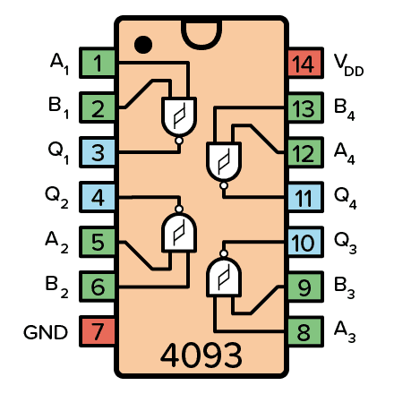
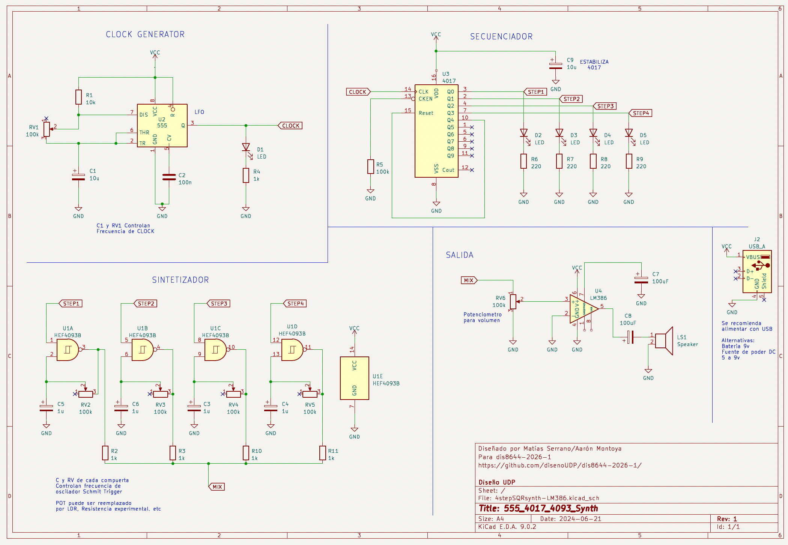

# sesion-06a 14.04

Hay una familia de chips que son los **4000**.

<https://en.wikipedia.org/wiki/4000-series_integrated_circuits>

## Schmitt Trigger

Segun gemini: Un **Schmitt Trigger** es un comparador con histéresis que convierte señales analógicas ruidosas o lentas en señales digitales más limpias.

Funciona con dos umbrales:
- Uno alto  
- Uno bajo  

Esto evita que el sistema esté cambiando constantemente por ruido.

## Chips

- **4093**: compuertas NAND con Schmitt Trigger  
  - Solo oscila si pin2 va en V++  

>Cada salida del Schmitt Trigger se conecta a una resistencia, y estas resistencias comparten un punto en común.

- **4017**: contador de décadas

## En clase

Hoy hicimos una mezcla de todo!!!

Conectamos:
- Clock (555)  
- Secuenciador (4017)  
- Sintetizador (4093)  
- Salida  

Hicimos una secuencia de 4 pasos con un clock (555), un secuenciador (4017), un sintetizador (4093) y la salida, fue una locura!!

Junto con mi bello grupo de trabajo los conectamos, el clock con el secuenciador funcionaba perfecto, pero el sintetizador no, y la salida estaba complicada, me explayo...

## Proceso

Con mi grupo logramos conectar:
- Clock + secuenciador -> funcionando bien  
- Sintetizador -> no estaba sintetizando ;c 
- Salida -> inestable  

No sonaba ;((( Luego moviendo los potenciometros, encontramos un lugar en especifico del potenciometro de la salida que hacia que sonara, pero aún así los potencioemtros de los sintetizadores no estaban sintetizando, sonaban todos igual y si los poniamos al maximo dejaba de sonar

https://github.com/user-attachments/assets/6f11d162-6df6-4715-a73a-124902b13c7e

Pero luego se nos ocurrio la mejor idea de todas!!! sacamos el sintetizaador, nos saltamos ese paso y conectamos dierctoa  al salida desde el secuenciador, misa y Aarón nos miraron rarismo, pero funcionó!! y sonada del uno, eslei

https://github.com/user-attachments/assets/4e531c3c-9fff-4e25-a35d-f22c86965e5b

## Entrega 24 de abril

Los primeros 3 son grupales, los siguientes 3 individuales:

1. **Factura del sintetizador**  
   Orden del circuito, limpieza, organización  

2. **Documentación textual**  
   Diagrama de bloques, esquemático, dibujos, explicación de cada parte  

3. **Modificaciones**  
   Decisiones de diseño, mejoras, parámetros, experiencia de uso  

4. Bitácoras marzo  

5. Bitácoras abril  

6. Presentación oral  
