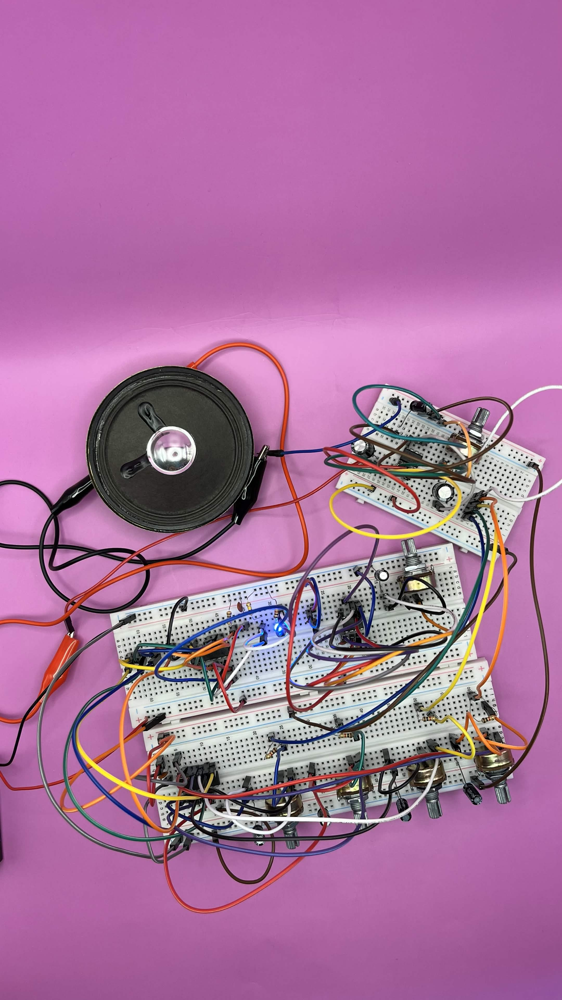

# sesion-06b 17.04

Hoy misa nos trajo una versión de la secuencia de 4 pasos de la clase pasada con modificacones.

Peeeero tuvimos problemas ;( Dejamos la conexion de la clase pasada armada, y hoy cuando le pusimos corriente ya no funcionaba, el Led no parpadeaba y no había secuencia de pasos.

Desconectamos todo y lo volvimos a conectar, mismo problema, así que cambiamos el chip 555 por uno nuevo, y funciono! había secuencia.

Ahora teniamos que hacer que los sintetizadores funcionaran bien, porque cada potenciiometro en el sintetizador, sintetizaaba toda la secuencia de sonido, no step x step.

Mientras resolviamos eso, misa nos dice que si sacabamos los led de la secuencia (que ya estaban funcionando) se arereglaría! Lo hicimos y funcionó!!

Luego ayudamos al grupo de Santiago Cifuentes a que su circuito suene, lo que hice fue conectarles desde 0 el paso del chip 89 ya que vi unas malas conexiones y Nico les ayudo a conectar de una manera mas ordenada el sintetizador, cambiamos el condensador que tenían por uno de menos uf y sonó!

Nos fuimos a jugar con los sintetizadores y condensadores para llegar a un sonido que nos gustara para nuestra solemne, queriamos un sonido muy agudo, pusimos los condensadores de menor uf y lo logramos! llegamos a un sonido que amamos.

Luego ideamos nuestra carcasa, como queríamos que luciera y unos vocetos.

Emi hizo un registro maravilloso de todos nuestros trabajos. <3

https://github.com/user-attachments/assets/917b6624-b5e3-4cd4-ba46-7ab9ac13024b

* Schmitt Trigger Oscillator Calculator <https://stompboxelectronics.com/resources/schmitt-trigger-oscillator-calculator/>
