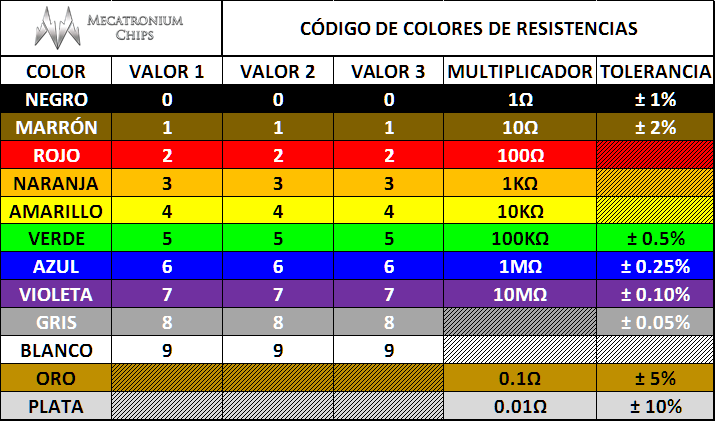
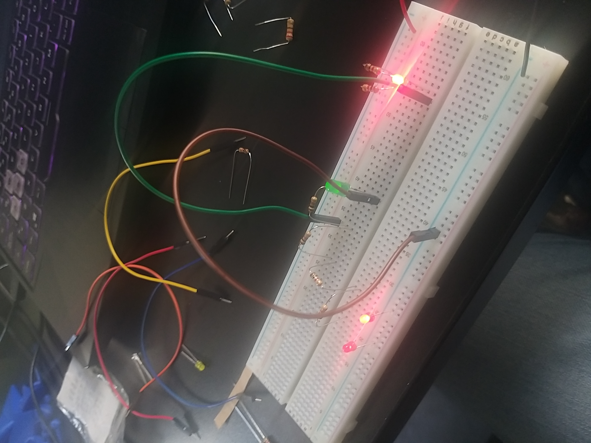

# sesion-02a
---
## Apuntes de la clase:

Chip: contador de secuencialidad *Un ejemplo es la secuencia en la música*
Otro chip son los conectores de batería…por un momento pensé que hablaban del instrumento, pero es solo la pila de siempre

No existe un material conductor absoluto por ello tenemos un rango.
Los de cobre son los conductores por excelencia y por ello los cables están hechos de este material, mientras que el carbón es más utilizado para resistencias.

Las resistencias tienen 4 rayitas de diferentes colores: en la mayoría de los casos el color dorado es el último. Porque al ser tan pequeños es mejor reconocerlos por colores asociados a los números.

Rojo café y el rojo negro son los dígitos, el café rojo es la cantidad de ceros (en palabras balatrinas las exponenciales) y el dorado es la tolerancia.

Dependiendo del circuito con los colores, se verán diferentes cifras.

- 1000: Ik
- 10.000: 10k

*La idea es que al final sepa entender y armar un esquemático*

Al hacer un circuito el cable negativo debe ir al lado de la resistencia y no en la misma línea, conectando el lado negativo del led al cable.

- Circuito paralelo: lo interesante de esto es que son independientes uno del otro

*Un circuito electrico es un circuito cerrado y resistivo*

- Los componentes tienen sus propios nombres siendo: R1 Y R2 con sus respectivos D1 y D2
  
- Vcc: voltaje de alimentación/ corriente continua (Estos cables
- Gnd: Ground/Tierrra

- Algunas cositas hechas en clase:

---

## Ejercicios:

1: 

| loquitoportilocoloco  | D1    | D2    | D3    | D4    |
| ---                   | ---   | ---   | ---   | ---   |
| R1                    |   0   |  0    |  0    | 0     |
| R3                    |  1    |   1   |   1   |   0   |
| R4                    |  1    |  1    | 1     |  0    |
| R2                    |  1    |   0   |  0    |  1    |
| R5                    |    0  |   0   |  1    |   0   |

2:

| loquitoportilocoloco | D1 | D2 | D3 |
| -------------------- | -- | -- | -- |
| R1                   | 1   |  0  |1    |
| R2                   | 1   |  0  | 1   |
| R3                   |  1  | 0   | 1   |
| R4                   | 1   |  0  |  1  |
| R5                   | 0   |   1 |  1  |
| R6                   |  1  |  1  |  1  |
| R7                   | 1   |  1  |  1  |
| R8                   | 1   |  1  |   0 |

3:

| loquitoportilocoloco | D1 | D2 | D3 | D4 |
| -------------------- | -- | -- | -- | -- |
| R1                   |  1  | 1   | 1   | 1   |
| R2                   | 1   | 1   | 1   |  1  |
| R3                   | 1   |  1  |  0  |  1  |
| R4                   |  1  |  0  |  1  |  0  |
| R5                   |  1  |  0  |  1  |  0  |
| R6                   | 1   |  1  | 1   |  0  |

---

Proceso del encargo:

- Todo comienza una vez termina taller. Estaba bastante perdida tal vez demasiado ya que normalmente a mí me cuesta dimensionar las cosas... sobre todo con circuitos que parecen abstractos.

- Al llegar al Lid tomé consejos de la Bernardita, una gran ayuda del Mateo, consejos del señor Humildad, de la Cami y el Felix. Muchas gracias a todos por ayudarme!

- Cosa que comencé a hacer los ejercicios uno por uno. Hice copy paste a la tabla del primer ejercicio por cada uno *grave error*

- Entre ello, queme 2 LEDS, algo raro ya que no era una fuente de energía muy grande.

- Me confundí y terminé solo haciendo hasta R5 en todos los ejercicios (maldita sea)

- Por lo tanto guardé mis cosas y me fui a la casa. Al día siguiente ya para la noche rehice todos los ejercicios y ya pude entender los esquemáticos sin muchas complicaciones.

Ahora dejaré fotos del proceso tanto en el Lid como en mi casa 	＼(≧▽≦)／

---

Kraftwerk es una banda alemana de música electrónica y tambien son considerados pioneros del género e influencia en muchos subgéneros de la música electrónica.

La banda combina ritmos repetitivos con melodías pegadizas

Las letras simplificadas del grupo son a veces cantadas a través de un vocoder. Bastante loco.

Radioaktivität/ Radioactivity es el album que se analizara en esta bitacora.

- La mayoria de su musica es bastante repetitiva y se puede diferenciar el Vocoder. No es mi tipo de musica pero puedo entender que es perfecta para musica de videojuegos.

- Tal vez podria ser parte de Hotline Miami (en alguna parte tranquila porque el juego es muuuuuy violento)

- Asociado a los 8 bits tambien, juegos de Atari

- A veces podia desesperarme un poco por los sonidos agudos de antenas sintonizando pero en general era musica de fondo.

- Airwaves seria una de esas canciones de juegos de vuelo.

- No hablemos de Uradium o Radio Star... mis odios sufrieron un poco mucho.

---

LCD Soundsystem

- grupo neoyorquino de música dance-punk, formado en 2002

- Inspirados por grandes artistas como DAFT PUNK (hace tiempo que no escuchaba aquel nombre)

- Destacan por su producción analógica saturada, letras irónicas y perfeccionismo técnico, influyendo profundamente en el indie moderno

- Incluso revitalizaron el uso de sintetizadores analógicos en vivo lo cual ya estaba muriendo de a poco

Para el album hablare de LCD Soundsystem...(2005) que nombre para una discografia

Su musica es bastante diferente a la del ultimo grupo, denotando unas voces muy de epoca "Vaquera" como con un cantadito (no se si me explico)
Tambien se ve esta repetición pero más a lo 31 minutos, se que es un poco raro pero me da esa sensación loca 

Cabe hablar de lo largo de sus canciones, asimilandose al propio Daft Punk en "Around the World" y otra vez "algunas canciones son bastante mas psicodelicas" perfectas...para Hotline Miami o una escena de fiesta infernal
