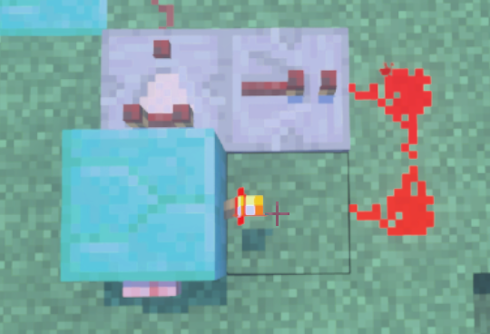
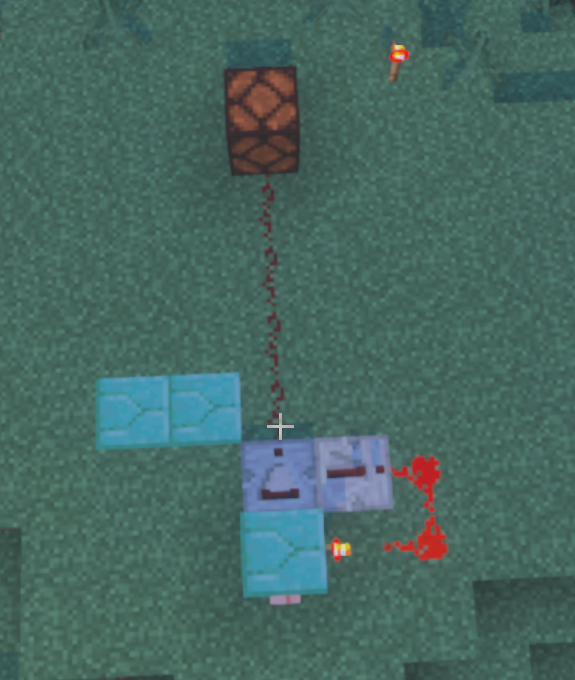
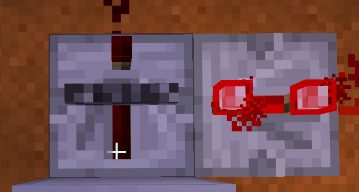
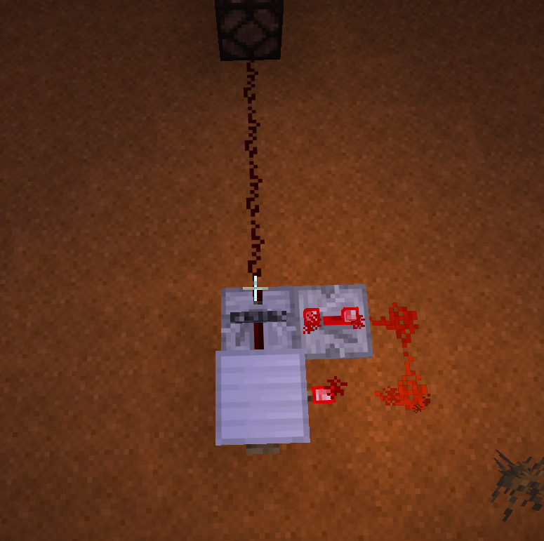
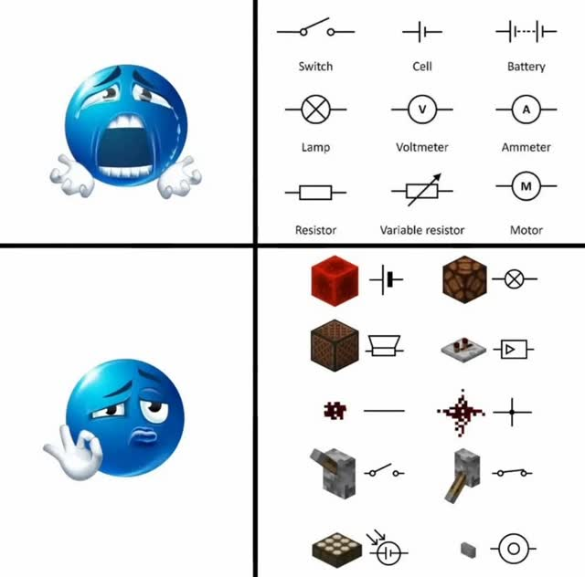
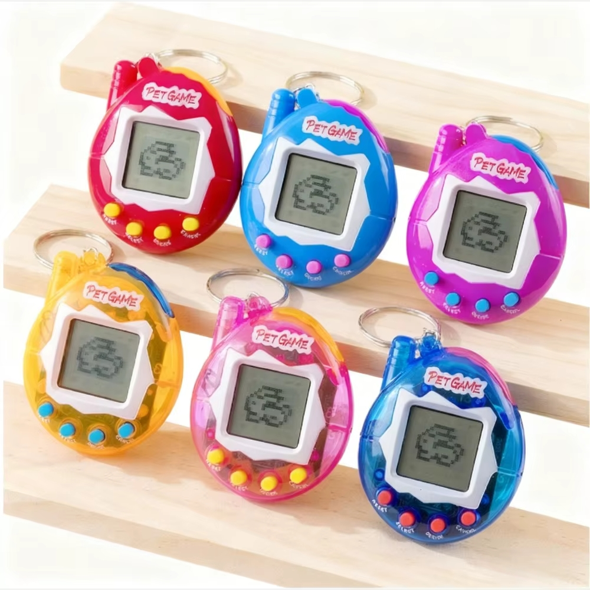

# sesion-04a

Apuntes:

Cabe destacar que estos esquematicos se leen al "reves" de izquierda y derecha
Una LDR (Light Dependent Resistor o fotorresistencia) es eso, la fotoresistencia 

| Valor                | Prefijo            |
|----------------------|--------------------|
| 1.000.000.000.000    | Tera               |
| 1.000.000.000        | Giga               |
| 1.000.000            | MEGA (M en mayúscula) |
| 1.000                | kilo (k en minúscula) |
| 1                    | Unidad             |
| 0.001                | mili               |
| 0.000 000            | μ (micro)          |
| 0.000 000 001        | nano               |
| 0.000 000 000 001    | pico               |

*Balatro mention: E es igual una potencia como en los multiplicadores del juego. (Tambien esta el exponente gogool que se uso para el nombre de Google)*

Los condensadores ceramicos vienen escrito en "pico" (vaya cine vivir en Chile para contemplar esto)

C -> Condensador

<https://www.falstad.com/circuit/>

---

## Sistema Flip-Flop...En minecraft

Por un encargo de Missa (más en broma que otra cosa) se nos pidio si podíamos descomponer y explicar un sistema Flip-flop en Minecraft

Un biestable, también llamado báscula (flip-flop en inglés), es un multivibrador capaz de permanecer en un estado determinado o en el contrario durante un tiempo indefinido (un Off y un On)

"A redstone comparator is a block that can produce a redstone signal from its front by reading chests, lecterns, copper bulbs and similar blocks, or be used to repeat a signal without changing its strength."

https://minecraft.wiki/w/Redstone_Comparator

Lo que dice en mi entendimiento es: que el comparador de redstone emite señales dependiendo de qué tan lleno esté un cofre o bloques de almacenamiento cerca de él o también es usado para
repetir una señal sin cambiar la intensidad de la energía

"El repetidor de redstone tiene 3 funciones principales: actúa como repetidor, diodo y retardador de la señal"

https://minecraft.fandom.com/es/wiki/Repetidor_de_redstone

Paso 1: Dar energía!

- Como siempre se ha sabido que la redstone es la fuente de poder más característica de Minecraft, ponemos una de las antorchas al lado en un bloque común para hacerlo nuestra fuente de energía

Paso 2: Conexiones

- Ponemos un comparador al frente del bloque y al lado de este ponemos el repetidor. El repetidor irá conectado a la antorcha directamente con un camino de redstone y el comparador con otro camino será conectado a la lámpara/Led que demostrará el cambio de estado

Paso 3: Work

- Terminamos poniendo el botón atrás del bloque y listo! Flip-Flop hecho.

### Explicación del circuito

Anteriormente ya puse para que sirven las cosas más fundamentales, pero ¿como funcionan aquí?

Por un lado el repetidor funcionara como un diodo, el cual funcionara como un interruptor de "solo un lado" dando energia a un lado y cerrando la energia del otro.

Al apretar el boton se conducira la energia al repetidor, el cual se la dara al comparador/repetidor quien almacenara la energia, bloqueando el estado de energia, para luego transmitir la señal al LED dejandolo en un estado de On indefinidamente

Cabe aclarar 3 cosas

1- El mecanismo puede funcionar con 2 repetidores o con un comparador y un repetidor

2- Para el que quiera replicarlo, debe si o si "Lockear" El comparador/Repetidor que vaya adelante del bloque, ya que de esta manera se almacenara el estado de luz y no cambiara al cabo de unos segundos

3- El lockeo debe ser en el tercer estado para que sea definitivo, de lo contrario al encender el LED, volvera a su estado original despues de un segundo

(Para hacer esto usar Java, ya que las anteriores imagenes son sacadas de bedrock y no se puede lockear el condensador)

---

AHORA QUE PASA: graciosamente Minecraft implementó un bloque especial para este estado, sin la necesidad de un circuito más complejo como el que hice.

*El conocido bloque: Bombilla de cobre*

Con este y una conexión de redstone ya está el flip flop más compacto...pero es aburrido, por lo tanto se hizo el anterior mecanismo.

PD: 

*Era gracioso ya que tiene sentido*

---

Tareas:

Destruir algo????
Buscar basurita electronica

Destripar un objeto electronico "pequeño"

### TAREA 2:

En primer lugar, he podido ver en videos ejemplos de errores que resultan en la peor de las catastrofes...por lo tanto (por mi seguridad y el no hacer basura electronica) no destruire circuitos 

Pero un ejemplo simple es polarizar un condensador (esos de barril) mal...causa una no grata explosión (según lo que converse con el seba, por ello es que se nos dieron condensadores no potentes)

---

Ejem.

El objeto que se utilizara en esta cirugia es "UN TAMAGOTCHI" *Un regalo muy preciado que obviamente reparare una vez termine este experimento*

El objeto de estudio esta dividido en 3 partes:

- Todo lo que es la carcasa (el estado en lo que todo esta sellado))

- Primer corte: es donde se pueden ver las pilas de reloj

  
- Segundo corte: Donde se puede manipular todo el objeto, desde la conexión, la pantalla o lo botones.

  

Como se puede apreciar, el circuito para transportar la energia no es la graaaaaaaaaaaaaaaaaaaaaaaaaan cosa.

Pero lo interesante es como demonios el "programa" puede funcionar si no esta conectado desde ningun cable.

EXPLICACIÓN POETICA!.

Cada uno de nosotres en este mundo hemos querido estar acompañados de una u otra manera, incluso si no es con gente real. Porque claro, socializar implica esfuerzo. Por lo tanto, aquí presento la solución tecnológica saludable (porque ya estoy viendo a alguien pensando en la IA y sus chats bots) para quien quiera un amigo de ceros y unos, que no juzga pero siempre interrumpe, aunque probablemente muera si lo olvidas tres días seguidos... *ejem*

Muy lindo y todo ¿pero cómo funciona? A simple vista es un huevo con una pantalla y 4 botones… pero la verdadera magia sucede dentro~ ¿Por qué? Porque, seamos honestos, ¿quién no se ha preguntado cómo funcionan los amigos por dentro?

¿solo yo? ... ok

En primer lugar sacamos los primeros tornillos para encontrarnos con nuestras hermosas pilas, esas que literalmente hacen andar al pequeñin. ¿Pero qué es esto? Abajo hay un círculo igual de plateado y brillante, pero conectado (con una soldadura muy paupérrima). Por si ustedes no lo saben, es un conectador de amistad, porque todo en el pequeño Tamagotchi depende de conexiones básicas… bastante más simples que las humanas, curiosamente. El círculo del centro es la energía positiva y lo que lo rodea es la negativa, como lo haría *una pila o una persona*, y ambas energías van conectadas a nuestra placa central donde sucede el pensamiento: un cerebro diminuto que maneja necesidades, gustos, energía, y un pequeño círculo negro bastante sospechoso que hace de “neurona”. Básicamente, todo lo necesario para simular afecto…!

Esta neurona se conecta con la pantalla principal en donde veremos al amigo y sus botones, los cuales se impulsan a la placa para dar la señal de nuestra accion y con ello cuidar con todo el amor que 4 botones pueden dar, a nuestro mejor amigo para siempre (hasta que se le acaben las pilas)
