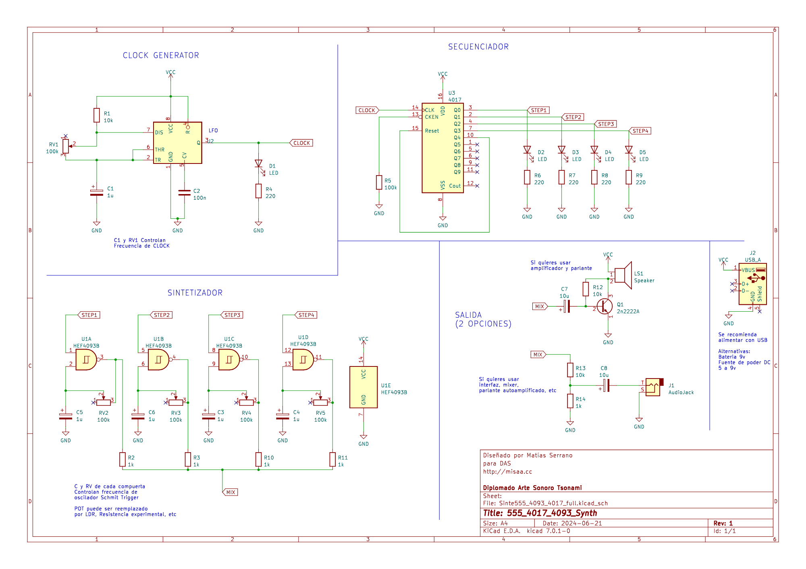
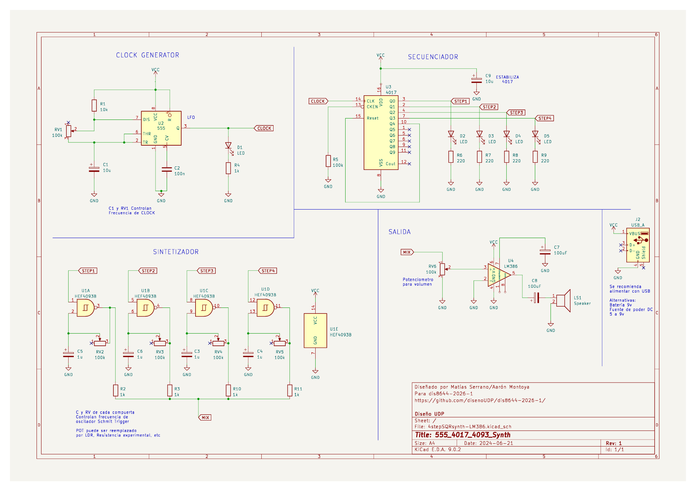
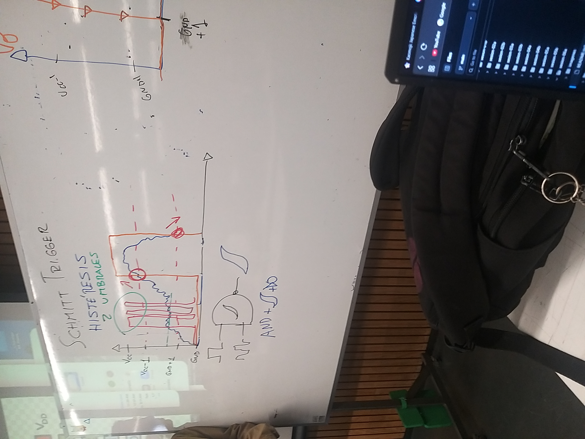

# sesion-06a

Histéresis: "La materia tiene memoria" fenómeno físico donde el estado actual de un sistema depende de su historia previa y no solo de las condiciones actuales

- El sistema "recuerda" su estado anterior (Como arduino que recuerda su codigo anterior maybe)
- Genera 2 umbrales internos:  VCC y GND
- Amortiguador de realidad
- Dependiendo que tan arriba o abajo este del umbral se mandara la señal (cabe recordar que para que se emita el sonido es cuando esta la transición presente)

Mix/Mixer: A traves de una resistencia pequeña se puede hacer la conexion para no tener 4 parlantes conectados 

---

Entonces ¿que es lo que debemos hacer esta clase?

Conectar el armatoste definitivo para hacer un sintetizador de "cartón"

¿Loco verdad? Comenzamos con algo tan pequeño como un 555 y ahora eso es solo una pequeña parte de algo tan complejo...que se pondra peor incluso.

Comenzando como siempre!
Tanto el 555, como el 4917 y el 4093 ya los habiamos visto 
Pero faltaba el audio

En primera instancia se nos dio el diagrama que se puede observar, pero tenia una salida de sonido de audifonos...y justo me tocó a mi hacer esa parte (JUSTO LA QUE NO SERVIA)
Cabe aclarar que tenia mi circuito 555 armado de antes ya que sabia que funcionaba...pero cuando se lo pase al equipo. DEJO DE FUNCIONAR CORRECTAMENTE!

Este es el funcional:

demonios...no se si habia parecido una idiota, una mentirosa o ambas.

	(╥﹏╥)  TODO HORRIBLE 

  Bueno, como ha sido hasta ahora, aquí mostrare todo el proceso que tuvimos aquel dia y unas cuantas reflexiones al final 	(・人・)

Se nos dio a explicar como funcionan los Smith Triggers (eso que cache con minecraft y todo jiji)

Varias de estas imagenes estan un poco desordenadas pero se va viendo como hicimos las conexiones del menso diagrama

Más y más conexiones por todas partes! incluso tuvimo que sacar todo y volver a hacerlo (Con más orden claro)

Esta imagen es para las anotaciones de poner condensadores para estabilizar mejor las conexiones 

El opus magnum casi listo...entero armado pero sin sonar

Y sus videoitos intentando captar el momento del exito...que no paso nunca, por poco!

---

Que travesía más larga tuvimos por aquí

Pero a lo largo de los dias he podido ver como mi grupo de trabajo es tan...woaos, estaban viendo una carcasa hecha en 3d y todo

Intentare hacer lo que pueda para aportar, incluso si me veo como una ridicula que es un poco lenta en entender! porque no quiero decepcionarlos 	.･ﾟﾟ･(／ω＼)･ﾟﾟ･.

