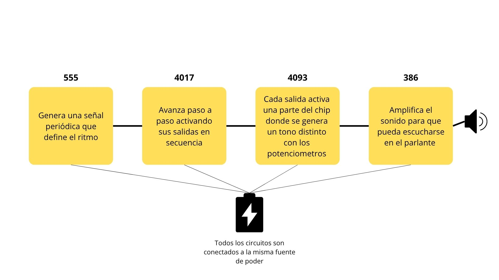

# sesion-06b

Fe de erratas: Según lo que pasó la clase pasada, hubieron errores que son correjibles. Una solución para estabilizar todo el circuito es con resistencias (la clase pasada igual hablaron de eso)

Condensadores Desacople: componente pasivo colocado entre la fuente de alimentación y tierra, lo más cerca posible de los pines de alimentación de un circuito integrado, para estabilizar el voltaje.

Condensadores de Acoplamiento: entre la conexion del potenciometro de la pata 2 y la entrada 3 del 386 deberia haber un condensador (filtro) de 100 uF

IC: en pocas palabras, el chip. o Integrated Circuit 

Para el futuro: Lm7805 *La gran promesa de los 5V* Regulador de voltaje

---

Entre todo el proceso para el fin de semana la idea es investigar que fuentes de alimentacion funcionarian para hacer una presentacion un poco más exotica

---

Empezamos con el desarrollo de la clase:

Siendo sincera aunque hiciera mi parte del trabajo como se me dijo, vi como mi grupo estaba tan entusiasmado con el tema de la carcasa...y bueno, no soy muy industrial para ayudar con ello (Me da un poco de lata no ayudar en cosas así, pero por respeto al tiempo de mis compañeras, prefiero no hostigar mucho)

Entonces, las imagenes y videos valen más que mil palabras.

Ver como modelan...es como guau, pero un guau que es así porque no entiendo nada

Cableando...y seguir cableando por cada una

...ya ni me molesto, fueron muchos minutos haciendo lo mismo, comprobar, ver, seguir y volver a comprobar

Pum, algo más semejante a un encuadre final

Y esto es algo incluso más completo *Que lindo y loco*

Spoiler: esto ya fue cuando nos funcionó...era para soltar una lagrima de felicidad

Y BOOM, VIDEOS:

---
Tarea de la casa:

Ok, como no pude ver nada de la carcasa, es mi turno de hacer algo por el team! y que mejor que hacer la "presentación" o parte de esta, ya que todo lo que es de carcasa...bueno...ya saben

EJEM.

<https://docs.google.com/document/d/1qIMDyYhwIFPpgcojij-dY1efTTOirKVZw2H7qRRULbE/edit?usp=sharing>

Este doc es parte central de lo que pondremos (espero) en el github después.

entre estas cosas intente recrear lo que se refiere a diagramas de cubos...

Y con todo eso...Viene el momento documentado 

Para este tema, Aarón ya nos habia comentado el tema, con ello el grupo comenzó a ver posibilidades, a mi se me hizo gracioso que con latas "energeticas" pudiera prender el circuito por lo que me puse manos a la o-

DIA DOMINGO: tenia los materiales necesarios, los cables y después veo...NO TENIA MI PROTO ¿COMO IBA A HACER LAS COSAS AHORA? era obvio que era mi fin...pensarian que no hice nada, me quitarian del grupo ( ╥ω╥ ) cualquier cosa

VI MI FIN!

pero lo lindo del cuerpo humano, es que es un conductor natural, y no solo eso, es una batería *no es como que podria explotar por la electricidad* 

Por lo tanto tocó hacerlo a la "mala"

Perfore agujeros, maté una resistencia, 3 cables y 2 leds *Vaya masacre*

PEEEEEEEEEEEEEEEEEEEEEEERO, al dia siguiente (lunes) fui por una proto en la mañana para comprobar una teoria que tenía en la casa

De una u otra manera no podia hacer que con solo el choque de las latas se prendiera el circuito, por lo tanto si hubiera un contacto discreto para el espectador, podriamos simular eso

Con uno de los cables muertos, lo pelé y con las puntas de cobre las inserte en nuevos agujeros de las latas

Y SI, FUNCIONA! por lo tanto si podemos esconder esta conexión, seria factible hacer esta activación del sintetizador.

Cabe destacar que hay muchas más maneras de hacerlo...pero por ser dia de lluvia ya se me ha cortado la luz como 4 veces, por lo que es señal de irme a la cama

https://www.instructables.com/Repurposing-Beverage-Cans-for-Low-Voltage-Electric/
https://microbit.org/es-es/projects/make-it-code-it/human-circuit-experiment/ 
https://www.sciencebuddies.org/science-fair-projects/project-ideas/Energy_p015/energy-power/make-a-battery-from-coins 

