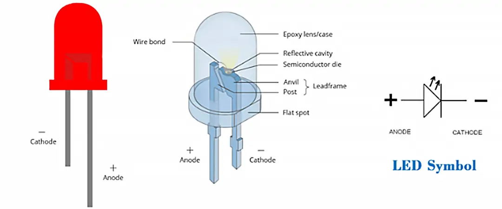
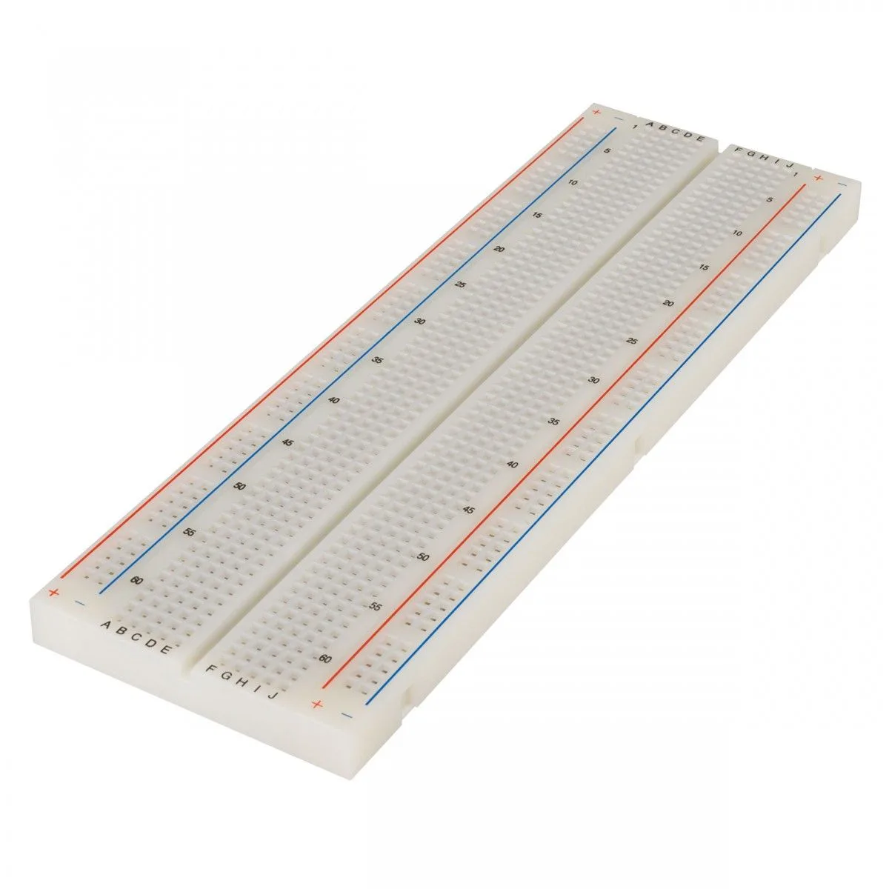
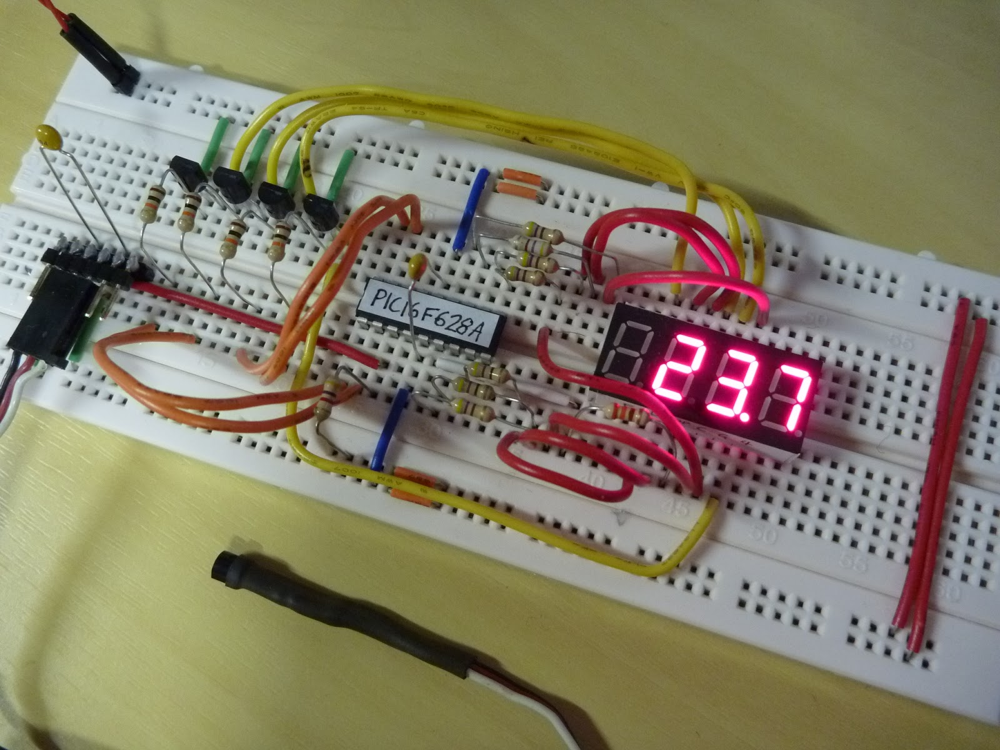
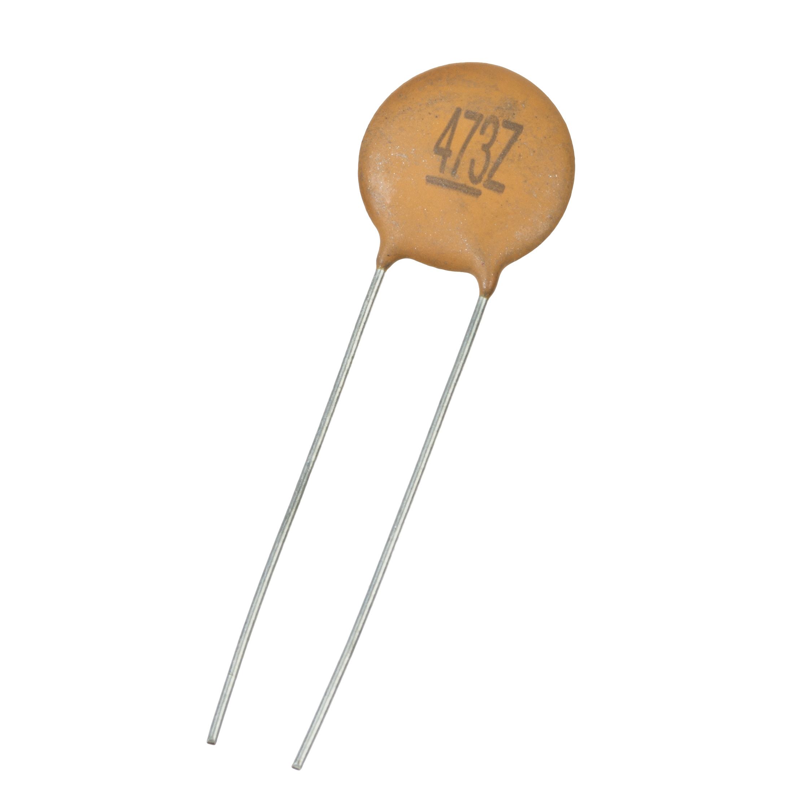
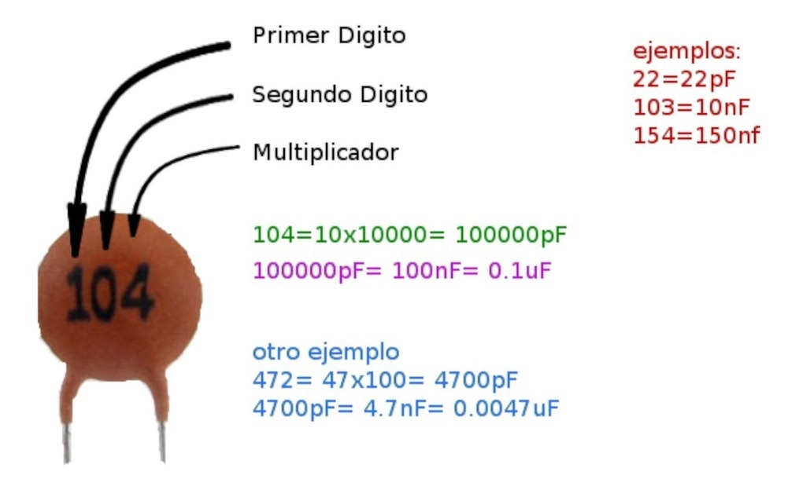
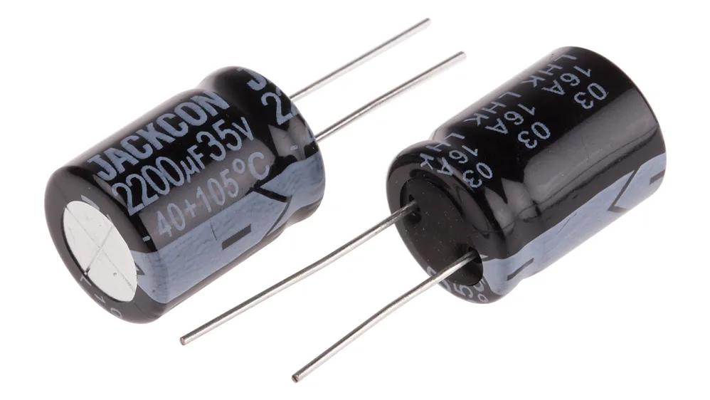
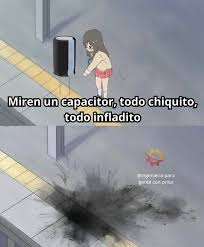
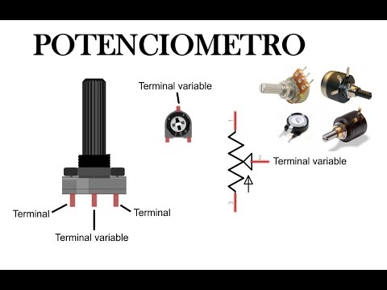
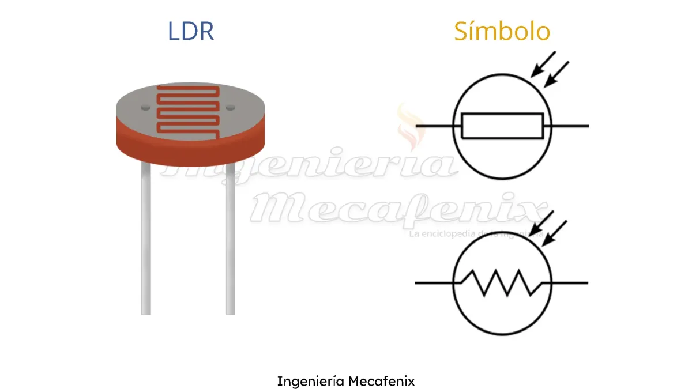

# sesion-02b

## Componentes ##

El dia de hoy revisamos una mayor variedad de componentes electronicos, por lo que realizaré un listado de los ya vistos:
### - Resistencia ###

***Encargado de que nada explote***

Una resistencia es el componente que *frena* un circuito. Si la electricidad fuera agua corriendo por una tubería, la resistencia sería un estrechamiento en el tubo que limita cuánto líquido puede pasar. Su función principal es controlar el flujo de electrones para que no lleguen con demasiada fuerza a piezas delicadas (como un LED) y las quemen.

Se mide en Ohms ($\Omega$) y no posee polaridad, por lo que no posee una orientación fija, lo puedes conectar como quieras. 

Para identificar el tipo de resistencia posee 4 colores, los cuales nos indican los valores correspondientes

 

### - Led (Diodo Emisor de Luz) ###

***Lucecita que se activa con poca energía***

Es básicamente un foco diminuto, pero mucho más eficiente y resistente que las ampolletas antiguas. En términos técnicos, es un componente que deja pasar la electricidad en un solo sentido y al hacerlo, brilla.

Si la resistencia era el **freno**, el LED es el **indicador** o la **estrella** del circuito. Lo más importante que es que tiene polaridad: si lo conectas al revés, simplemente no prende.

>Su lado positivo se llama ***anodo*** y su negativo ***catodo***

 

### - Batería ###

***Corazón energético***

Es un depósito que almacena electricidad mediante reacciones químicas, lista para *empujar* la corriente a través de los cables en cuanto cierras el circuito. Su potencia se mide en Voltios ($V$), que determinan cuánta fuerza tiene ese flujo y su duración en Amperios-hora ($Ah$). A diferencia de una resistencia, la batería tiene una dirección fija, es decir posee polaridad.

 

### - Cable ###

***Tuberías de electricidad***

Está compuesto por un alma de metal (normalmente cobre) que deja pasar los electrones con total libertad, envuelto en una capa de plástico que actúa como *muro* para que la electricidad no viaje por donde no debe. En electrónica, se usa para unir componentes y sin ellos la energía no tiene por dónde viajar.

 

### - Protoboard ###

***Lienzo donde se trabaja***

Simplemente se insertan las patas de los componentes (como LEDs o resistencias) y los cables en los orificios para conectarlos. Los bordes suelen tener líneas largas (buses) para la energía, mientras que el centro tiene filas divididas para separar los componentes. Es la herramienta perfecta para experimentar.

 

### - Capacitor ###

***Batería pequeñita***

Se le puede decir que es un amortiguador. Si la energía de la batería parpadea, el capacitor entrega lo que tiene guardado para que el flujo no se corte. Se mide en Faradios ($F$), aunque lo normal es ver microfaradios ($\mu F$) porque son piezas pequeñas. En electrónica, son esenciales para filtrar ruido y estabilizar voltajes. 

> Cada capacitor tiene un límite (ej. $16V$ o $25V$). Si le metes más de lo que aguanta, puede inflarse o incluso explotar.

#### Ceramico ####

Posee un sistema de codigo en su cara frontal

#### Electrolítico ####

> Posee polaridad, la franja con el signo menos ($-$) indica la pata negativa.

>Meme educativo
 

### - Potenciometro ###

***Reagulador dínamico***

Internamente tiene una pista de carbón y un contacto móvil (cursor) que se desplaza al girar el eje, cambiando la longitud del camino que recorre la electricidad. Se mide en Ohms ($\Omega$) y suele tener tres patitas para conectarse, las de los extremos son fijas, y la del centro es la que *varía* el valor según hacia dónde gires la perilla.

### - Fotoresistor (LDR: Light Dependent Resistor) ###

***Controlador según luz***

Es el componente responsable de que los postes de luz en la calle se prendan solos al anochecer. En términos técnicos, es un material semiconductor que reacciona a los fotones. No tiene polaridad, así se puede conectar en cualquier sentido.

### - Chip 555 ###

## Preguntas sesion-03a ##

1. ¿Cual es la manera correcta de utilizar los colores en la protoboard?
2. ¿Cual es el mínimo y máximo voltaje/amperaje que soportan los led?
3. ¿Cual es el límite para programar en GitHub?
4. ¿Que otros simbolos existen para los esquematicos?
5. ¿Como puedo generar planos o esquematicos?
6. ¿Que otros chips existen y en que se ocupan normalmente?
7. ¿Que son las compuertas logicas?
8. ¿Como se ocupa un multimetro?
9. ¿Que alternativas exiten a utilizar cables tipo dupont?
10. ¿Existe alguna otra ley, aparte de Ohm que sea necesaria estudiar para poder profundizar en la electronica?
11. ¿Que es un transistor?

 

## Elementos adicionales ###

Audio: Álbum con variedad de sonidos en base a ¿sintetizadores?

https://www.youtube.com/watch?v=3_NdwoTQykY&list=PLnBDrwd58yXKAe3gks6dvTxVwtQgC5Mb4

 

Video: Tipos de sonidos y sus respectivos esquematicos

https://www.instagram.com/reel/DWGpoQRKbAW/?utm_source=ig_web_copy_link&igsh=NTc4MTIwNjQ2YQ==
