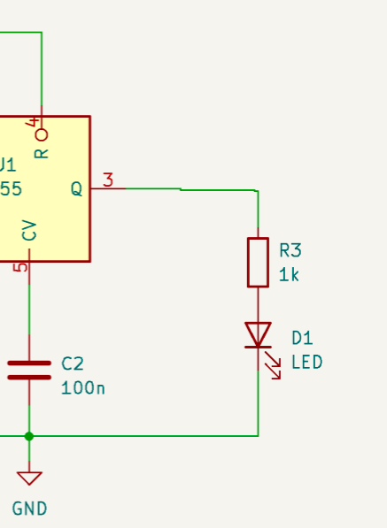
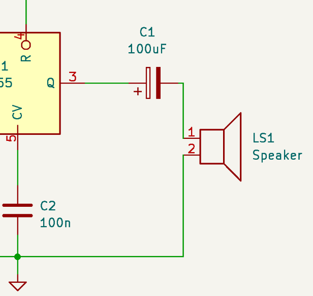
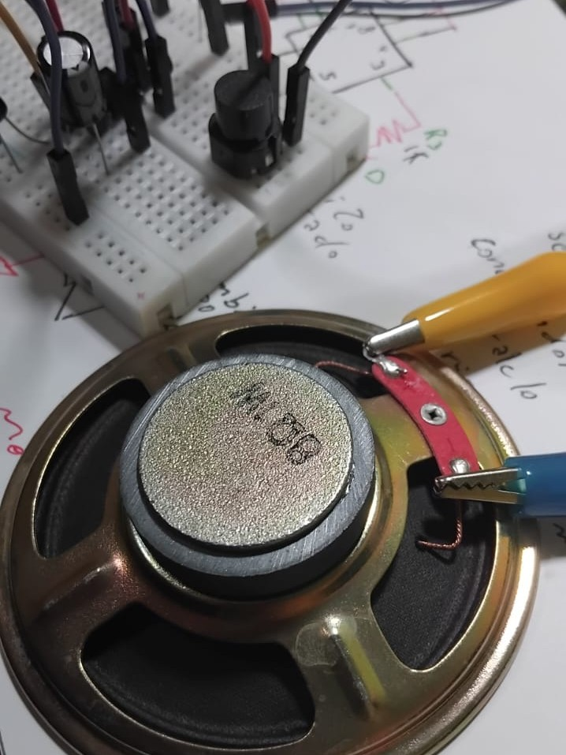
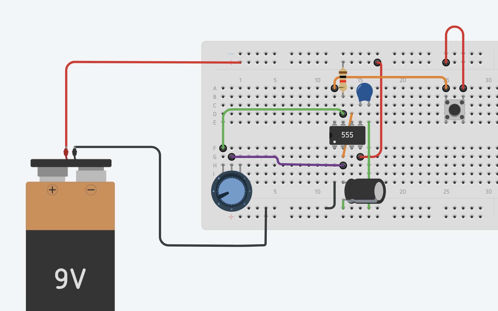
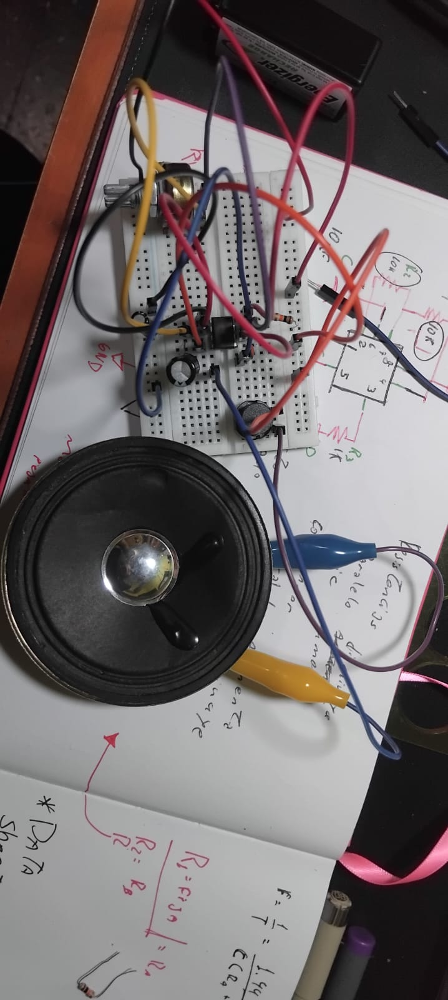
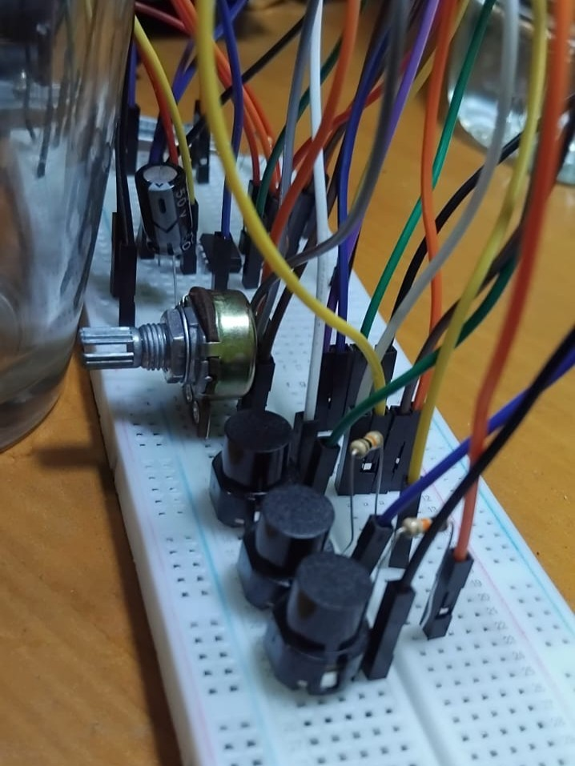
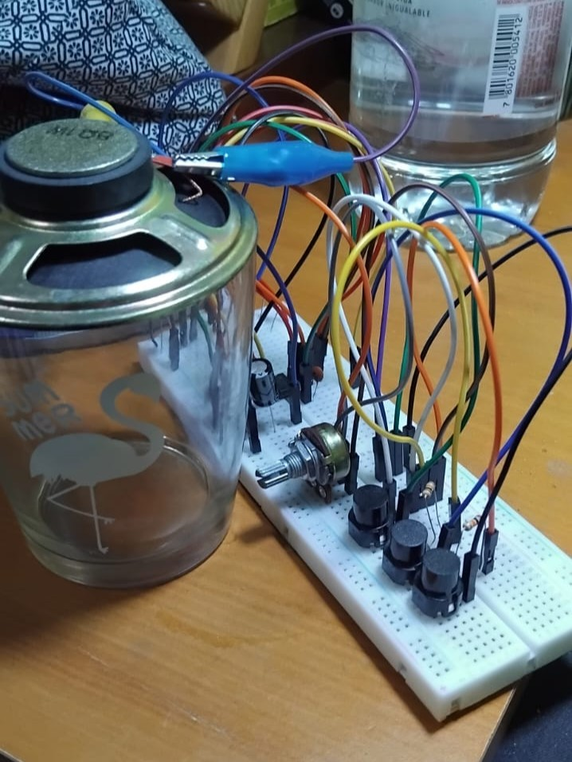

# sesion-03a

## Apuntes clase ##

Se trabajo sobre el esquematico de la clase anterior, donde se reemplazo ahora el Diodo o Led por el parlante. El principal cambio ocurre en el Output 3 del chip 555.

Donde se reemplaza R3 por un capacitor electrolitico (C3) de $100\mu F$

> Antes

 

> Despues

 

 

Importante mencionar que para concectar el parlante se utilizo un nuevo implemento, los caimanes, unos tipos de pinzas que sirven para hacer contacto

 

 

Luego empezamos a trabajar para tener una ***Interfaz*** (bonita palabra), por lo que agregamos un interuptor al sistema. Acá se mencionó que existen de 2 tipos

- **Fijos o con memoria:** Pueden recordar el estado en el que se les deja, como el interruptor de luz (o como la Ultimate de Nunu y Willump en LoL)
- **Pulsadores:**  Estos al momento de soltar deja de *funcionar*, como los timbres de las casas (o como la Ultimate de Malphite en LoL)

Para estos ejercicios utilizamos los pulsadores.

 

> Ejercicio Realizado

 

## Encargo ##

### 1. Toy Organ Cirtcuit ###

 

Parte importante de lo que se descubrio al momento de realizar este *plano electronico* es la relación que poseen los switch o interruptores que se ven es que poseen cierta relación en sus *velocidades*

Cabe destacar que este ejercicio se busco resolver de manera individual primero, generar ideas propias y luego comparar entre el grupo.

> Al referirme a *velocidad*, se puede entender al tiempo que ocurre entre cada *tick* o sonido que se produce. Basicamente a la frecuencia con la que ocurre el sonido,  pero no me quiero aventurar a decir que esta **frecuencia** es directamente de la onda o pulso electrico (Preguntatr en clase o investigar prontamente sobre si viene al caso denominar de esta manera)
> > Para representar velocidad se usará $\overrightarrow{v}$. Esto con el fin de evitar tanta redundancia de palabras
> >  Si nos referimos a las ***frecuencias del sonido*** (Hz) se utilizará la palabra ***tono***. Entiendo que no son necesariamente lo mismo, pero a fines practicos, nos encontramos en el umbral de un abismo de contenido, por lo que el usar terminos más ambiguos en lo relacionado a sonido será solo momentaneo.

 

| Switch 1 | Switch 2 | Switch 3 | Potenciometro |
| - | - | - | - |
| Mayor velocidad base | Velocidad menor a Switch 1 | Velocidad igual a Switch 2 | Regula la Velocidad de todos los Switch, además de cambiar el ***tono*** del sonido |

> Revisando los apuntes me percate que existe una relación entre el periodo de la frecuencia y su ***tono***. A una mayor $\overrightarrow{v}$ más agudo el sonido
> > No quise editar las tablas, porque siento que es parte del aprendisaje mostrar mis primeras interpretaciones de lo sucedido

Ahora bien, lo curioso ocurre al presionar uno o más interruptores

| Sw2 + Sw3 |
| - |
| El periodo de su frecuencia aumenta |

| Sw1 + Sw2 y/o Sw3 |
| - |
| Prevalece la $\overrightarrow{v}$ del Switch 1, por sobre cualquiera de ambos sonidos | 

 

### Documental ###

A pesar de incialmente la idea de ver un documental sobre la historia de la música electroacustica no era muy de mi agrado, logré rescatar un par puntos que me llamaron la atención y que se podrían investigar en otro momento.

Primero debemos entender que este documental se enfoca en la vida de José Vicente Asuar, pionero de la música electroacustica en Latinoamerica.

Dentro de su historia, el COMDASUAR fue de lo más impresionante, es un instrumento electronico pionero, puesto que fue un predecesor del concepto MIDI**1**. Lo importante de esto es pensar y recordar que en Lationoamarica y más especificamente en Chile se puede crear, fabricar y pensar, no solo en Europa o Asia.

> **1** El **MIDI** (siglas de musical instrument digital interface, o en español ‘interfaz digital de instrumentos musicales’) o midi es un estándar tecnológico que describe un protocolo, una interfaz digital y conectores que permiten que varios instrumentos musicales electrónicos, computadoras y otros dispositivos relacionados se conecten y comuniquen entre sí.
> > Def. de WIKIPEDIA

 

 

---

> Probe una manera más didactica de escribir mis apuntes, utilizando referencias y a ratos lenguaje más coloquial, espero que no haya ningún problema
