# sesion-05a

## Apuntes Clase 07 de Abril ##

### Compuertas lógicas ###

Estan basasadas en la algebra booleana. En simple palabras son sistemas que al recibir 2 input generan un output dependiente de que sistema hablamos. Un ejemplo de esto es la compuerta AND, la cual para tener un outpot positivo (_1_), dependemos de que ambos input sean tambien positivos.

Otra manera más técnica sería: _"Es una conjunción lógica que resulta verdadera si y solo si todas sus premisas son verdaderas."_

#### AND ####

Ya se explicó anteriormente, pero en resumen, su output es 1 exclusivamente cuando A y B son 1, para el resto de los casos es 0

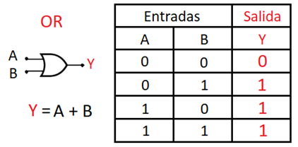

 

#### OR ####

Su salida será 0 siempre que A y B lo sean, para el resto de casos es 1

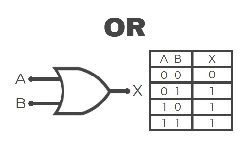

 

#### NOT ####

La lógica de esta compuerta radica en la negación, si recibe un 1 saldrá un 0

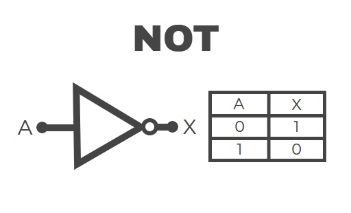

 

### Chips Nuevos ###

#### Chip 4093 ####

Se compone de 4 compuertas NAND, que es la unión de una AND y una NOT, es decir que convierte la salida normal de AND y la invierte, por ejemplo si el output AND es 0 luego de pasar por NOT, se convierte en 1.

Sus pines se distribuyen asi:

| Pin | Función      | 
| --- | ------------ | 
|  1  | 1er NAND (A) |
| 2   | 1er NAND (B) |
| 3   | 1er NAND (Y) |
| 4   | 2do NAND (Y) |
| 5   | 2do NAND (A) |
| 6   | 2do NAND (B) |
| 7   | Ground       |
| 8   | 3er NAND (A) |
| 9   | 3er NAND (B) |
| 10  | 3er NAND (Y) |
| 11  | 4to NAND (Y) |
| 12  | 4to NAND (A) |
| 13  | 4TO NAND (B) |
| 14  | VCC          |

>Es importante al momento de utilizarlo que se conecte un Capacitor de 100 μF para que sirva de _amortiguador_ y que el _ruido_ de la corriente no queme el chip

 

#### Chip LM386 ####

Su función es la de amplificar

Este chip se diseño para uso más pedagógico, debido a la posibilidad de trabajar de mejor manera con baterías de 9v y Parlantes de 8Ω, elementos tradiciones en los kits DIY

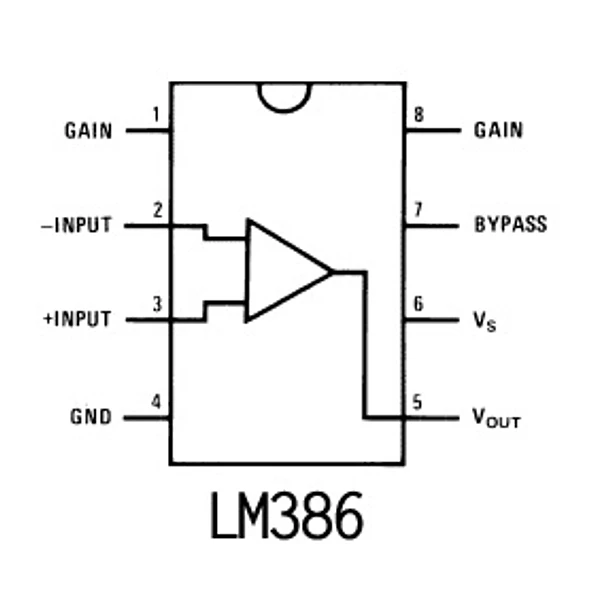

| Pin | Función                   | 
| --- | ------------------------- | 
|  1  | Gain                      |
| 2   | Invertign Input (-)       |
| 3   | Non - Inverting Input (+) |
| 4   | Ground                    |
| 5   | Outpu                     |
| 6   | VCC                       |
| 7   | By Pass                   |
| 8   | Gain                      |

>Si se conecta el pin 1 y 8 mediante un capacitor de 10μF la ganancia pasa de 20 a 200
>
>>La ganancia es la relación matemática entre la magnitud de la salida y la magnitud de la entrada
>>
>>> **Ganancia baja (20)**: Se usa cuando la señal de entrada ya es relativamente fuerte (como la salida de un teléfono o computadora). Evita que el sonido se distorsione rápidamente
>>>
>>> **Ganancia alta (200)**: Se usa para señales muy débiles, como las de un micrófono o una guitarra eléctrica. Al aumentar tanto la señal, el chip se vuelve más propenso a captar ruido o a "saturar" (cortar la onda), lo que genera distorsión

 

### Sonido y sus alteraciones ###

En los circuitos que estamos conociendo y probando se puede concluir que tanto Resistencias y Capacitores afectan al sonido, mediante algo similar a un filtro

### Sintetizadores ####

Se componen de diferentes módulos, siendo 4 principalmente:

 

#### 1. Oscilador / VCO ####

Convierte una onda constante y _fome_ a una más compleja, teniendo 4 principales formas:

a. Sinusoidal: Esta basada en el concepto trigonométrico del Sin (seno), por lo que son curvas .

b. Triangular: Es una onda con forma triangular, esto genera que sus cambios sean _difuminados_, pero rápidos a la vez

c. Square: Posee forma cuadrada, por lo que presenta alteraciones directas entre el monte y el valle 

d. Saw: Se considera el tipo de onda más compleja, por su forma de sierra

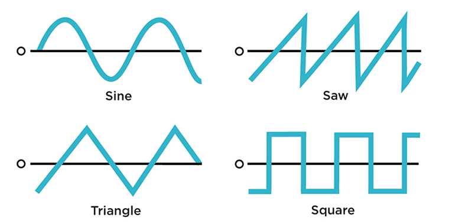

> Se pueden controlar mediante VC

 

#### 2. Filtro ####

Un filtro eléctrico o filtro electrónico es un elemento que elimina una determinada frecuencia o gama de frecuencias de la señal eléctrica que pasa a través de él, pudiendo modificar tanto su amplitud como su fase. Los filtros electrónicos son particularmente importantes en la síntesis substractiva y están controlados a menudo por una envolvente o un LFO. Tenemos tres tipos fundamentales: de paso alto, de paso bajo o de paso de banda.

#### 3. Amplificadores / VCA ####

Aumenta la ganancia de una onda eléctrica en función de un voltaje de control, puede decirse que hace lo contrario a los filtros. El voltaje que sirve de control en el funcionamiento puede provenir de un generador de envolventes o un LFO.

 

#### 4. Generadores de envolventes / ADSR ####

Cuando se genera un sonido, se producen variaciones en la potencia y en el contenido del sonido a lo largo del tiempo. Las fases por las que pasa la ejecución de un sonido a lo largo del tiempo se denominan:

1. **A**ttack: Es el tiempo de entrada. La forma en que va aumentando la potencia del sonido desde que se toca la nota hasta que alcanza su máximo

2. **D**ecay: Una vez alcanzado el máximo en la intensidad del sonido éste baja ligeramente hasta llegar un punto en que se estanca

3. **S**ustain: La intensidad en este punto permanece constante mientras se mantiene la ejecución de la nota

4. **R**elease: El tiempo y la forma en que va desvaneciéndose el sonido una vez que dejamos de tocar la nota

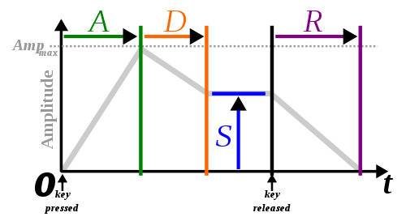

 

#### Apartado siglas ####

- VCC: Voltage Common Collector (Fuente de energía)

- VC: Voltage Control ()

- VCA: Voltage Controlled Amplifier (Amplificador)

- VCO: Voltage Controlled Oscillator (Oscilador)

- DAC: Digital-to-Analog Converter (Conversor de señal digital a análoga)

- LFO: Low Frecuency Oscillator (Oscilador de baja frecuencia)

 

### Eurorack ###

Es un formato de sintetizador modular, por lo que si se quieren conectar diversos modulos, estos deben permanecer bajo el mismo tipo. Por lo que conectar un VCA Eurorack con un VCO Mugg podría terminar en una máquina de humo en vez de sintetizador, esto se debe a que cada sistema se articula en base de diferentes configuraciones.

Otra manera de ver esto es tratar de que mi amigo que tiene Minecraft Bedrock juegue conmigo que tengo Minecraft Java, no se puede, dado que son sistemas incompatibles que funcionan bajo lógicas diferentes

#### VCV Rack ####

Es un software donde se simula la experiencia de uso en sintetizadores modulares, el cual tiene una interfaz muy practica al momento de aprender y experimentar sin quemar nada en el proceso

Esta basada en el estándar Eurorack

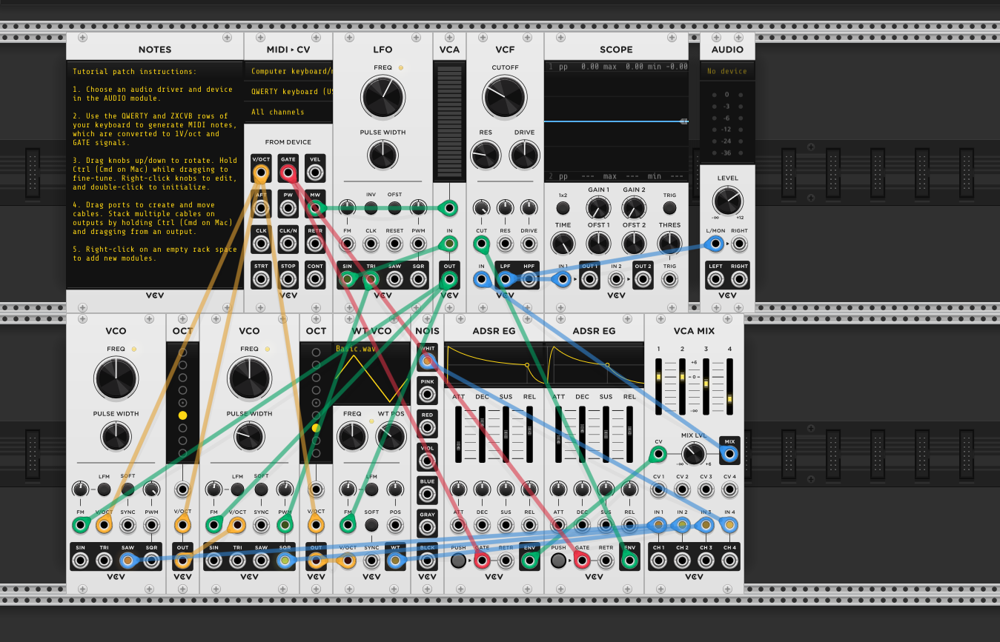

 

### Moritz Klein ###

Dentro de los referentes que se mencionan en clase destaco a Moritz Klein. Quien vende (en colaboración con https://www.ericasynths.lv/) modulos Eurorack, con la particularidad de que adjunta manuales en sus kit DIY para usuarios que no tengan ningún conocimiento previo

>Acá destaco no solo el compartir la información para que aún sin comprar el modulo, uno pueda hacer su propia versión, sino que tambien el aspecto gráfico de este, no es como los de IKEA o LEGO, pero transmiten de la mejor manera todo lo necesario para entender

https://moritzkleininstruments.com/

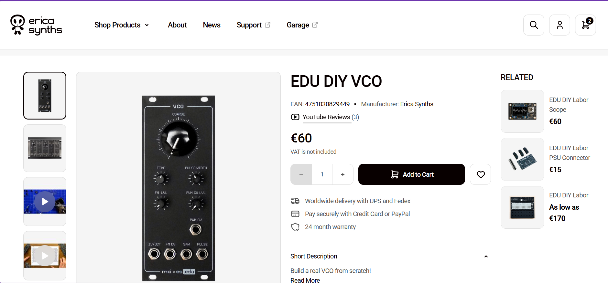

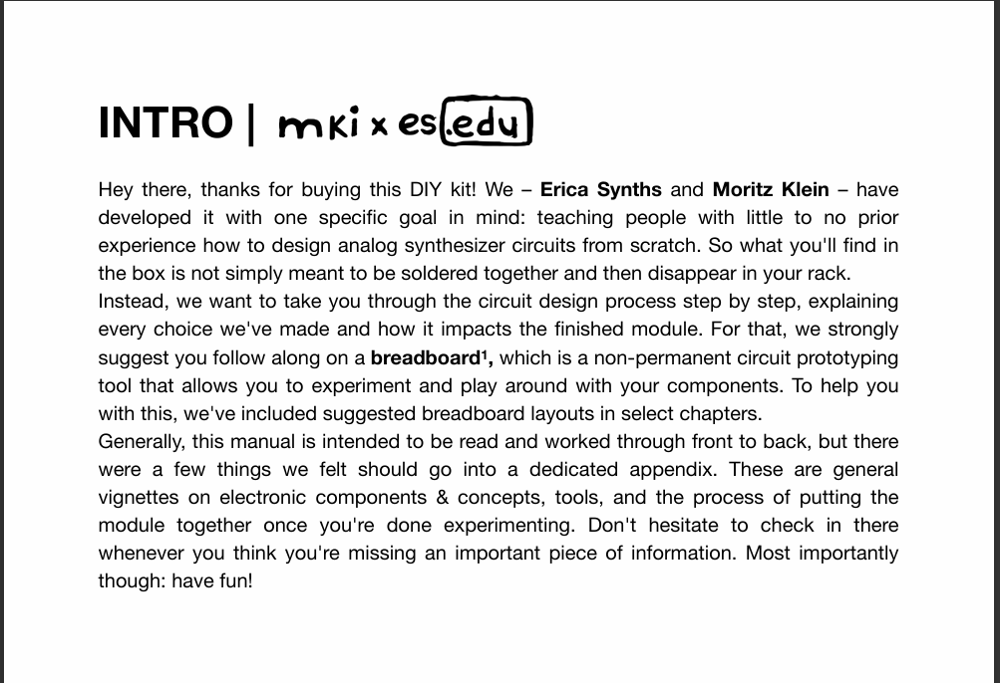

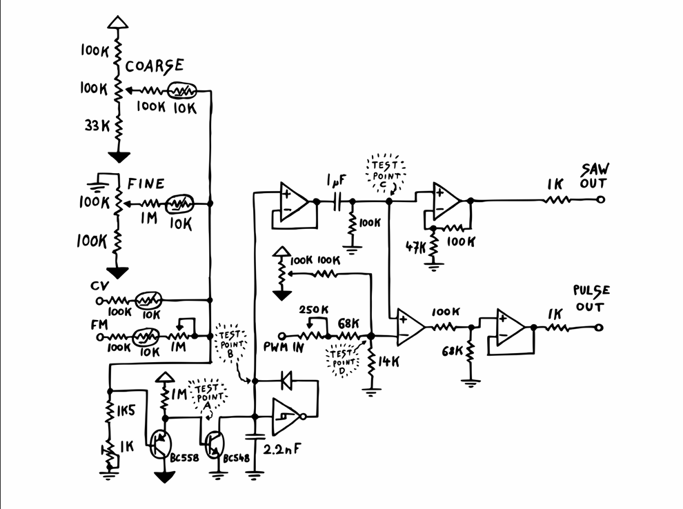

 

#### Videos ####

Cabe mencionar Klein posee un canal de youtube (https://www.youtube.com/@MoritzKlein0), en el cual explica y realiza algunos kits o enseña principios ligados a los modulos

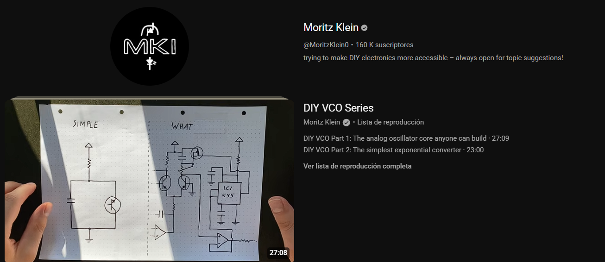

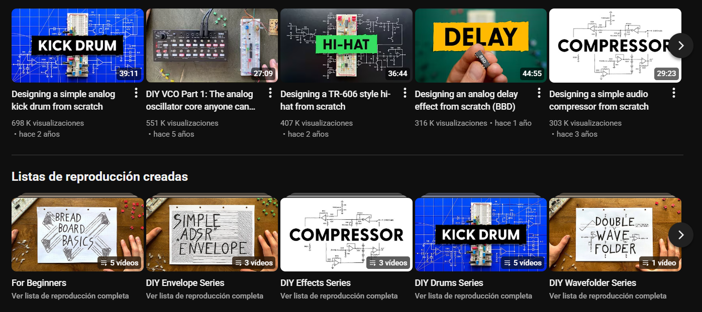

 

## Ejercicios Aplicados ##

### Oscilador ###

En clase fabricamos un oscilador o también llamado VCO, esto en base a un chip 4093, haciendo uso de sus compuertas _NAND_

Algo importante a detacar es que el Pin 1 se conecto directamente a VCC, esto con el fin de tener 2 posibles resultados de los 4 probables que se obtienen generalmente.

A esto se suma la incorporación del chip LM386, el cual amplifica la corriente para tener un resultado más notorio.

>Acá solamente utilizamos una compuerta NAND (de momento)

 

Una vez desarrollado, hicimos una variación. Ahora en vez de conectar el Pin 1 a VCC lo conectamos al Pin 11, el cual es el output de otra compuerta NAND. El resultado es que ahora tenemos un Oscilador que activa otro oscilador (Inception xd)

La función de la nueva compuerta NAND es servir a modo de Reloj, por lo que tambíen serviría un 555 Astable

>Recordemos que un reloj (CLK / Clock) no es más que un _metrónomo_ presionando un switch pulsador

 

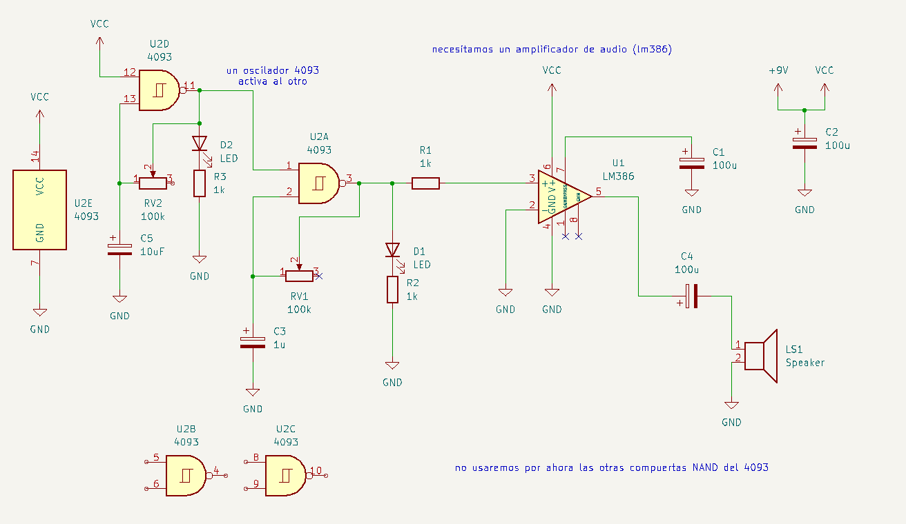

 
 
## Encargo / _Schmitt Trigger_ ##

Este sistema establece un umbral para definir cuando algo está encendido y cuanto está apagado, este umbral se genera tomando como referencia 2 voltajes diferentes, por lo que elimina el _ruido_ que podría alterar a un comparador normal. 

Por ejemplo: Si estamos jugando Minecraft tenemos 3 posibilidades 

a. Estar quieto (0)

b. Caminar (0.5)

c. Correr (1)

Y estas se definen según cuanta presión apliquemos al botón _W_, siendo 0 no presionar y 1 tener la tecla hasta el fondo, un comparador normal entendería que:

a. Estar quieto (0 - 0.4)

b. Caminar (0.5)

c. Correr (0.6 - 1)

Por lo que si jugamos normalmente y tenemos ligeras variaciones como 0.4 a 0.6 tendriamos a _Steve_ pasando de caminar a correr a estar quieto de manera intermitente e irregular. Lo más normal es querer variar estos umbrales tan sensibles, ahí entra en juego el Shmitt Trigger, quien establecería límites _más reales_, es decir que entendería que:

a. Estar quieto (0 - 0.2)

b. Caminar (0.3 - 0.7)

c. Correr (0.8 - 1)

Estableciendo un rango más amplio y reduciendo la sensibilidad.

> Entiendo que puedan existir ciertos puntos que no asemejen la realidad del funcionamiento del sistema en cuestión, pero en tintes generales esta fue mi manera de entender como funciona
>
> > Se que para correr en Minecraft se debe presionar la _W_ dos veces con un determinado tiempo, no soy fake fan xd
