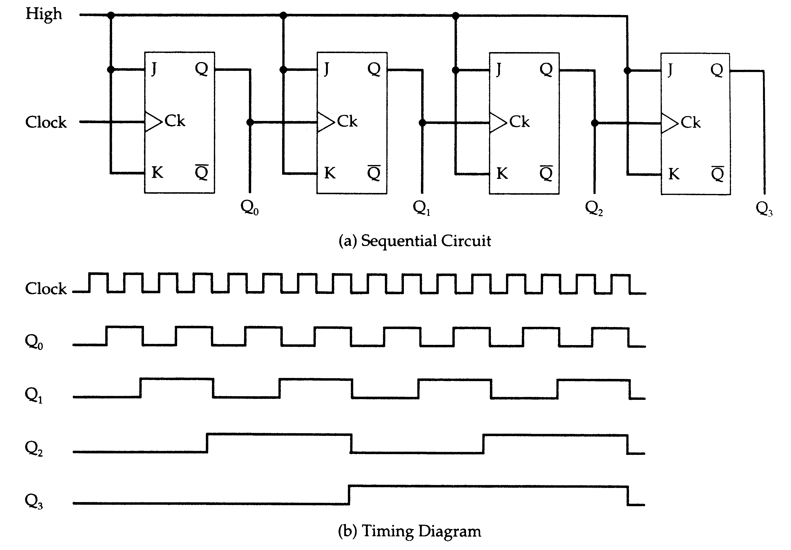
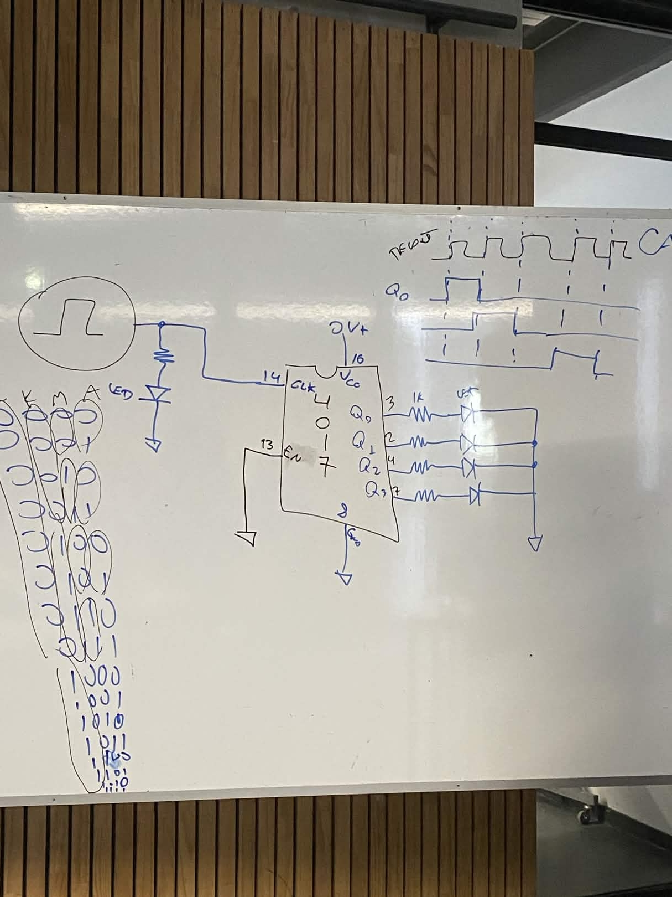

# sesion-05b

## Apuntes clase 10 de Abril ##

### Importante ###

Empezar a pensar en como se relacionan los sistemas electronicos con el usuario 

>Diseño UX

- Push, Turn, Move: Libro enfocado a la interfaz en sistemas electronicos

 

### Contador de decada / Secuenciador ###

Trabajamos con el chip 4017 (que quemé en 5 minutos xd), el cual es un secuanciador o contador de decadas (_cuenta_ con sus 10 salidas), se basa en el conteo binario

| Números de base 10 | $2^{4}$ | $2^{3}$ | $2^{2}$ | $2^{1}$ |
| ------------------ | ------- | ------- | ------- | ------- |
| 1                  | 0       | 0       | 0       | 1       |
| 2                  | 0       | 0       | 1       | 0       |
| 3                  | 0       | 0       | 1       | 1       |
| 4                  | 0       | 1       | 0       | 0       |
| 5                  | 0       | 1       | 0       | 1       |  
| 6                  | 0       | 1       | 1       | 0       |
| 7                  | 0       | 1       | 1       | 1       |      
| 8                  | 1       | 0       | 0       | 0       |
| 9                  | 1       | 0       | 0       | 1       |
| 10                 | 1       | 0       | 1       | 0       |
| 11                 | 1       | 0       | 1       | 1       |
| 12                 | 1       | 1       | 0       | 0       |
| 13                 | 1       | 1       | 0       | 1       |
| 14                 | 1       | 1       | 1       | 0       |
| 15                 | 1       | 1       | 1       | 1       |
 

| Pin | Función | 
| --- | ------- | 
| 1   | Q5      |
| 2   | Q1      |
| 3   | Q0      |
| 4   | Q2      |
| 5   | Q6      |
| 6   | Q7      |
| 7   | Q3      |
| 8   | Ground  |
| 9   | Q8      |
| 10  | Q4      |
| 11  | Q9      |
| 12  | CO      |
| 13  | CI      |
| 14  | CLK     |
| 15  | MR      |
| 16  | VCC     |

- CO: Envía un pulso cada 10 ciclos; sirve para conectar otro 4017 y contar hasta 100.
- CI: (clock inhibit ) Si se conecta a positivo, el chip "ignora" el reloj y detiene el conteo
- CLK: Clok, es donde se debe conectar un reloj al chip (555 Astable / 4093 )
- MR: (Reset)	Si recibe un pulso positivo, el conteo vuelve inmediatamente a la salida 0.

 

