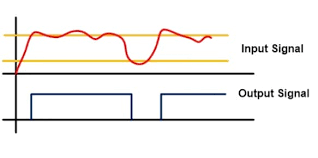
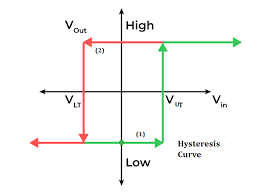
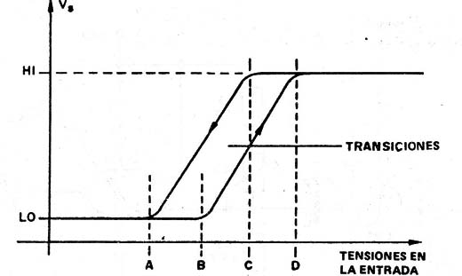
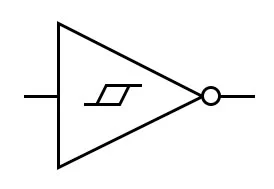
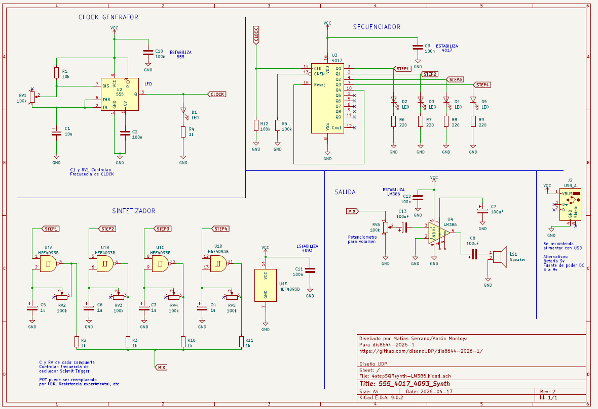
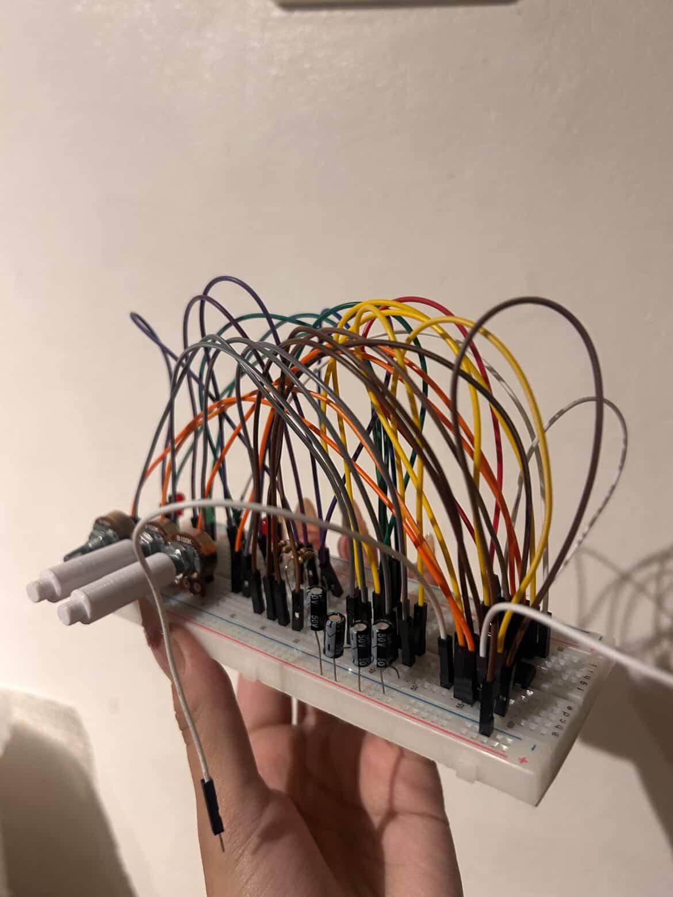
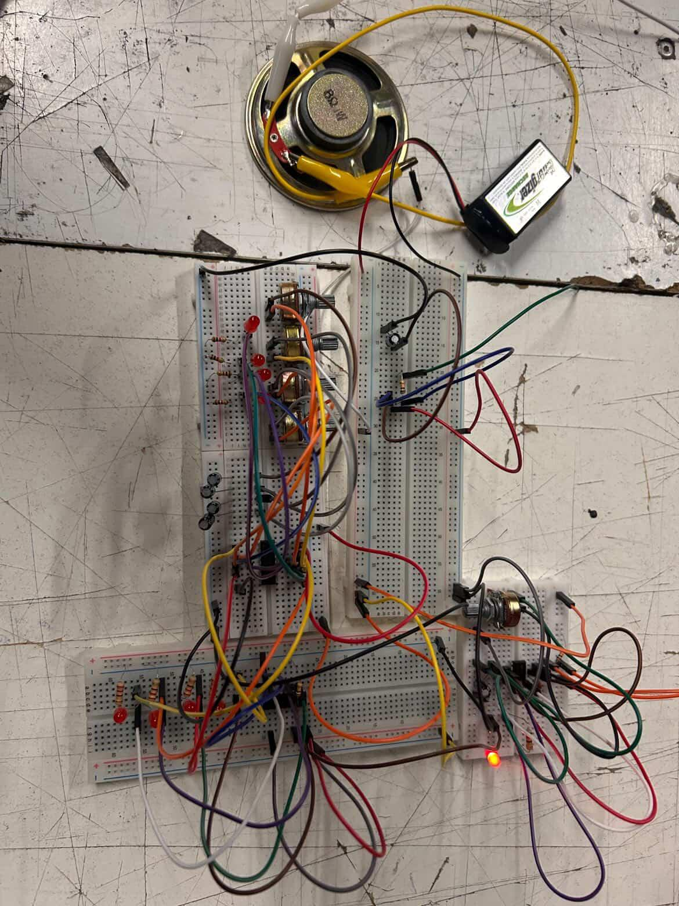
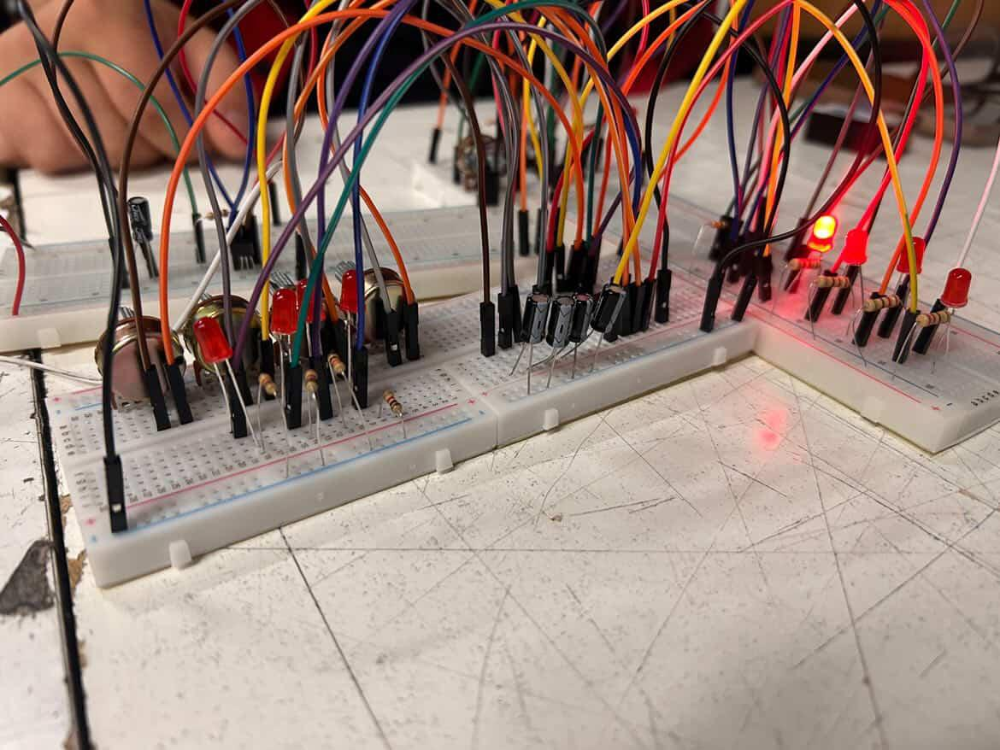
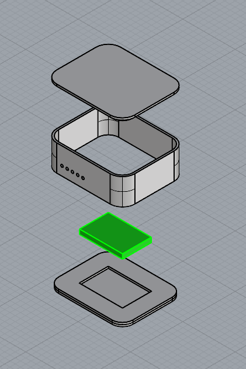
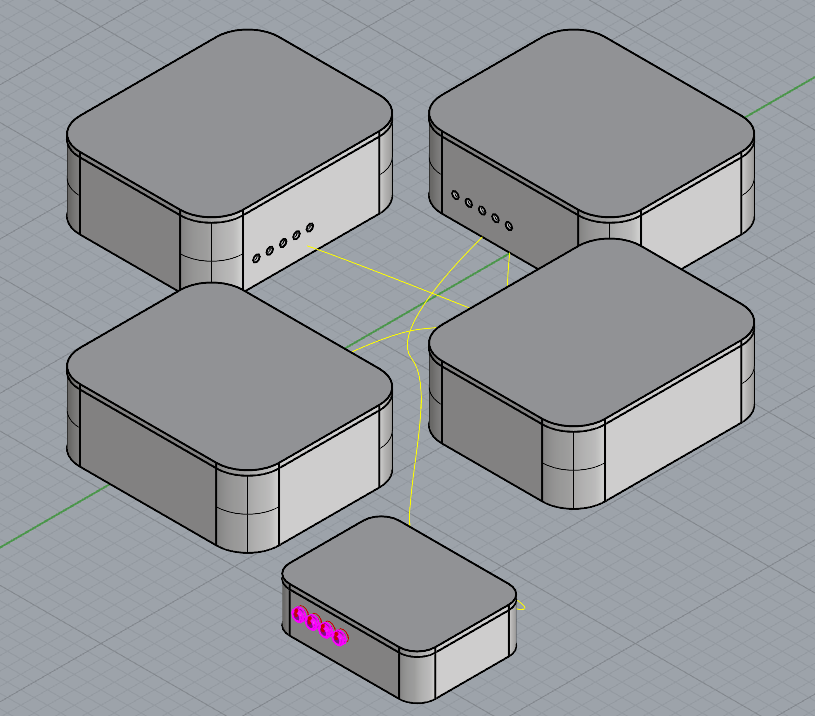

# sesion-06a

## Apuntes clase 14 de Abril ##

### 30 minutos ###

Se inicia la clase con los tradicionales 30 minutos _offside_, que en lo personal llamaría "ronda de referentes", porque siempre termino con varios libros y/o personas relevantes. En este caso tenemos:

1. Bibliografía

- Aesthetic Programming: A Handbook of Software Studies

  - Se analiza al código más que meramente como software, sino que se plante como herramienta estetica y política. Todo esto es analizado desde el como impacta la cultura dentro del desarrollo de software

- The Nature of Code: Simulating Natural Systems with JavaScript

  - Guia sobre código en p5.js (que no es más que JavaScript), enseña a recrear comportamientos de la naturaleza mediante código, como pueden ser las leyes de movimiento de Newton hasta fractales, evolución genética y redes neuronales

 

2. Portafolio Template:

   Misa nos compartió el proceso de realización de su portafolio, la peculiaridad es que se desarrolló mediante Github y ____ (no recuerdo el elemento, si alguien sabe recuerdeme por favor). Lo importante de esto radica en la versatilidad del resultado, esto se puede lograr porque en Github podemos organizar la información por **jerarquías**, para luego exportarlo a un sitio web, controlando como se van a visualizar cada elemento según la jerarquía establecida. Acá es donde podemos lograr varíar el resultado, debido a que podemos seleccionar de manera dínamica que se visualizará, generando un portafolio específico según lo que necesitemos, siempre y cuando tengamos todo lo necesario cargado en Github.

   >Me gustaría profundizar más en el como se logra, esto es por las ganas de aprender y poder realizar mi portafolio de una buena vez
   >
   >> Viendo algunos resultados tanto de compañeros como de profesores puedo decir que es de lo mejor me podrían haber enseñado

 

3. Dossier / CV

Haciendo un enlace con el punto anterior tenemos una definición de terminos importantes no solo como estudiante de diseño, si no que como futurx profesional

- Portafolio: Es una recopilación de proyectos realizados, acá lo que destaca es el proceso por sobre información profesional como podría ser la casa de estudio o trabajos anteriores [***Proyectos con su respectivo proceso***]

- Curriculum Vitae: Siendo el más conocido, posee un enfoque a ser un resumen sobre la carrera profesional (tiende a ser solo una plana de hoja carta). Contiene información como: centros de estudios y grados académicos, puestos de trabajo relacionados al cargo a postular, habilidades y destrezas, etc [***Historial laboral***]

- Dossier: Posee una mayor extensión en comparación al CV, esto porque no busca ser un resumen sino un recopilatorio detallo de proyectos y trabajos realizados [***Hoja de vida laboral***]

 

### Familia CD 4000 ###

Es un conjunto de Circuitos Integrados (IC) del tipo CMOS (Complementary Metal-Oxide-Semiconductor). Introducida originalmente por RCA en los años 60, es popular porque funcionan con voltajes entre 5V y 12V, por esto la gran mayoría de proyectos DIY los utilizan (sumado a su bajo costo)

>Valor aproximado del chip 4093: $300clp 
>
>> Tienda de referencia **Electrónica Ibarra**, ubicada en **San Diego 920**

 

| **Nombre** | **¿Qué hace?**                                           | **¿En qué se ocupa?**                                                      | 
| ---------- | -------------------------------------------------------- | -------------------------------------------------------------------------- |
| **CD4017** | Contador de décadas con 10 salidas                       | Secuenciadores y divisores de frecuencia                                   |
| **CD4011** | Contiene cuatro compuertas NAND                          | Creación de osciladores, detectores de nivel y lógica combinacional básica |
| **CD4026** | Contador de décadas que maneja displays de 7 segmentos   | Relojes digitales y paneles numéricos sencillos                            |
| **CD4066** | Interruptor de control de señales analógicas y digitales | Conmutación de audio, ruteo de señales de sensores y multiplexación        |
| **CD4013** | Doble Flip-Flop tipo D                                   | Memorias de un bit y botones de encendido/apagado                          |
| **CD4093** | Contiene 4 compuertas NAND con **Schimitt Trigger**      | Osciladores estables y eliminación de rebotes en botones y sensores        |

 

### Schmitt Trigger ###

Ahora finalmente comprendí bien el funcionamiento del Schmitt Trigger. Basicamente consta de un "_doble seguro_", por lo que una corriente debe pasar 2 límites para generar un cambio en una onda cuadrada, esto con la finalidad de evitar que el _ruido_ genere ondas indeseadas 

Histéresis: 

> Acá se puede apreciar como la onda con ruido se rectifica gracias al "_Schimitt Trigger_"

 

> Representación tradicional de la transformación de onda
>
> > Eje X: Voltaje de Entrada
> >
> > > Izquierda: $V_{LT}$ (Lower Threshold): El umbral inferior. La salida solo pasará de Alto a Bajo cuando la entrada caiga por debajo de este punto.
> > >
> > > Derecha: $V_{UT}$ (Upper Threshold): El umbral superior. La salida solo pasará de Bajo a Alto cuando la entrada supere este punto. 
> >
> > Eje Y: Voltaje de Salida
> >
> > > Abajo: Generalmente cercano al voltaje de saturación negativa o tierra (GND)
> > >
> > > Arriba: Generalmente cercano al voltaje de saturación positiva o $V_{CC}$

> ***Ahora con todas las imagenes y gráficos podemos decir el porque del simbolo***

 

#### CD4093 ####

 

Ahora viendo al IC 4093 podemos entender que posee 3 funciones en una:

- ***AND + Histéresis + NOT***

Si retomamos el como funciona, hay que entender que tenemos 4 modulos (que corresponden a las compuertas NAND), además de la alimentación. Cada módulo funciona de la misma manera, lo que nos importa acá es el compartamiento en general, puesto que ya se explicó en sesiones anteriores el como es por dentro y el porque de cada pin.

Si conectamos una de las entradas de la compuerta (por ejemplo el pin 1) logramos reducir de 4 estados posibles a solo 2. Siguiendo esta lógica podriamos conectarle un reloj (como un 555 Astable) para lograr una variación de onda cuadrada

 

## Ejercicios / Sintetizador de 4 pasos ##

En clase unimos ya los 4 chips que hemos visto hasta el momento, siendo el 555, 4017, 4093 y 386

El proceso inicio en esta clase y continuo hasta siguientes sesiones

 

 

Por lo que podemos ver tenemos 4 secciones:

1. Clock → 555

2. Secuenciador → 4017

3. Sintetizador → 4093

4. Salida → 386

 

### Organización grupal ###

Considerando que el proyecto consta de 4 chips, separamos el trabajo de manera que cada una pudiera realizar uno de los circuitos, para luego conectarlos entre sí. Esta idea en la practica puede resultar útil, pero nosotras lo realizamos sin establecer directrices, por lo que cada quien realizó todo como prefería, entonces al momento de interconetar todo, no funcionó. Lo siguiente no fue la mejor manera de solucionar todo, ya que nos separamos en parejas para **rehacer** 2 circuitos cada par, pero nuevamente sin lineamientos generales, logrando así que lo que antes funcionaba, ya no lo hiciera y al revés 

  Inicialmente daban señales de vida el Clock (555 Astable) y el Secuenciador (4017), pero luego en la 2da parte, estos dejarán de funcionar, no así el Sintetizador (4093) y la Salida (386).

  Algo que se descubrió en este proceso es lo ya mencionado, **directrices**, cuando se logró hacer funcionar al 4093 y 386, lo que cambió fue el orden y parámetros clave. Entendiendo que el Sintetizador funciona con las 4 compuertas NAND del 4093, todas poseen la misma lógica de armado, entonces se establecio:

| De        | Hasta         | Color    |
| --------- | ------------- | -------- |
| Chip      | Capacitor     | Amarillo |
| Capacitor | Potenciometro | Gris     |
| Chip      | Potenciometro | Naranjo  |
| Chip      | Step ____     | Blanco   |

La lista es obviamente más larga, pero la idea es entender que se esteblecio un sistema para entender bien que todo esté conectado donde corresponde. Esto ayudo enormemente no solo en entender y corroborar, sino que al momento de armarlo, se podía realizar de manera más eficiente. Lo que podría mejorar aún más esto, es el etiquetar cada cable con su compuerta NAND correspondiente, estó haría todo mucho más comodo.

 

### Imagenes ###

 

 

### Trabajo Post-Clase ###

Finalizando la clase se nos informó en que consistia la entrega, sumado a la realización y funcionamiento del Sintetizador Modular, debemos encapsularlo en una caja de cartón (lastimosamente para mí, ya que quería diseñar algo en 3d, pero encontraré la manera de introducir mi mayor afición a este proyecto). Esta debe poseer una Interfaz, es decir, que se pueda entender el como utilizar sin necesidad de leer una guia o manual

Como grupo coordinamos en que iba a ver la manera de hacer los recipientes de cada circuito lo más fáciles y con el mayor oficio posible. Por lo que me decidí a modelar en 3D (si, lo conseguí) una opción inicial, la cual buscaba identificar las piezas necesarias y adaptadas a las siguientes necesidades:

- Que la protoboard pueda encajarse a presión y no utilizar el adhesivo que incluye

- Evitar los ángulos rectos en la medida de lo posible (Con el fin de alejarnos de la imagen clásica de los módulos de sintetisadores, que son prismas rectangulares)

- Que se pueda abrir para acceder al cableado en caso de emergencia (Importante, conociendo al error humano como variable importante del fallo)

- Que pueda conectarse de manera comoda entre módulos

Debido a todas estas caracteristicas, se decidió utilizar el corte láser. Consideramos importante retomar aprendizajes previos (tal como el uso del corte láser) para no olvidarlos.

Por lo que se presentan los resultados, o mejor dicho: ***los primeros prototipos***

 

Para mejorar la visualizaciíon de la idea modelada, concluí que debía añadir texturas y colores para contextualizar, esto se logró gracías a la IA. En otras ocasiones me llegó a tomar horas lograr un render como los que se van a ver, estos los obtuve a los 5 minutos de terminar el modelo

***Prompt***

- "Transforma la imagen a un render tipo realista, donde las piezas grises deben ser de carton corrugado y la pieza verde debe ser una protoboard de 400 pin. Además de colocar un fondo azul para generar contraste con los elementos centrales ""

 

