# sesion-06b

## Clase 17 de Abril ##

### 30 Minutos / Referentes ###

- Frei Otto → Soap Film → Jabón

Realizaba uan simulación de la estrucutra en base a burbujas de jabón, generando formas organicas y autosustentables en términos estructurales

> Paralelismo Gaudi → Sagrada familia → Catenarias 
>
> > Términos interesantes para investigar, ya que es de mi ínteres las estructuras y más aún las autosustentables

 

- Tokio Metro Fungi 

Sigue la lógica anterior y relata como se desarrolló el metro de Tokio en base a la expansión de micelio. Se extrapoló el plano de Tokio y se colocó sustrato en base a las densidades poblacionales, por lo que este se expandio minimizando el esfuerzo, siendo así la ruta más optima

 

### Correcciones al Circuito ### 

Misa nos comentó que luego de desarrollar y experimentar el ejercicio en casa descubrió 4 puntos claves a corregir:

1. PullDown: Se conecta un extremo de una resistencia de 100kΩ entre el output del 555 (pin 3) y el input del 4017 (pin 14), el otro extremo debe llegar a GRND.  Esto con el fin de filtrar la corriente más _dispersa_, en otras palabras eliminar el ruido

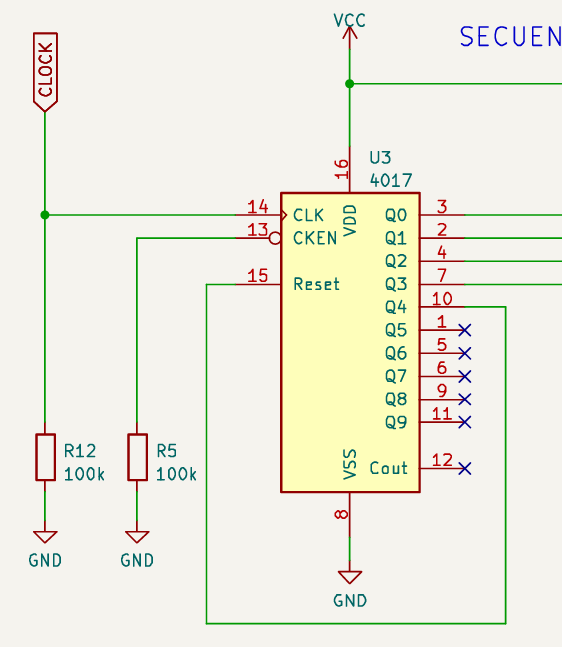

>Se implento de la siguiente manera

- Considerar que tambien existe el **PullUp**

2. Condensador Desacople: Este concepto se mencionó anteriormente, pero ahora se profundizó de mejor manera. Similar al Pulldown (según yo xd), en el sentido de que se utiliza para estibilizar al chip del ruido y variaciones de voltaje extremas, que podrían quemarlo. Importante es que fisicamente se ubique cerca del chip, para mayor efectividad.

Se debe conectar un extremo al pin de alimentación y el otro a GRD. Considerar que no se debe reemplezar el capacitor por el cable, deben existir ambos, es decir deben haber 2 conexiones desde el pin de alimentación, un cable / alambre y el capacitor

En este caso se trabajó con capacitores de 100nF (lentejas 104)

3. Condensador De Acople: En este caso se utiliza un capacitor electrólitico de 100μF, que interrumpe la conexión directa del parlante al potenciometro, es decir que el + se conecta al pin 2 de la resistencia variable y el - debe ir al parlante. 

La función es que sirva a modo de _filtro_, para evitar que los componentes previos se quemen, además de reducir el ruido

4. Alimentación

Acá se nos planteo que la familia de chips 4000 (revisar sesion-06a) opera dentro de 3 voltajes posibles, por lo que podemos probar y experimentar para realizar diversas conexiones

  a. 12v: Baterías de auto

  b. 9v: Baterías (las que usamos), paneles solares

  c. 5v: USB A

Mi plan es tener un cable USB A, con conexión dupont al otro extremo, para alimentar los chips con mi batería portatil o con un transformador de celular

 

### Desarrollo en clase ###

Se volvió a armar cada circuito, pero considerando lo descubierto en la sesión anterior esta vez realizamos de manera grupal circuito por circuito, establecimos un sistema: una persona ejecuta, otra le dicta cada paso, otra revisa que se esté ejecutando bien el cableado, la última toma apuntes.

Además, esta sesión si pudimos realizar todos los circuitos... pero no sonó. Ahora detallo el proceso general por chip 

#### 555 ####

El único problema fue que el capacitor estaba conectado desde el pin de alimentación (8) hasta VCC, en vez de GROUND.

#### 4017 ####

Hicimos la instalación de los componentes incluyendo los led y resistencias, los cuales al unir todo hacen que suene muy bajo. Esto se debe al consumo energetico de estas piezas, generando un deficit energetico en el parlante, por lo tanto se nos recomendó eliminarlos.

Acá inicio nació una de las primeras ideas de experimentación en el grupo que fue como lograr colocar los led, más que por un fin estetico, por uno funcional, dado que el poder ver como el secuenciador activa los led al tiempo que suena una _nota_, nos podría ayudar a ubicar posibles fallos en alguna compuerta NAND, además de servir como indicar en el contexto interfaz de usuario.

##### Posible solución #####

Se investigó fuera de clase que elementos nos podrían servir, acá entran los transistores 2N2222 (mismos explicados en sesiones anteriores). De modo general se pensó en útilizar la capacidad de amplificación de voltaje que poseen.

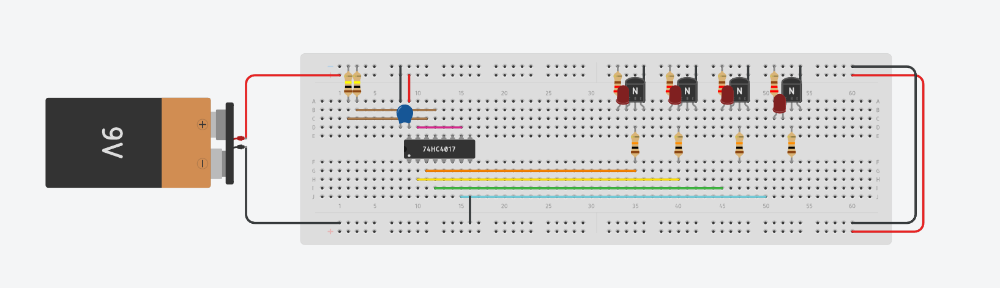

>Hay unos errores que note luego de hacer la captura y ahora revisando el documento jejeje
>
>> Los 2 últimos transistores no estan conectados a los _step 3_ y _step 4_

Acá se puede ver una posible solución, esta se investigó y se considero mostrar como posibilidad en la sesion-07a... Actualizaremos en esa sesion como resulta todo

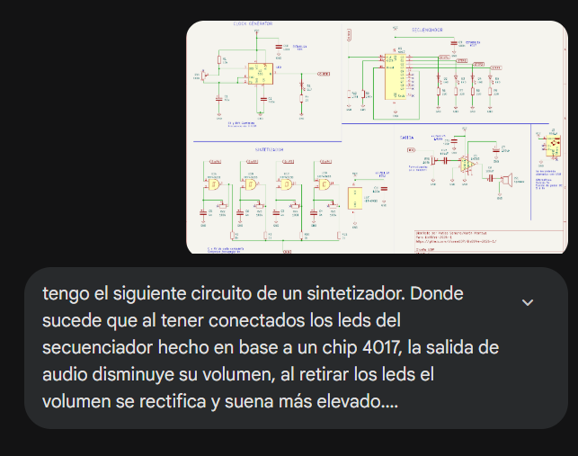

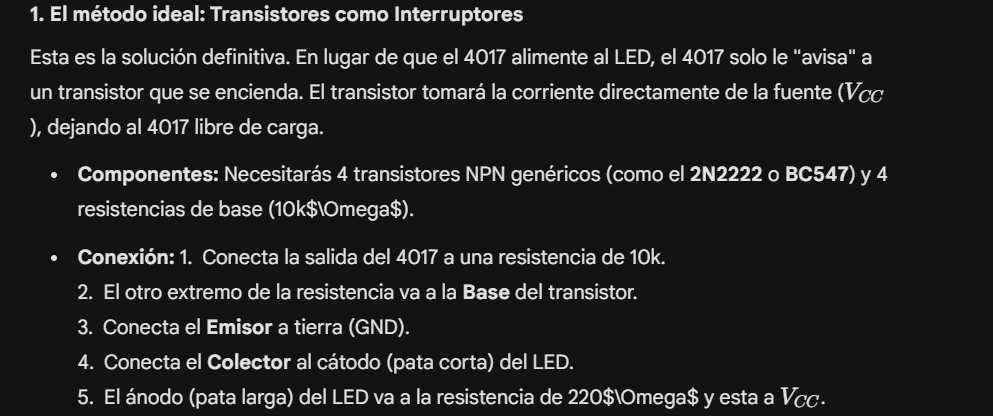

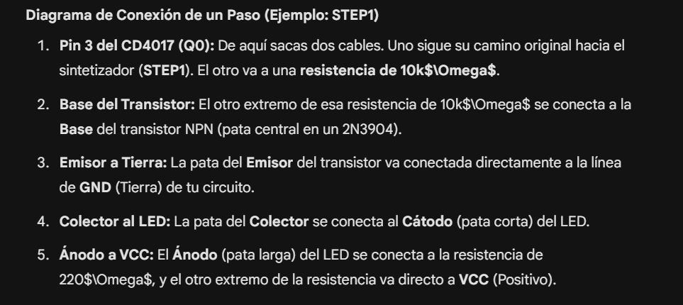

#### 4093 ####

En el primer intento de conexión no funciono, para poder identificar el error se comenzó a probar compuerta por compuerta, por lo que enventualmente se conectó todo correctamente

#### 386 ####

Acá en el primer intento logró conectarse todo bien. Esto porque al unirse al 4093 sonó y eso nos alegró, debido a que teniamos el 50% ya solucionado... O eso creiamos, ya que el unir este par al 555 + 4017 fue un poco de caos. El que se soluciono utilizando colores definidos en base a la función, por ejmplo todos los _Step x_ estaban con color azul, entonces podiamos ubicarlos más facilmente

Una vez que encendimos luego de corregir todos los errores posibles, nos percatamos de otro detalle, no eliminamos los led, sip, los que mencione antes. Al retirarlos se obtuvo el primero sonido más elevado. VICTORIA, por ahora, aún falta trabajo, pero podemos considerar esto un pequeño Checkpoint.

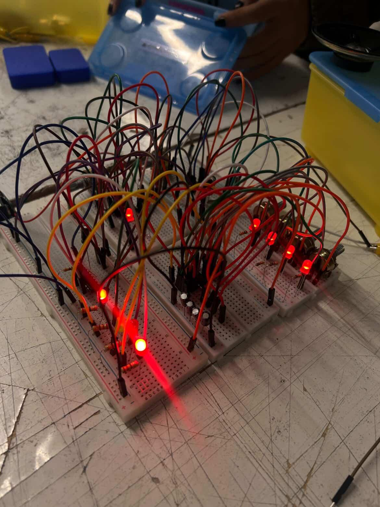

 

## Desarrollo Post clase ##

Como se mencionó anteriormente, se revisó el uso de transistores.

Pero ahora nos enfocaremos en 1 hora despues del término de la clase. Tal como se vio en la sesion-06a, diseñamos cajas para poder guardar los circuitos de manera modular, ahora es cuando procedemos al corte láser

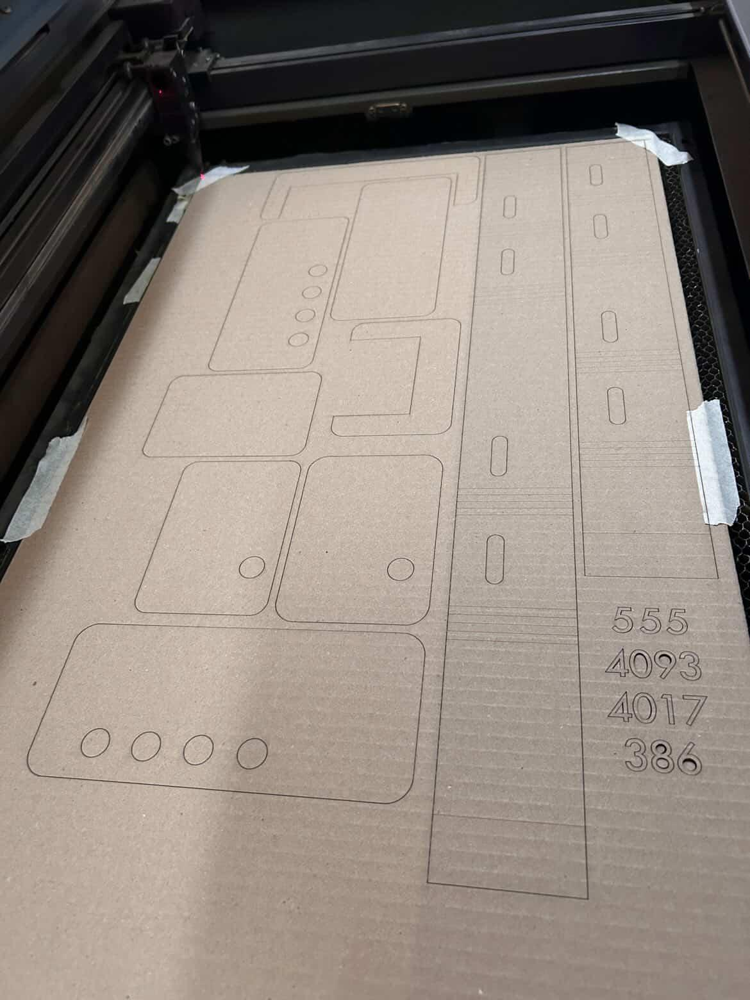

> Si en algún momento algún compañero de sección o incluso de otra clase desea aprender, puede comunicarse conmigo sin ningún problema y le puedo enseñar

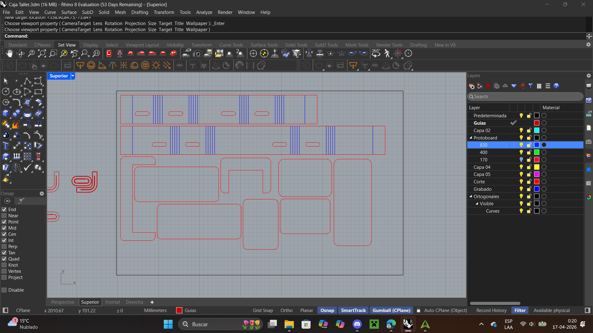

 

Luego se armarón y se procedio a instalar los circuitos, acá nos percatamos de pequeños detalles, como que la abse debería ser extraíble, esto con el fin de poder acceder al circuito eliminando a la caja de la ecuación.

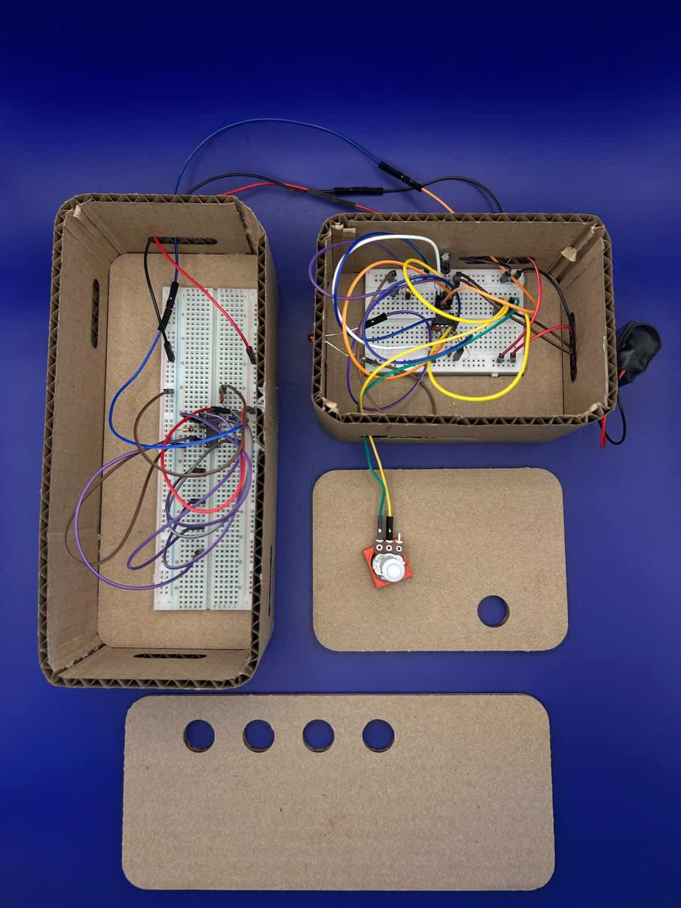

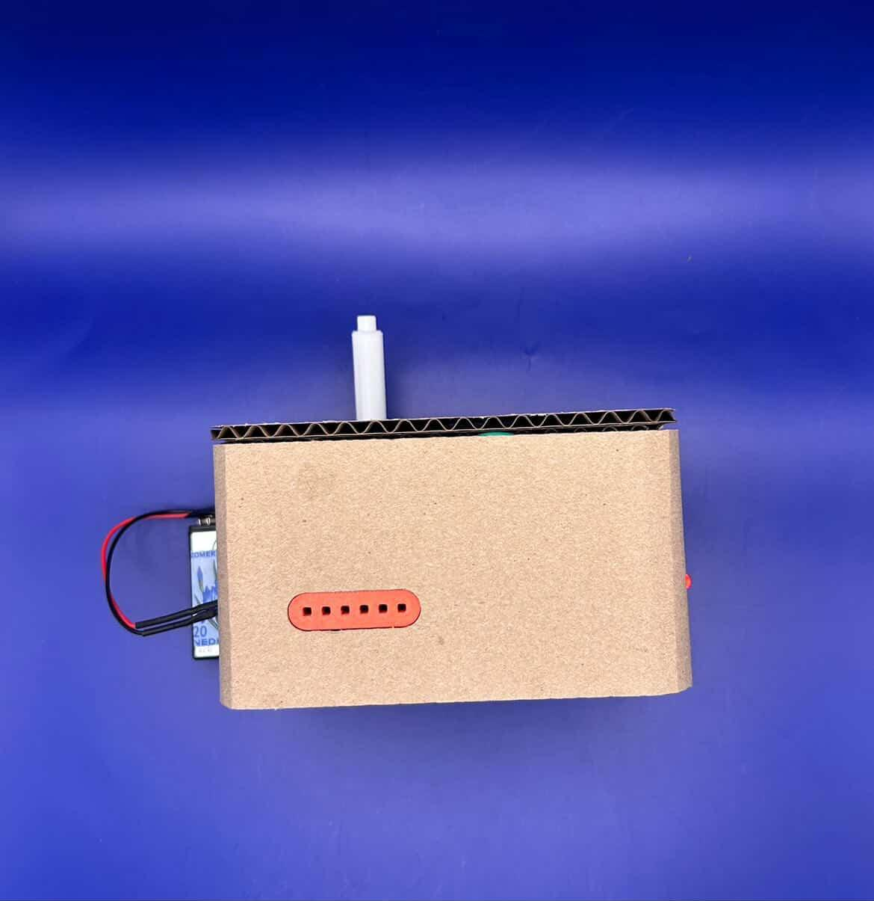

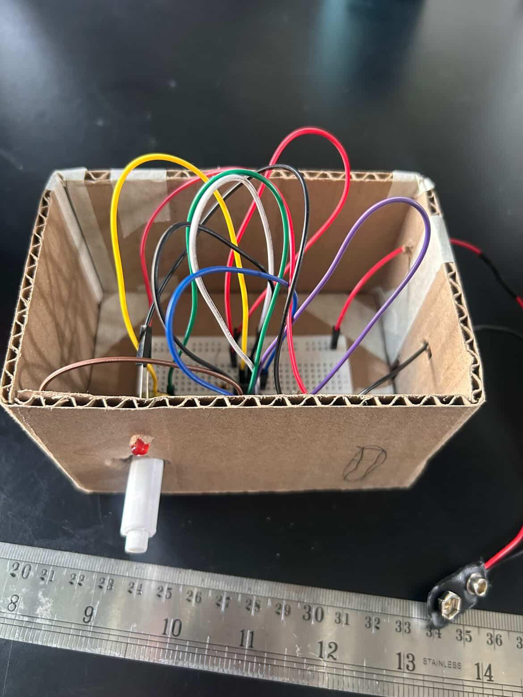

 

Luego de esto, por mi parte me enfoque en proponer ideas en relación a la interfaz, es decir, la ubicación de leds y perillas, cosa que aún teniamos pendiente.

Siendo estos los resultados:

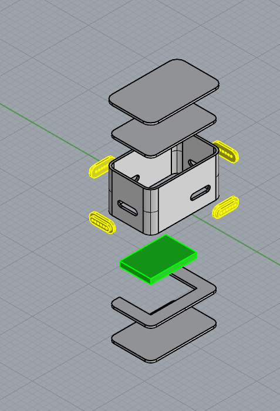

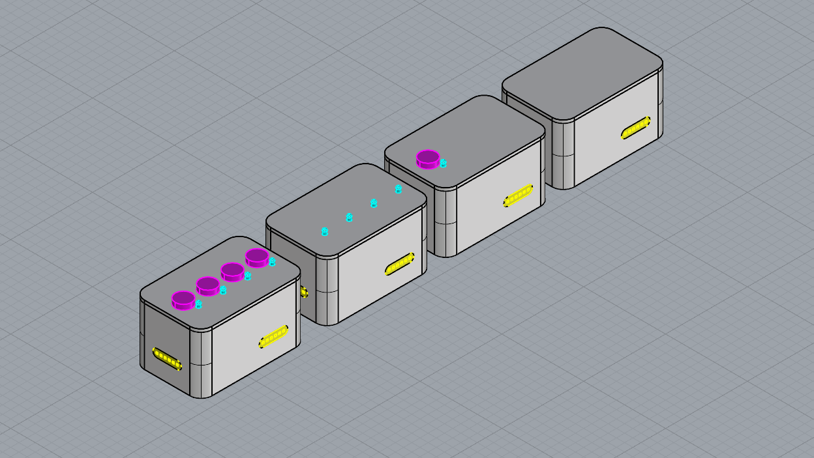

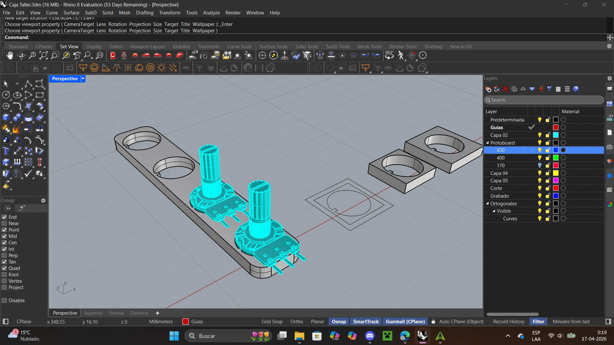

---

Luego de esta semana nos queda solucionar:

1. Interconexión entre módulos

2. Interfaz de cada módulo

3. Sonido o entonación

4. Documentación

