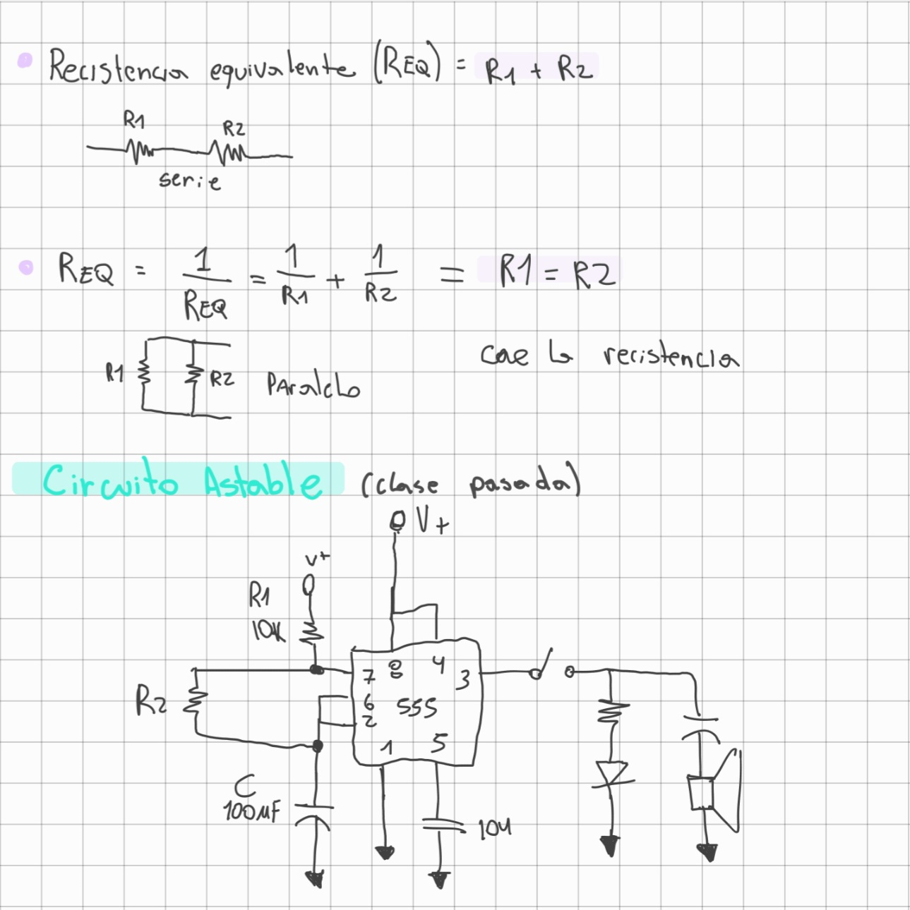
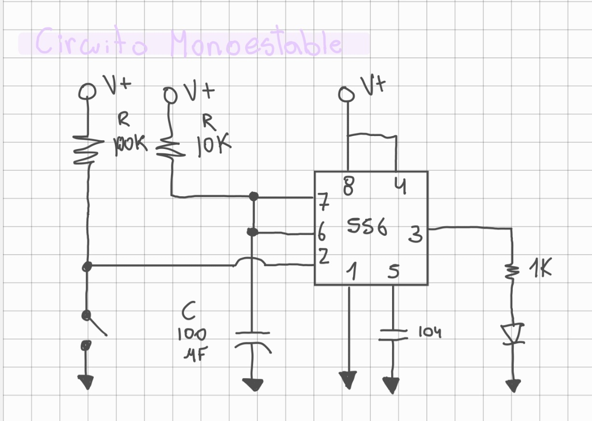

# sesion-03b
## Apuntes 27 mar
### Resistencia equivalente (REQ)
la resistencia equivalente es una resistencia imaginaria que puede sustituir a todo un conjunto de resistencias en un circuito complejo, sin que cambie el comportamiento total del mismo (es decir, manteniendo la misma corriente y voltaje total).

Básicamente, es como "resumir" varias piezas en una sola para facilitar los cálculos. La forma de calcularla depende totalmente de cómo estén conectadas las resistencias entre sí.

 

**1. Resistencias en Serie**

En esta configuración, las resistencias están conectadas una tras otra en un solo camino. La corriente debe pasar por todas ellas obligatoriamente.
+ Regla: Se suman directamente.
+ Fórmula: $REQ = R_1 + R_2 + R_3 + ... + R_n$
  
Ejemplo: Si tienes tres resistencias de 10, 20 y 30 ohmios en serie, la resistencia equivalente es de 60 ohmios.

**2. Resistencias en Paralelo**

Aquí, las resistencias están conectadas a los mismos dos puntos (nodos), ofreciendo múltiples caminos para que pase la corriente.
+ Regla: La inversa de la resistencia equivalente es la suma de las inversas de cada resistencia.
+ Fórmula: $\frac{1}{REQ} = \frac{1}{R_1} + \frac{1}{R_2} + \frac{1}{R_3} + ...$

Dato clave: En paralelo, la resistencia equivalente siempre será menor que la resistencia más pequeña del grupo.

### Circuito monostable

 

Un circuito monostable (o monoestable) es una configuración del chip 555 en la que el circuito tiene un solo estado estable: el estado bajo.

A diferencia del circuito astable que armaste anteriormente (que oscila continuamente), el monostable funciona como un temporizador de un solo disparo.

**Funcion**
+ Estado de Reposo: La salida está en "bajo" (0V) y nada sucede.
+ El Disparo: Al recibir un pulso negativo en el pin 2, la salida cambia instantáneamente a "alto".
+ Temporización: La salida se mantiene en "alto" durante un tiempo determinado por una resistencia ($R$) y un capacitor ($C$).
+ Retorno: Una vez cumplido el tiempo, la salida vuelve a "bajo" y se queda ahí hasta que reciba otro disparo.

### "Atari Punk Console"

 

La Atari Punk Console que armamos funciona mediante el trabajo conjunto de dos etapas. La primera parte utiliza un chip 555 configurado como astable, donde el potenciómetro ($R_1$) regula la frecuencia de los pulsos; la segunda etapa es un monostable que recibe esos pulsos y define su duración mediante la LDR ($R_4$). Al mover el potenciómetro o variar la luz sobre la fotoresistencia, modificamos la onda sonora resultante, lo que nos permite regular el tono y el timbre del parlante para crear sonidos electrónicos experimentales.

En conjunto con mis compañeros, llevamos a cabo la construcción del circuito conocido como Atari Punk Console. El funcionamiento principal de este dispositivo consiste en la generación de sonidos electrónicos, permitiéndonos regular y manipular el tono emitido por el parlante a través de un potenciómetro y una fotorresistencia (LDR). Fue muy divertido hacer este circuito y con nuestro grupo no tuvimos grandes complicaciones haciéndolo; nos funcionó bien por un rato, pero después se nos quemó uno de los chips :( Aun así, estuvo muy entretenido jugar con los tonos del parlante.

**Imagen del resultado trabajado en clases**

 

