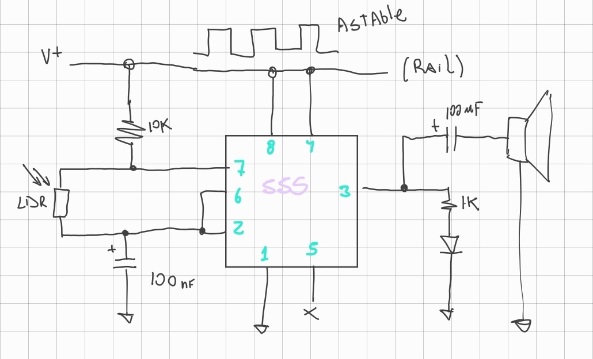
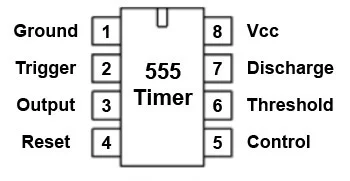
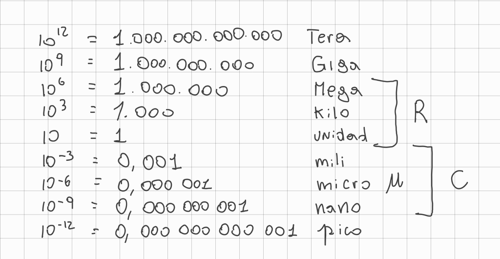
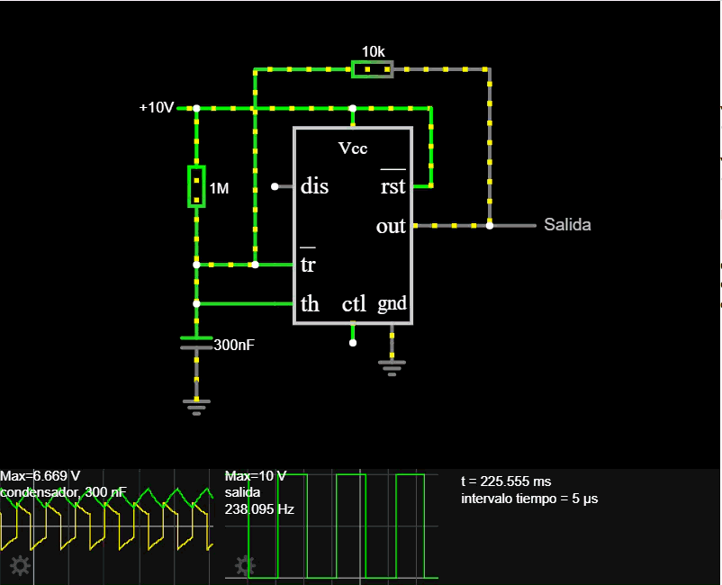
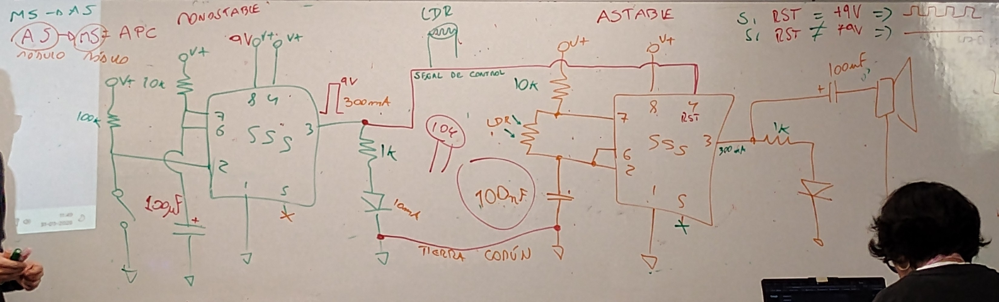
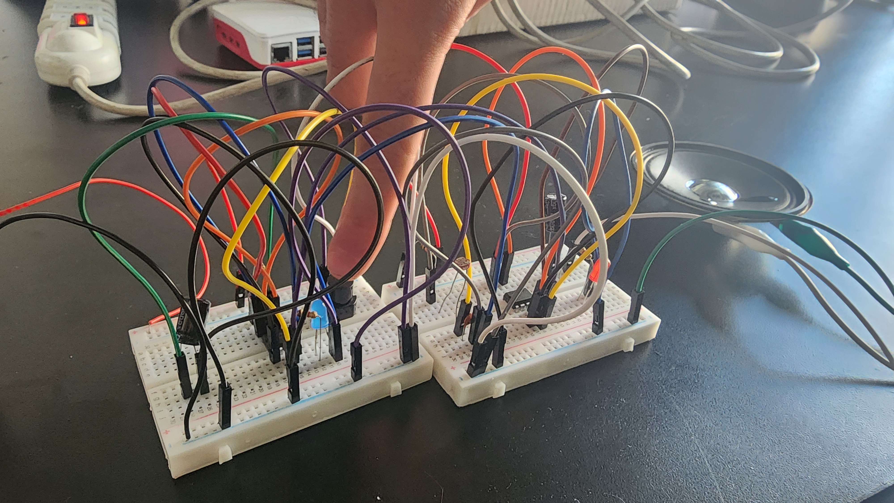

# sesion-04a
## Apuntes 31 mar
### Repaso chip 555 con circuito astable
+ circuito astable
  

+ pins y nombres del 555
  

### Unidades y sus prefijos 
para los prefijos de alta magnitud se usan en las recistencias (R) y para los de baja magnitud se usan en los capacitores (C)

### falstad
Nos mostraron esta pagina https://www.falstad.com/circuit/ que nos ayuda a entender mejor como fluye la corriente, en el ejemplo un circuito con el chip 555 

## Ejercicio en clases
teniamos que armar en conjunto con un compañero un circuito MS→AS

