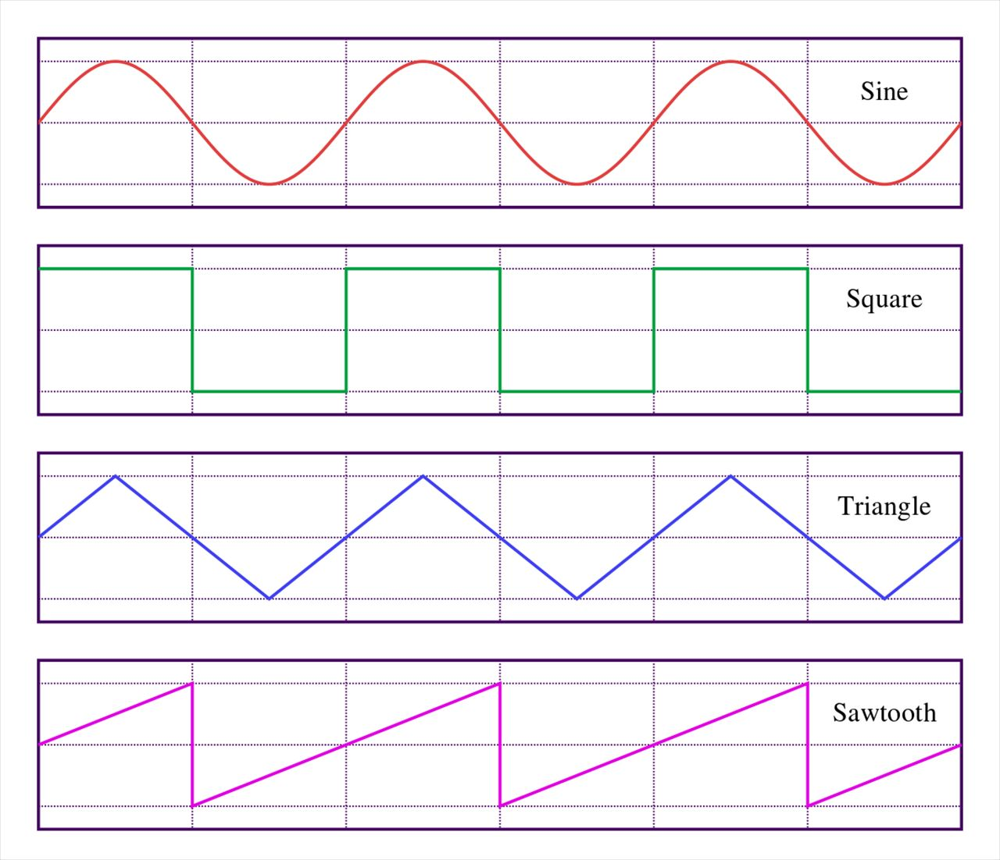
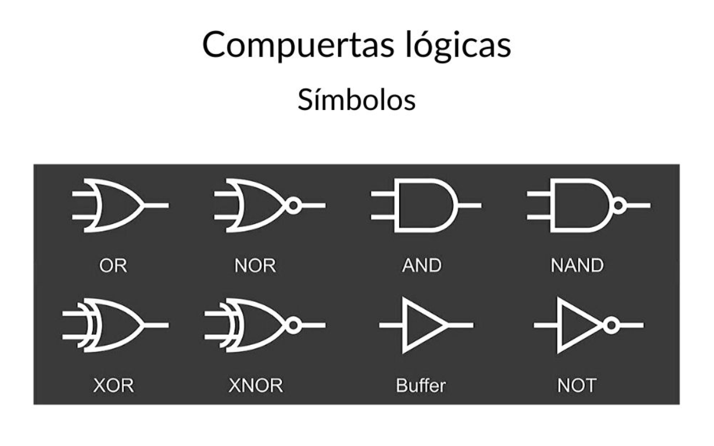

# sesion-05a
### Apuntes 07 abr
No pude asistir a esta clase pero le pedi a mis compañeros que me pasaran sus apuntes y me explicaran un poco lo que fue esta clase
## Resumen de Clase: Síntesis, Lógica y Hardware Modular
La síntesis sonora es la creación de audio mediante señales eléctricas controladas por voltaje (VC - Voltage Control).
+ **Módulos clave:** El VCO genera el sonido, el LFO lo modula (movimiento lento) y el VCA controla el volumen.
+ **Formas de Onda:** Cada onda tiene un sonido y una forma visual distinta, lo cual determina el "timbre":

| Onda  | Descripción Visual   | Característica Sonora   |    
| ---   | ---   | ---   | 
|SIN    |    Suave, sube y baja |  Sonido puro y limpio. |     
|TRI    |    Líneas rectas, picos claros |  Un poco más brillante que la seno.  |     
|SAW    |    Como los dientes de un serrucho |   Sonido "violento" o agresivo; tiene mucha información armónica. |     
|SQE    |    Bloques: sube, se mantiene, baja |   Es la que han estado trabajando. Sonido hueco y robótico.  |   

+ **Lógica Digital (Comuertas)**

+ **VCV Rack:** VCV Rack es un simulador de código abierto del estándar Eurorack que permite conectar módulos virtuales como osciladores (VCO) y amplificadores (VCA) mediante cables digitales para comprender el flujo de la señal (Signal Flow). Una ruta básica conecta el VCO al VCA y este al módulo de audio, permitiendo manipular el volumen en tiempo real sin interrumpir el sonido. La diferencia fundamental es que, mientras VCV Rack ofrece un entorno "ideal" sin fallos, el trabajo físico en protoboard con chips como el CD4093 y el LM386 presenta desafíos reales como el ruido eléctrico, la polaridad de los componentes y el desgaste de la batería.

## Lógica Combinacional y Álgebra de Boole
La electrónica digital utiliza la lógica para procesar información sonora. Basado en las leyes de George Boole, usamos el sistema binario:
+ Binario: 0 representa 0V (GND/Apagado) y 1 representa el voltaje positivo (VCC/Encendido).
+ Onda Cuadrada: Se produce físicamente al alternar muy rápido entre 0 y 1.
+ Tablas de Verdad: Gráficos que definen la salida de una compuerta según sus entradas.

## Implementación Física: El Chip CD4093 (NAND)
El CD4093 es el "corazón" del sintetizador modular que estamos construyendo.

+ Arquitectura: Es un chip de 14 patas que contiene 4 compuertas NAND independientes.
+ Compuerta NAND: Solo entrega un "0" si todas sus entradas son "1". Es la base para crear osciladores.
+ Conexiones de alimentación (Vital): Según el diagrama de clase:
    + Pata 14 ($V_{DD}$): Voltaje positivo (++).
    + Pata 7 (GND): Tierra o negativo (--).
    + Pares de entrada/salida: Por ejemplo, la compuerta 1 usa las patas 1 y 2 como entradas ($A_1, B_1$) y la pata 3 como salida ($Q_1$).

## Amplificación y Salida (LM386)
Para que el sonido del oscilador sea audible, necesitamos potencia:
+ LM386: Es el amplificador que toma la señal débil del CD4093 y la potencia para mover un parlante.
+ Realidad vs. Virtual: A diferencia de VCV Rack, en el protoboard físico debemos cuidar la polaridad de los capacitores, evitar el ruido eléctrico y asegurar la carga de la batería.
---
Ruta del Sonido: > Energía $\rightarrow$ Lógica NAND (CD4093) $\rightarrow$ Amplificación (LM386) $\rightarrow$ Parlante.

---
