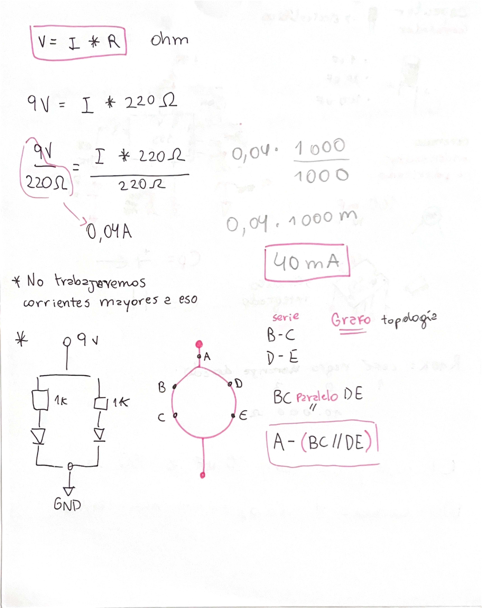

# sesion-02b
viernes 20 de marzo 2026 

## apuntes tomados en clase ##

### Circuito con chip 555 ###
+ Se utilizó el chip 555 como generador de señales.
+ Se armó un circuito con: Un potenciómetro. Un fotorresistor (variable según la luz).
+ El LED parpadea dependiendo de la frecuencia de la señal generada.
+ Se observó que la frecuencia de parpadeo depende de la resistencia de entrada.
+ Al iluminar el fotorresistor (ej: con el flash del celular), cambia la velocidad del parpadeo.
+ Al ajustar la perilla del potenciómetro, también se modifica la frecuencia del LED.

## Implementación del circuito en clase ##

## Repaso contenidos ##

+ CPU: Unidad central de procesamiento; ejecuta instrucciones y controla el sistema.
+ Ohm (Ω): Unidad de medida de la resistencia eléctrica.
+ Circuito eléctrico: Conjunto de componentes conectados que permiten el paso de corriente.
+ Circuito en serie: Componentes conectados en un solo camino.
+ La corriente es la misma en todos y si uno falla, todo el circuito se interrumpe.
+ Circuito en paralelo: Componentes conectados en varios caminos. El voltaje es el mismo en cada rama y si uno falla, los demás siguen funcionando.
+ Potenciómetro (B100K): Resistencia variable (100kΩ) que permite ajustar el paso de corriente.
+ Chip IC (circuito integrado): Dispositivo que contiene múltiples componentes electrónicos en un solo encapsulado.
+ Capacitor electrolítico: Almacena energía eléctrica; tiene polaridad (+ y −).
+ Capacitor cerámico: Almacena energía; no tiene polaridad y suele ser de menor capacidad.
+ LED: Diodo que emite luz al pasar corriente.
+ Ánodo: Terminal positivo LED.
+ Cátodo: Terminal negativo LED.
+ Espectro resistivo (código de colores): Sistema de bandas de colores para identificar el valor de una resistencia.
+ GND (ground / tierra, 0V): Punto de referencia del circuito (voltaje cero).
+ VCC: Voltaje de alimentación del circuito (energía que lo hace funcionar).

## Preguntas ##
+ ¿Qué significa que dos componentes compartan un mismo nodo en un circuito?
+ ¿Qué errores comunes se cometen al pasar un esquema de circuito a la protoboard?
+ ¿Cómo puedo verificar que dos componentes están correctamente conectados en la protoboard?
+ ¿Cómo puedo saber si estoy interpretando correctamente un esquema antes de armarlo físicamente?
+ ¿Qué estrategia recomiendan para armar un circuito paso a paso sin confundirse?
+ ¿Qué debería revisar primero cuando un circuito no funciona?
+ ¿Dónde puedo buscar información confiable para entender mejor cómo armar circuitos en protoboard cuando no comprendo el procedimiento?
+ ¿Cómo se elige el valor de una resistencia al diseñar un circuito y no solo seguir un esquema?
+ ¿Qué diferencia práctica hay entre usar resistencias de distintos valores en un mismo circuito?
+ ¿Por qué en el ejercicio LOQUITOPORTILOCOLOCO, la intensidad de la luz de los LED variaba en lugar de mantenerse constante?
