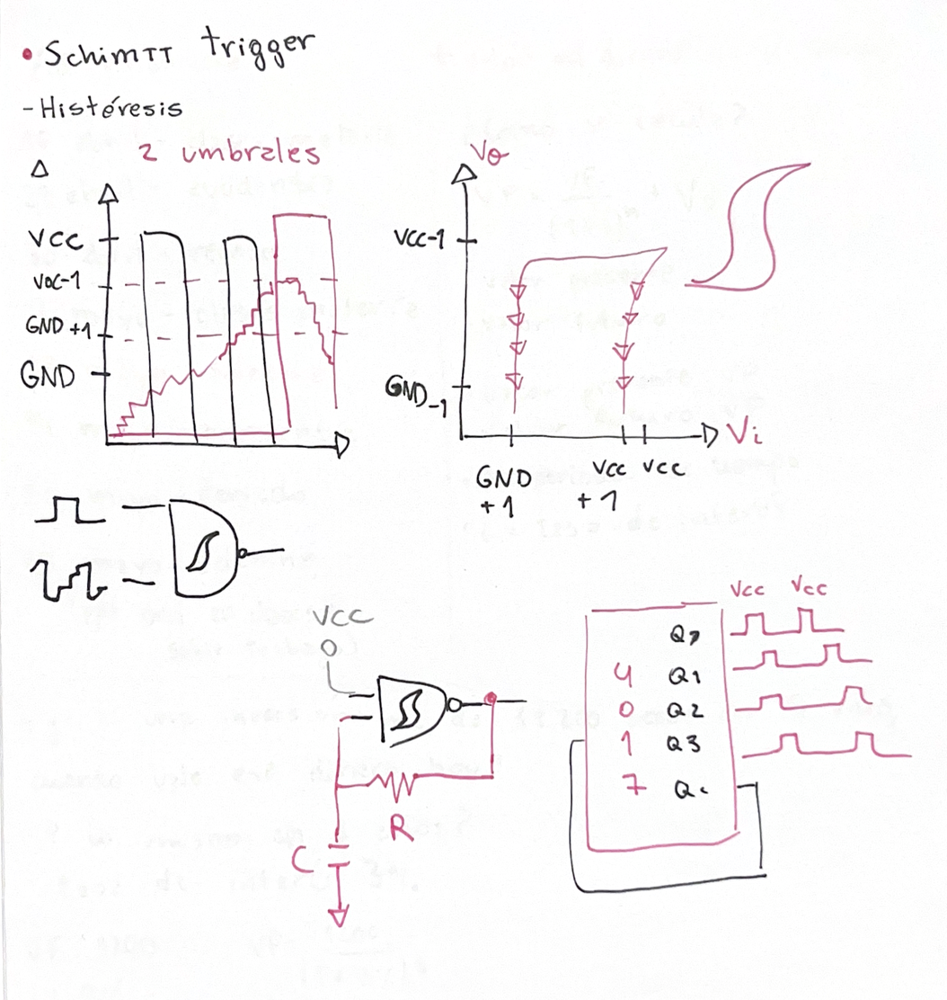
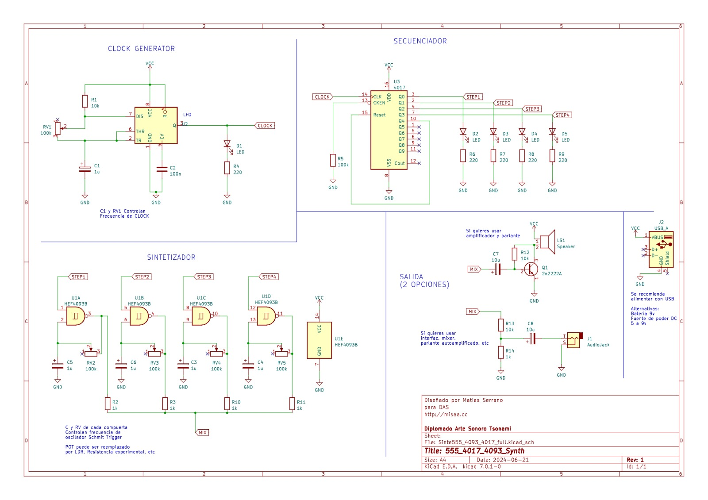

# sesion-06a
## Apuntes en clase ##

### Schmitt Trigger ###

El Schmitt Trigger es un tipo de comparador electrónico que convierte una señal de entrada inestable o “ruidosa” en una señal digital limpia.
A diferencia de un comparador normal (que tiene un solo umbral), el Schmitt Trigger utiliza dos niveles de voltaje distintos, lo que se conoce como histéresis.

¿Qué hace?

+ Limpia señales con ruido
+ Evita cambios rápidos e indeseados en la salida
+ Genera transiciones más estables entre “alto” y “bajo”

### Histéresis (idea clave) ###

La histéresis significa que el circuito no cambia de estado en un solo punto, sino en dos:

+ Umbral superior (UTP):
 La salida cambia de bajo a alto solo cuando la señal supera este nivel
+ Umbral inferior (LTP):
 La salida cambia de alto a bajo solo cuando la señal baja de este nivel
+ Zona intermedia (zona muerta):
 Entre ambos valores, el circuito mantiene su estado y ignora pequeñas variaciones

¿Por qué es importante?

Porque en señales reales siempre hay pequeñas fluctuaciones (ruido).
 Sin histéresis, la salida podría cambiar muchas veces rápidamente sin control.
El Schmitt Trigger evita eso y entrega una señal clara y estable.

 ## Proyecto 01 – Primer avance ##

 

Se dividió el trabajo en tres partes:

+ Clock
+ Secuenciador
+ Sintetizador

Cada integrante trabajó su parte por separado en distintas protoboards.

Durante el proceso nos surgieron problemas al trabajar de forma separada, ya que dificultó la integración del circuito completo.

En el clock y el secuenciador se nos presentó una falla con un LED que no encendía. Se cambiaron componentes (LED y resistencia), pero el problema continuó, al final logramos descubrir que el problema era el chip 555, así que al reemplazarlo, funcionaron todos los LEDS. 

También hubo limitaciones de espacio, ya que solo se contabamos con tres protoboards pequeñas, lo que impidió implementar correctamente el sintetizador.

Decidimos priorizar la solución del problema del LED y dejar el armado del sintetizador para la siguiente sesión, considerando traer protoboards más grandes para facilitar el montaje.
