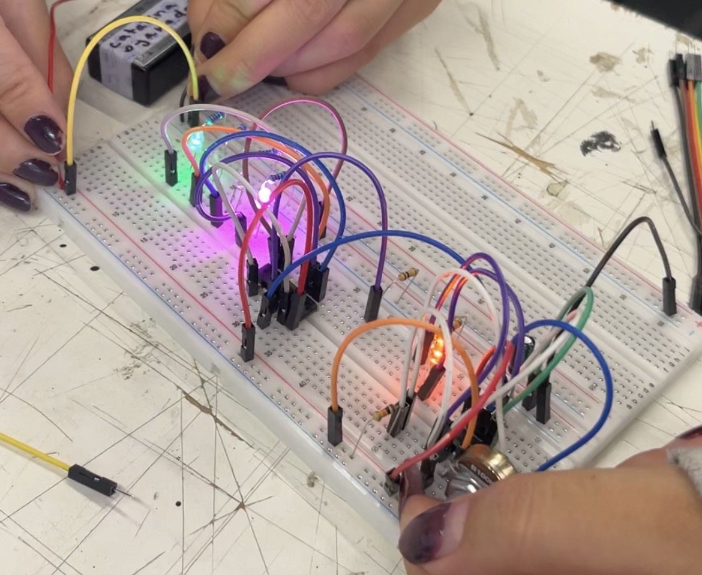

# sesion-06b

### Proyecto 01 – avance en clase ###

En esta clase decidimos reiniciar completamente el circuito y comenzar desde cero utilizando protoboards más grandes (830 puntos), con el objetivo de trabajar de forma más ordenada y evitar errores anteriores.

A diferencia de la clase anterior, optamos por trabajar armando en conjunto en ambas protoboards: cada una se encargaba de armar una parte específica mientras las demás apoyábamos revisando conexiones, dando indicaciones y detectando posibles errores. Esto nos permitió entender mejor el circuito completo y lograr una integración más clara entre los pasos.

El armado del clock y el secuenciador (4017) resultó exitoso desde el primer intento. Logramos una secuencia estable, con los LEDs encendiendo de forma ordenada, lo que confirmó que ambas etapas estaban correctas. 

Con esta base funcionando, avanzamos hacia la etapa del sintetizador, que presentaba mayor complejidad. Completamos las conexiones utilizando el chip 4093 y se integró con la etapa de salida de audio. Sin embargo, al finalizar el montaje, no se obtuvo señal de audio.

Para diagnosticar el problema, realizamos una verificación por etapas:

+ Confirmamos el correcto funcionamiento del clock y el secuenciador.
+ Revisamos conexiones generales (alimentación, tierra común, continuidad).
+ Evaluamos la posibilidad de fallas en componentes individuales.

Siguiendo la recomendación del profe Misaa, probamos los potenciómetros y partes del circuito de forma aislada en otra protoboard, conectándolos directamente a la salida de audio para comprobar su funcionamiento. Este proceso nos permitió descartar algunos errores, pero también generó mayor complejidad por el aumento de cables y conexiones, nos dificultó un poco la lectura del circuito.

Debido a limitaciones de tiempo, no logramos resolver completamente el problema durante la clase.

Después de clases, decidimos simplificar y rehacer la etapa del sintetizador desde cero. Además, se incorporó un condensador de 100 µF en la etapa del 386, lo que ayudó a estabilizar y mejorar la salida de audio. Tras estos ajustes, finalmente logramos obtener sonido. 

## Observaciones ##

+ Trabajar en conjunto facilitó la integración del circuito.
+ El orden en la protoboard fue clave para evitar errores.
+ La revisión por etapas permitió identificar y aislar fallas.
+ El uso adecuado de componentes (como el condensador en el LM386) fue determinante para obtener audio.

Conclusión del avance

A pesar de las dificultades técnicas, se logró completar el circuito y obtener sonido. El proceso permitió comprender mejor la relación entre las distintas etapas (clock, secuenciador y sintetizador) y la importancia de un montaje ordenado y colaborativo, logramos obtener sonido. Resultó, nos costó, pero muy felices y emocionadas de escucharlo.
