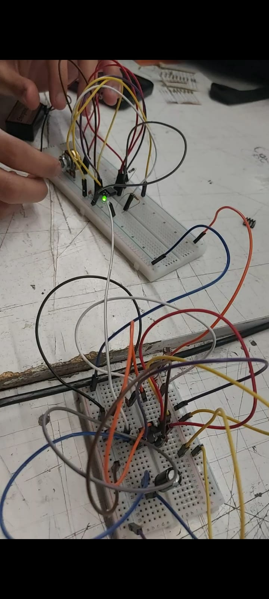

# sesion-03b

27-03-2026

## Apuntes

El toy organ integra el interuptor

Si agrego los interruptores arriba y abajo dejan un apagado total

Organos tienden a tener muchas teclas y este organo "Toy organ" tiene 2 elevado a 5 de combinaciones

Los botones son partes donde se corta o se daja pasar el flujo

Resisteni Equivalente de 2 resistencias en derie

Ej mental, oprimimos 2 switches a las vez

La resistencia funciona en paralelo puede sen 1 d

Que pasa si las 2 resistencias son exactamente las mismas

Caso especial R1*(R1)/2(R1( = R1/2

cuando las resistencias son ecctamente las mismas las cargasiminuye

El flujo delrio ayuda a entender eletrónica

Vamos a hacer otro juego con el botón con 

Vistamos el segundo modo de operación del 555 que se llama:

### Modo de operación 555 Monostable

Construcción en clase

**Robert Forrest MIMS**

+ HAWDBOOKS
  
+ COOKBOOKS

**Más de Diseño e ingenierias**

+ O´REILLY

+ WILEY

+ ROUTLEDGE

+ MAKE

### ATARI PUNK CONSOLE

Son 2 555
  
 usa un 555 astable y un 555 monostable

 Lo que hacemos es construir abstrabciones: cajitas y primero se hace un astable

 el atari punk console consiste en conectar un astable y un monostable

Como cultura del occidente mantendremos la lectura de izquierda a derecha aunque se puesde deconstruir

LDR: FOTO RESISTOR **porque significa Light Dependent Resistor (Resistor Dependiente de la Luz) en inglés**

---

Logramos conectar con varios intentos y errores el chip 555 de la stable y la monostable, con ayuda de los profes logamos llegar al descubrimiento de que un chip falleció y probando con uno nuevo logro funcionar y moviendo algunos piezas para acortar el uso de los clables dupont.

A continuación la foto de el objetivo logrado con los materiales compartidos de mi compañero tomás catrileo y mios:

