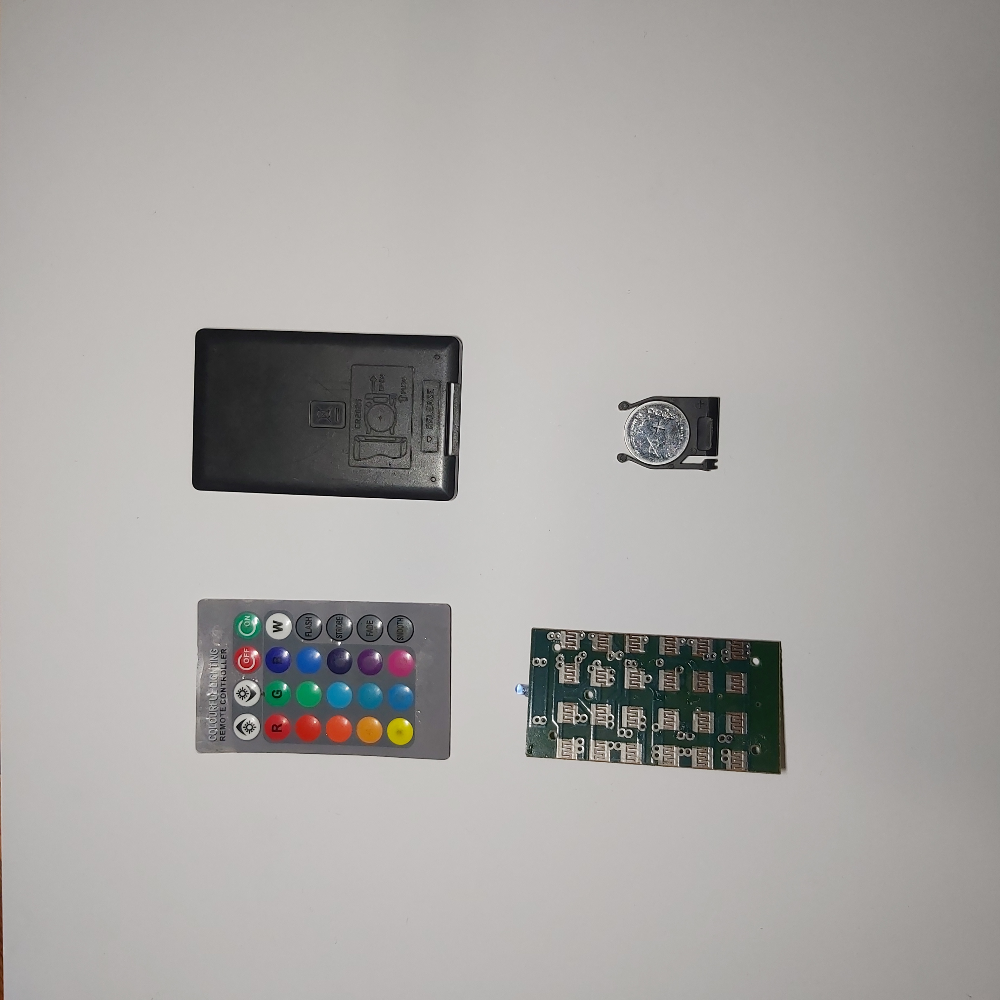
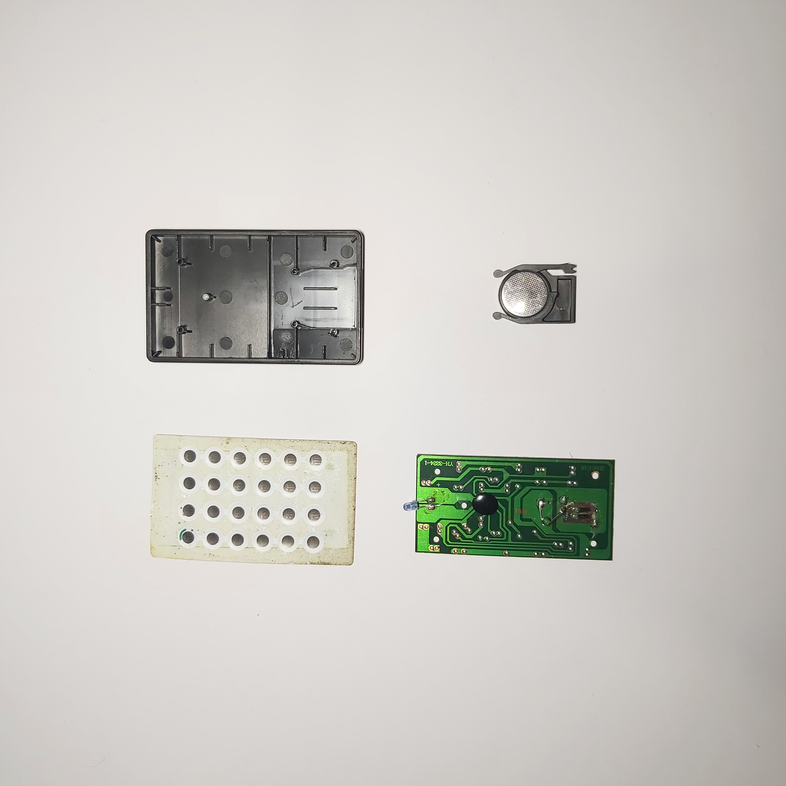

# sesion-04a

31-03-2026

## Apuntes

Página 555 Timer Circuits para ver esquemas

Mas adelante haremos grupos de trabajos almenos por esta primera seremos maximo 3

Vamos a repasar chip 555 Astable

Las "Patas de del chip se llaman **Pin**"

¿La pata 4 o la 8 va al positivo? es lo mismo porque los 2 van a positivo

Las barras llamadas en en español también se les dice RIEL

en la pata "pin 5" puede ir o no ir

Herramienta (falstad circuit simulator) the B2B portal for restaurants, wineries and co. Falstaff

Se puede copiar y pegar un tipeo el cual sirve para la web Falstad con el circuito

EL astable tiene ondas que suben y bajan a cada momento (AS)

En cambio el mono stable nesecita un impulso para subir (MS)

            AS - MS = APC

          Módulo    Módulo

La para cuatro se llama: Reset y cuando esta conectado directamente a positivo está inhabilitado

osea que si reset es positivo: va a oscilar

si reset no es positivo (osea negativo): no hay oscilación

asi que la pata 3 del primer chip habilita la pata 4

Entre el Condensador de salida y el parlante

### ENCARGO

0. Destruir de forma creativa un chip si murio

1. CACHURERA: extirpar los cables, las placas (y estas placas también tienen un orden) y cosas de algo electronico de algo quiera sacrificar, ver como está disecionado y poner fotos y textos de como funciona y describirlos con nuestra imaginación EJ: perilla de **mucho atao** a **Poco atao**

 hay muchas cosas como (placa verde, carcaza, perilla, botones,) decifrar como sacan energia? Que cosa esta afuera y que cosa está adentro

+ NO ABRIR (Micro ondas o TV Antigua) condensadores muy grandes como latas

+ No hacerlo a pata pelada

+ No hacerlo con nada enchufado

Que es lo superficial, que es lo interno escondido y como funcionan sus partes

---

### Desarrollo Encargo

0. No se me ha destruido ningun Chip 555 pero si debo comentar que en un punto construllendo el circuito Monostable se calento tanto que casi me quemaba el dedo

1. El objeto que escogí para sacrificar se llama: **Controlador RGB** que es un control el cual usaba para cambiar las luces de un color a otro en una lampara y tambien su intencidad

**EN EL EXTERIOR**

- Carcaza protectora: Protege todo lo que está adentro

- Botones de plástico: Panel de mando multi color "los que preciono para acionar el color de la lampara"

**EN EL INTERIOR**

- Placa verde: PCB "Printed Circuit Board" que es una placa donde los circuitos electricos están impresos en vez de cables sueltos

- Pasta seca negra y brillante: Chip cubierto por resina **Epóxica** "material plástico duro que se usa para proteger y aislar componentes electrónicos" **COB** "Chip On Board", evita daños como golpes, polvo, humedad y hace que sea más barato fabricar el control

- LED: Encia señal al controlador del bombillo led

- Sobresalientes metálicos: Portapilas y pila, da energía al control

- circulos negros debajo de los botones: Contactos metálicos de los botones "puentes eléctricos"

**¿Cómo obtiene energía?**

De la pila que parece una moneda y que en este caso es una CR2025, se llama así porque **CR** indica el tipo de batería de litio (aparece Litium Battery 3V) y **2025** describe su tamaño (20mm de diámetro y 2,5 mm de grosor), La energía viaja por el circuito metalico de la placa verde hasta activar el chip.

**¿Cómo funciona?**

Se juntan los contactos metálicos y el chip detecta qué botón fue, luego este envía una señal al LED infrarrojo que viaja por el aire hasta que el controlador LED del bombillo recibe la orden y cambia el color o brillo.
