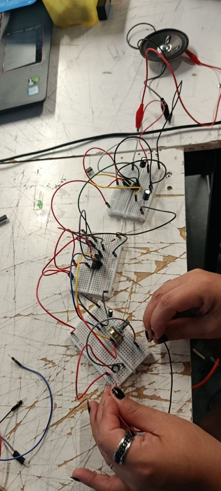
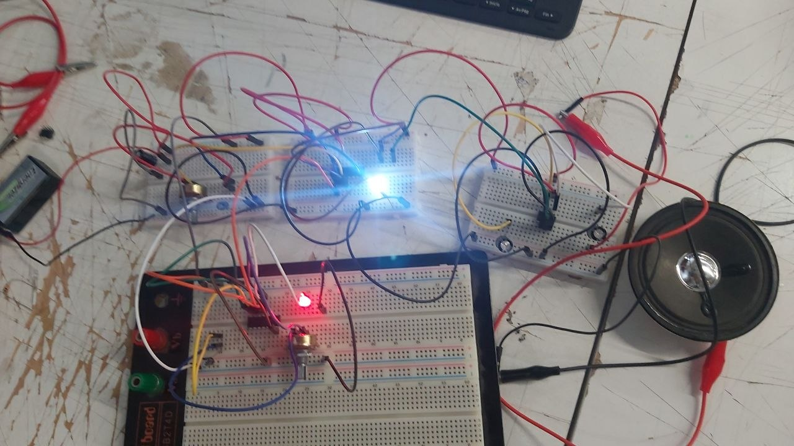
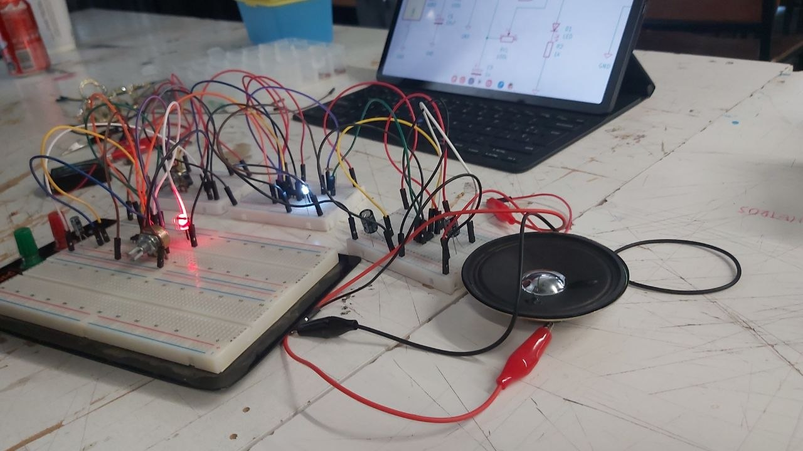
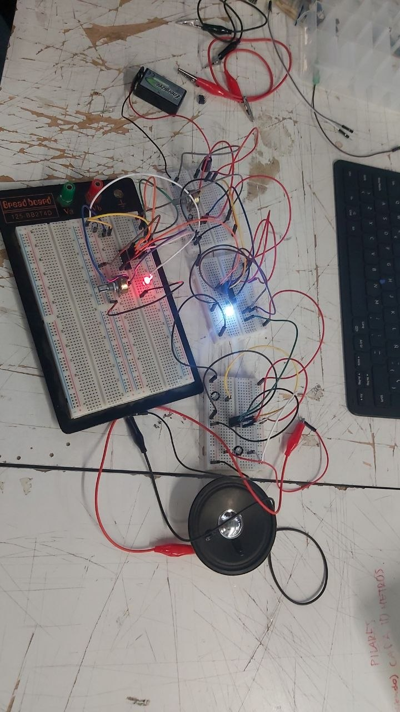

# sesion-04b

07-04-2026

## Apuntes de clases
Miramos VCV Rack y Modulargrid.net

Euro rack, una manera de hacer sintetizadores, y otras formas son Moog Unit

Gesto control, dale como lo ensayamos -> Voltaje a Euro Rack -> Oscilador (Microtone) -> Filtro - VCA -> RC Parlante

Poiesis <20Hz :(

- 11 :)
- 10 :)
- 01 :)
- 00 :(

En vez de comprar EuroRack, lo hacemos gratis con VCV RACK

Descargué VCV Rack

Algunos tienen borde negro y otros no, porque son entradas y salidas; se enciende una "GATE" (compuerta) cuando suena

- Oscilador VCO = VC controlado por voltaje
- Los VCO podemos controlar "por qué suenan"
- LFO = Oscilador "Low", baja frecuencia (para hacer modulaciones, cambios en torno a un punto)
- VCD = Voltaje corriente directa
- VCF

Vamos a condicionar que algunas patas de los chips, algunas sean entradas y otras sean salidas

Si le hacemos click derecho a la pantalla de VCV Rack, se abre una variedad de opciones

Los chips DAC convierten lo digital a la realidad analógica

CONECTAMOS VCO a AUDIO en VCV Rack

4 salidas distintas

- Sin = Onda seno
- Tri = es como una onda triangular (suena más chillona)
- Saw = sierra (porque tiene forma de onda diente de sierra)
- SQR = Square (tipo de onda cuadrada)
- VCA = es como alguien que dice que le suba o baje el volumen

Lógica es una rama de la filosofía

Es la pregunta por el logos, por la razón y cómo opera

Se aplicó por un señor lógico y matemático llamado Boole - álgebra

En simple, existen el signo suma OR "o" y el signo de multiplicar AND "y", y el negativo "-" "not"

0 -> Conocido como tierra y 1 -> Conocido como 9V

Compuertas:

AND = redondeada, siempre está apagado a no ser que las 2 estén prendidas, es más lineal

OR = redondo y puntiagudo, hay 2 opciones

NOT = triángulo con punto

NAND = lo contrario de AND

CLK = Clock, temporizador

eoc significa: En Otro Caso

Cuando X es 0 -> No oscila

Pasaremos al chip 4093

Usaremos resistencias y condensadores para variar la frecuencia

Y acá unas fotos de lo que hicimos en clases:

En esto nos funcionó el sonido sin problemas, pero sí nos dimos cuenta de que la breadboard tenía cuatro líneas metálicas por dentro que transportan los electrones y estaban separadas, entonces en la tabla de la breadboard hay que conectarlas juntas en positivo y juntas en negativo con unos jumpers.

### Tarea

Averiguar que significa "Schmitt Trigger"

https://moritzkleininstruments.com/

https://www.ericasynths.lv/

---

### Respuesta encargo

Un Schmitt trigger es un circuito electrónico que se utiliza para convertir señales de entrada inestables o con ruido en señales digitales más definidas.

A diferencia de un comparador común, no trabaja con un solo nivel de referencia, sino con dos: uno para cuando la señal sube y otro distinto para cuando baja.

Esta diferencia entre ambos niveles, conocida como histéresis, permite que la salida no cambie constantemente frente a pequeñas variaciones en la señal de entrada.

Gracias a esto, se obtiene una respuesta más estable.

Se utiliza principalmente para limpiar señales, evitar conmutaciones erráticas y facilitar la transición entre señales analógicas y digitales.

Redacción. (s.f.). Schmitt Trigger: ¿Qué es y cómo funciona? Descubrearduino. Recuperado de https://descubrearduino.com/schmitt-trigger-que-es-y-como-funciona/
