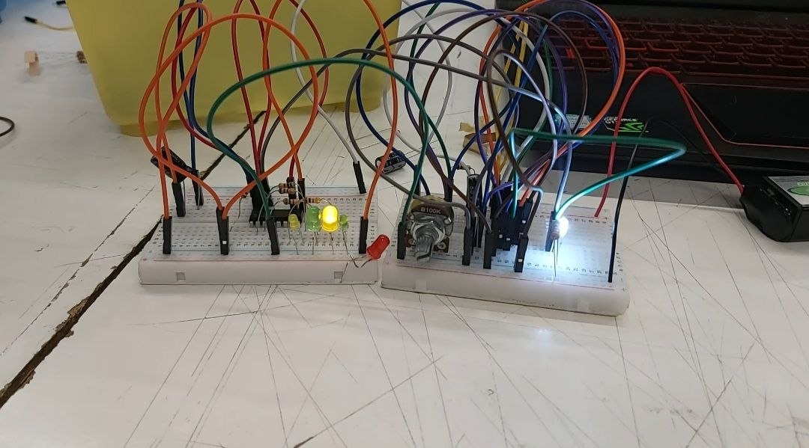

# sesion-05a

10-04-2026

Interfaz UX

Ejemplo de Push, Turn, Move

Guitarra Bilt Relevator

David Byrne

Decidió hace unos años que todo lo que

St. Vincent Guitar

Hacer una interfaz de cartón

Una caja de cartón donde tenga perillas y otra caja de cartón y una salida donde esté el parlante y que emita el sonido

Campo de sentido

---

AKA, nosotros decimos que es AESTHETIC

Vamos a hacer un reloj

555 Astable
CD4093: colocar la pata 14 a positivo y la 7 a negativo

Contador de década

Cuenta desde 0 hasta 9, o sea que genera 10 momentos distintos

Contar en binario

Vamos a usar un chip que se llama 4017

Tiene 16 patas

---

En un principio fue difícil entender cómo se iban a entrelazar los 2 circuitos de los chips 555 con 4017, haciendo que prendiera en secuencia 4 LEDs, con los que se variaban con un potenciómetro la velocidad de cambio en la luz que prendían o hacían el cambio, pero con un poco de tiempo, teniendo en cuenta siempre la posición de los jumpers, que estén cuadrados con como dice el esquema y que las resistencias sean las adecuadas, fijándose que los negativos y positivos estén en su lugar y colocando adecuadamente el chip, fijándose que las patas conecten efectivamente con las partes del circuito que deben conectar, hizo que nos funcionara correctamente el circuito.

