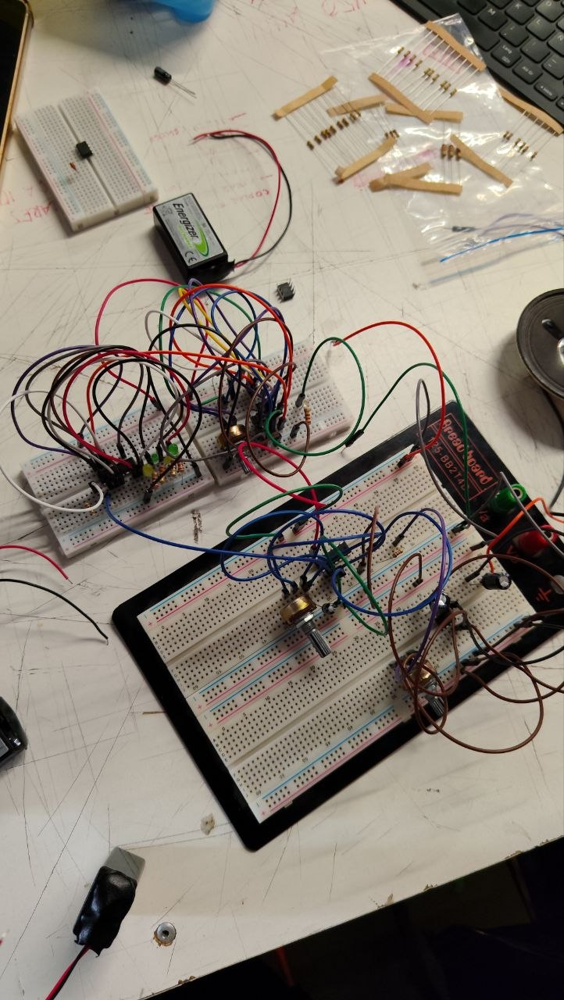
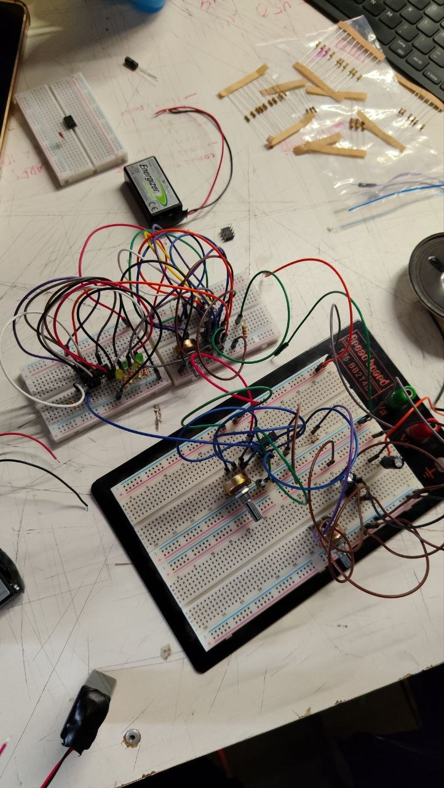

# sesion-05b

14-04-2026

## Apuntes de clase

**Schmitt Trigger**

Comparador: Revisar si tiene más fuerza a un lado que al otro

A > B, entonces sí va a tener energía

Y el modo invertido es si B > A

Dice que la materia tiene memoria, que no solo le importa lo que pase ahora, sino también lo que ha pasado antes

Histéresis: 2 umbrales

### CHIP 4093

Solo oscila si el pin 2 = V++ (positivo)

### CHIP 4017

Contador de décadas: Contábamos hasta 4 y al quinto lo mandábamos a resetear

---

Completamos, como en la clase anterior, la primera parte del circuito (chip 555 y 4017) sin problemas, pero a la hora de pasar al sintetizador y la salida, especialmente con el "Mix" y los "Steps", hizo que no nos funcionara la conexión completa de todo el circuito, sonando por separado y alumbrando por separado. Luego, los profes se llevaron el esquema para realizar algunos ajustes y poder mejorarlo para la siguiente clase. Adjunto imágenes de resultados:

