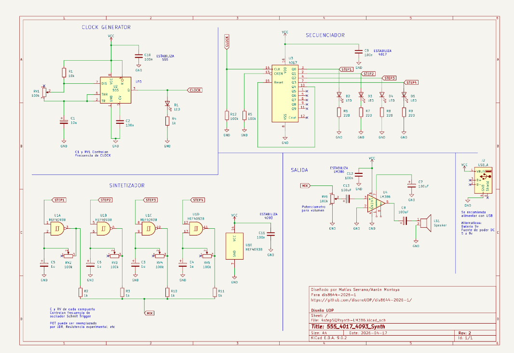
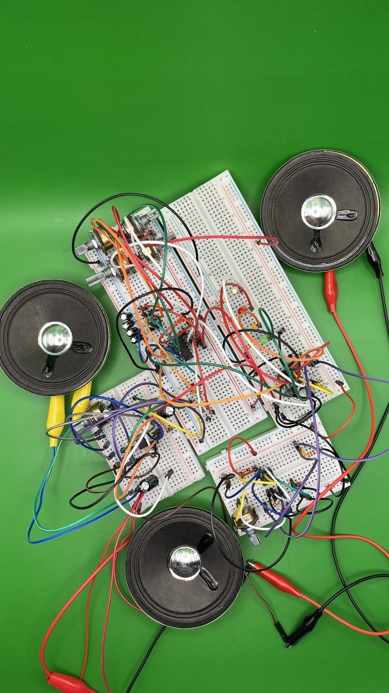

# sesion-06a

17-04-2026

"Más 2 decimas por decirle a los compañeros de arriba que no arrastren las mesas."

1. Arreglos en los chips, por ejemplo colocando una resistencia de la pata 3 del chip 555 a la pata 14 del chip 4017. Por lo que esta resistencia ayuda a estabilizar (R pull-down).

2. Condensador de desacople: se conectan lo más cerca del chip y a tierra.

3. Condensador de acople.

4. Fuentes de energía alternativas: según los datasheet.

- 9V si: Batería como las que tenemos
  
- 12V si: Batería de auto, Paneles solares

- 5V si: USB-A, power bank

Los cargadores se calientan porque todo movimiento genera fricción.

---

Para esta clase, lo que nos dejaron fue proceso y productividad en clases, ya teniendo este esquema completo con las mejoras que le hizo el profesor en casa:

Construimos y verificamos cada parte del circuito por separado

- Clock Generator (Chip 555)

- Secuenciador (Chip 4017)

- Sintetizador (Chip 4093)

- Salida (Chip LM386)

Lo primero fue hacer que funcionara como siempre el clock generator con el secuenciador para enseguida trabajar con la salida y, de último, dejar lo más complicado para nuestro grupo, que es la parte puntual de los "Steps" y el "Mix", que sería pasar de este circuito al de salida permitiendo dar sonido dependiendo de cada uno de los "Steps" y, a la vez, que se prenden las luces LED. Algo que también nos ayudó fue verificar que todo estuviera correctamente conectado donde debería estar y utilizar un mejor orden en el color y largo de los jumpers. También el asegurarnos de que los chips funcionaran correctamente y que ninguna batería estuviera descargada.

Al final nos funcionó y logramos sacarle algunas fotos con fondo sólido, como mostraré más adelante, pudiendo experimentar un poco con los potenciómetros, que son los que dan el paso al flujo de electrones y ayudan a que cambien la velocidad de cambio en el clock o el volumen en el caso de la salida.

En lo personal, creo que el estabilizar cada sección del circuito con condensadores y resistencias ayudó mucho a que nos funcionara correctamente a nosotros, evitando quemar algún chip en el proceso.

- Como extra, decidimos colocarle 3 parlantes para escuchar en diferentes lugares a la misma vez y funcionó: "el ritmo es el mismo y suena a la vez en cada parlante".
