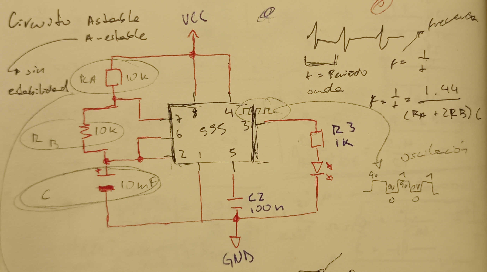
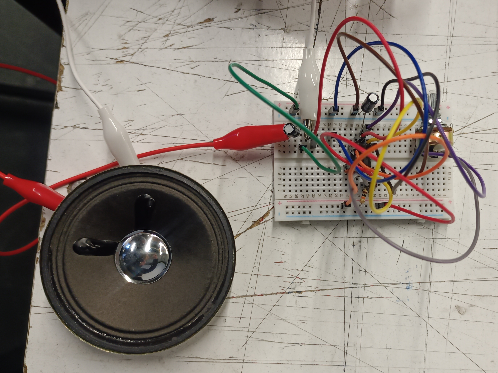
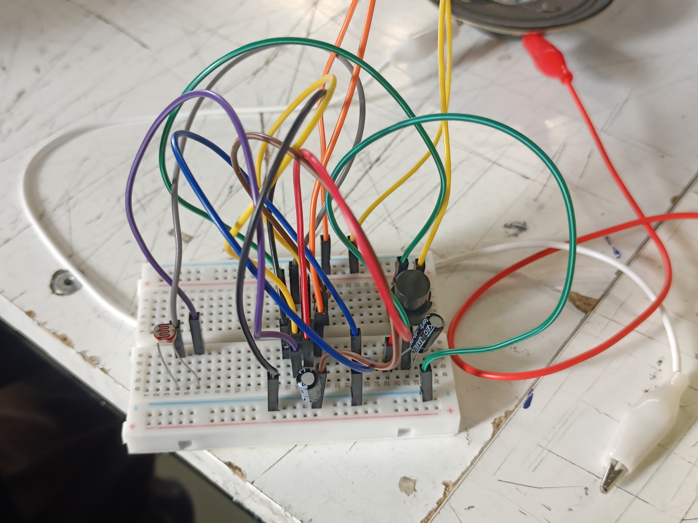
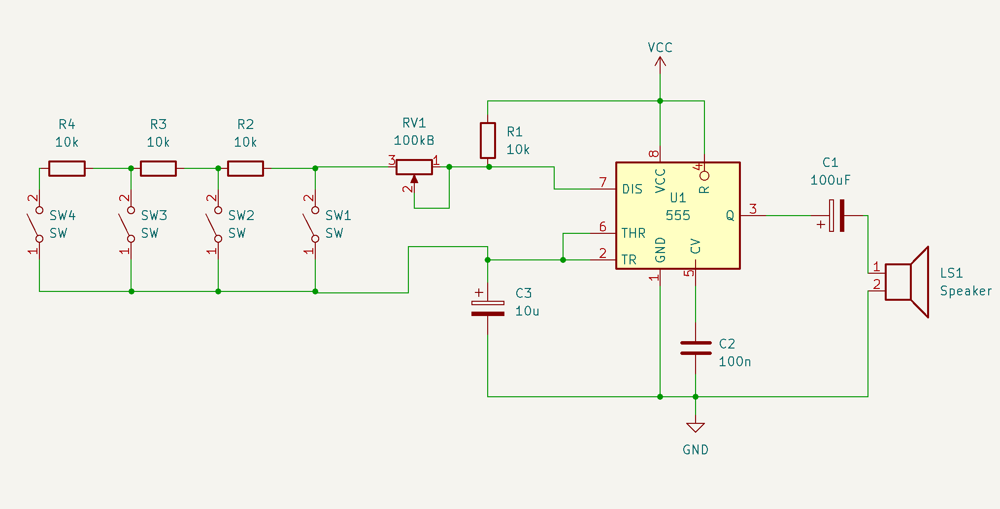
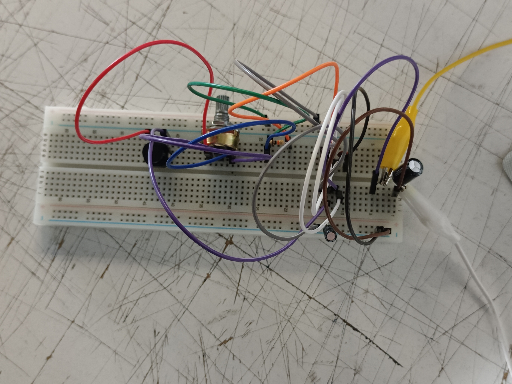
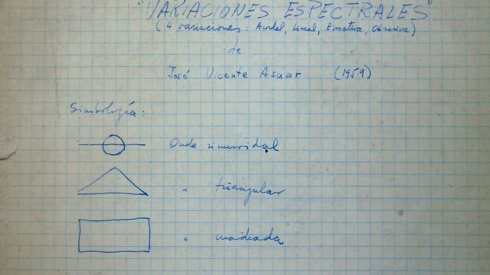
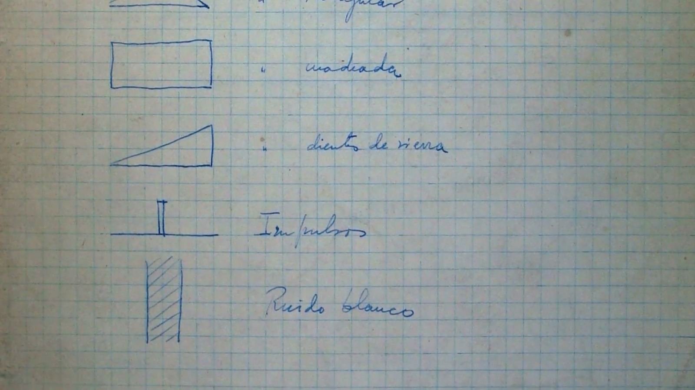
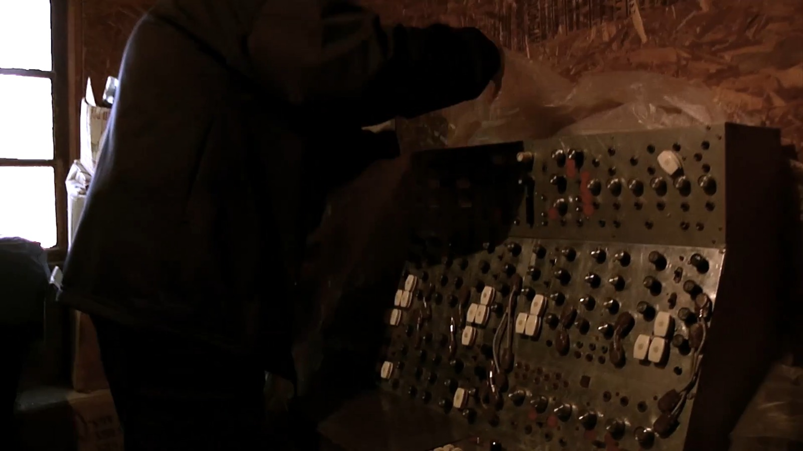

# sesion-03a

# Apuntes 24/03

Volvimos a trabajar en el circuito astable (sin estabilidad) que usamos la clase pasada pero ésta vez le hicimos un cambio, el cual fue introducir el parlante al circuito.

Para poder conectar el parlante al circuito y hacerlo sonoro, añadimos un capacitor el cual reemplazó a R3 y D en el esquema original. Luego de conectar el capacitor al circuito, se unió al parlante mediante cables caimán, lo cual quedó de ésta manera:

Al conectar la protoboard con la batería pudimos escuchar sonidos muy interesantes, por lo que con mi compañero decidimos ir experimentando con distintos capacitores y añadiendo un fotorresistor para poder jugar con éste junto al potenciómetro, en donde descubrimos que con el capacitor de 1μF era más difícil de controlar aparte de sonar muy agudo, en un punto haciendo un ruido plano y agudo parecido al que suena cuando algo está a punto de explotar, mientras que el de 10μF y 100μF suena más grave y es más fácil de controlar su sonido. En un momento, nos emocionamos mucho y se dio la idea de conectar dos parlantes al mismo circuito, y cuando lo hicimos lamentablemente falleció el chip NE555P, el cual siempre será recordado con mucho cariño (o no, por débil).

Luego de probar todo ésto, se nos enseñó el cómo incluir interruptores al circuito, en donde aprendimos que existían dos tipos de interruptores:

- Switch: Al encenderlo, éste se mantiene así hasta que uno manualmente lo apague. Ej: Luces de la sala.
- Temporal: Al apretarlo, éste se enciende, pero si lo sueltas se apaga, por lo cual no se mantiene activo sin interacción. Ej: Timbres.

Se nos entregó un botón por persona, el cual se puede identificar las patitas positivas de las negativas al ver el plástico de abajo o al encontrar la parte plana de la base plástica, el cual indica el negativo del botón. Se ubicó el botón con el negativo hacia abajo, quedando así:

---

# Encargos

### Circuito extendido

Como encargo se nos indicó extender el circuito que ya habíamos realizado y tener la mayor cantidad de botones posibles siguiendo el siguiente esquema:

Nos agrupamos con dos compañeros más e intentamos armar el circuito. En el primer intento, cada uno partió por partes distintas trabajando de manera un poco independiente, y para probar si funcionaba lo conectamos a la batería (solo probando con un botón, ya que no queríamos hacer todo sin saber si funcionaba con uno solo), y no sucedió nada por lo que pensamos que tal vez se nos olvidó algo o conectamos mal las cosas por no hacerlo de manera ordenada. Al intentarlo nuevamente, lo hicimos parte por parte en conjunto (revisando cada sección de las patitas del chip), y al conectar el circuito con la batería, no pasó nada. Revisamos en conjunto el circuito para poder identificar en qué nos equivocamos, pero no encontramos nada, y luego nos dimos cuenta de que el chip había muerto y estaba muy caliente. Al cambiarlo por otro, tampoco pasó nada, y el chip se calentó un poquito, por lo que pedimos ayuda a Aarón para ver si podía identificar qué habíamos hecho mal ya que no supimos identificarlo nosotros mismos, y nos dijo que era válido no lograrlo y lo que valía realmente era el intentarlo, pero que tal vez no estábamos funcionando bien ya que estábamos cansados y no habíamos almorzado. Aquí una foto de nuestro intento de extensión no lograda:

### Variaciones Espectrales

En el documental se habla sobre la vida del ingeniero y músico chileno José Vicente Asuar, pionero de la música electroacústica chilena, el cual generalmente se reconoce por ser el creador del "COMDASUAR", siendo éste el primer computador musical en latinoamérica el cual el mismo Asuar dijo que era considerado como tecnología punta en los años 70'. Al inicio del documental hablan de Asuar como un músico misterioso, alguien que hizo algo impresionante, pero que debido a la falta de interés que hubo en su época desapareció y costó bastante ubicarlo y ponerse en contacto con él para poder crear el video que hemos visto. 

Asuar cuenta que la música está en muchos elementos de la naturaleza, recordando escuchar un concierto de pájaros, los cuales tenían tonos agudos, graves y habían distintas velocidades sin un verdadero órden, al igual que la música electroacústica que es una abstracción de los sonidos que nos rodean tal como lo dice Claudio Asuar.

José Asuar dice que al momento de hacer una composición de música electroacústica no se necesita una partitura ya que se hace en un estudio y el resultado es como un cuadro, pero que es interesante el tener una partitura como un método analítico para entender todo lo que hay dentro de la obra y así poder reconocer los símbolos con algún estímulo, razón por la que creó una simbología la cual se muestra en las siguientes imagenes:

(Éstas imagenes se muestran dentro del documental de Variaciones Espectrales, no me pertenecen)

José Vicente Asuar creó el COMDASUAR (Computador Musical Digital Analógico Asuar) en el año 1978, desarrollándolo desde cero y de manera autónoma. El computador funcionaba como una herramienta intrumental y compositora, adelantándose a la tecnologías futuras pero que lamentablemente, como se mencionó al inicio de todo el texto, éste fue abandonado debido a la falta de interés en las personas de la época, por lo cual el COMDASUAR terminó abandonado dentro de una casa de campo que tenía José Asuar.

(Imagen de documental, no me pertenece)

