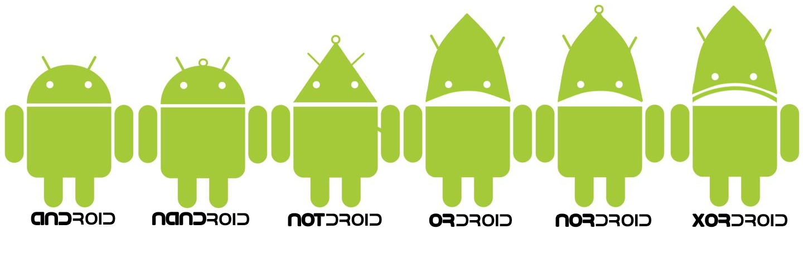
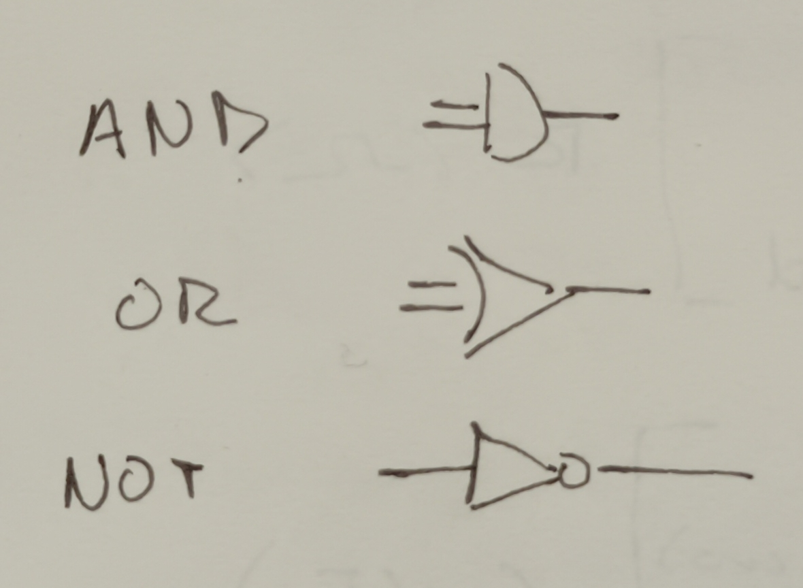
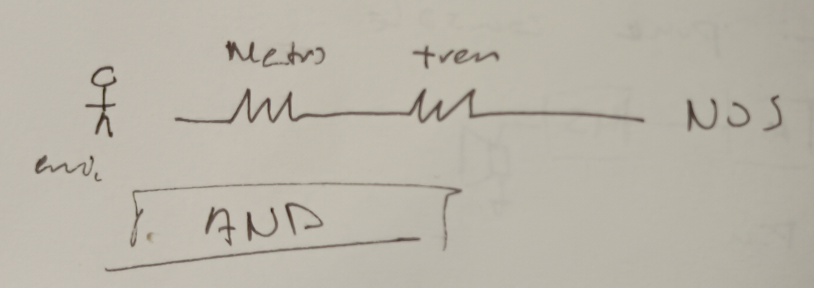
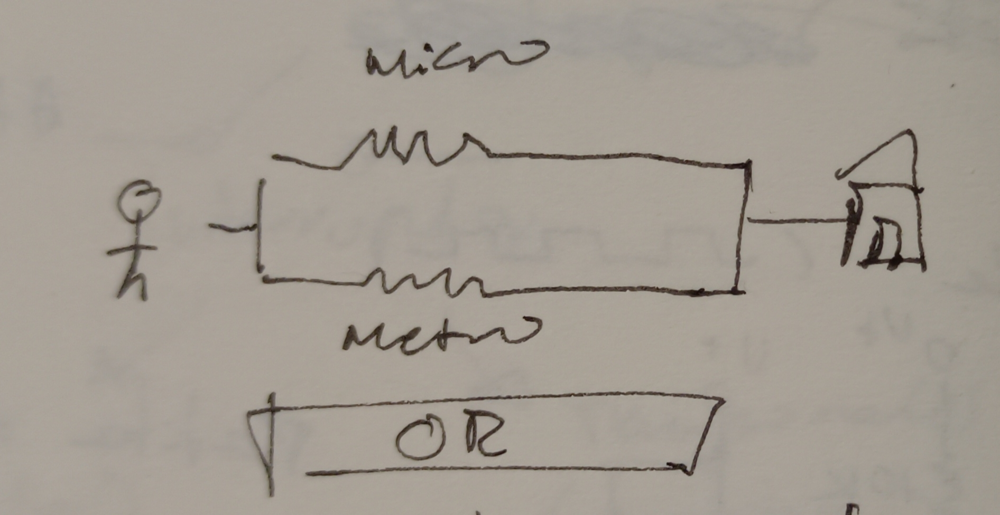
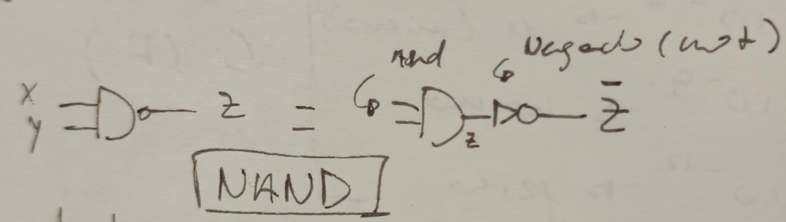
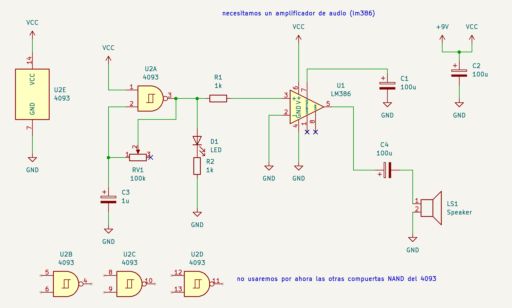
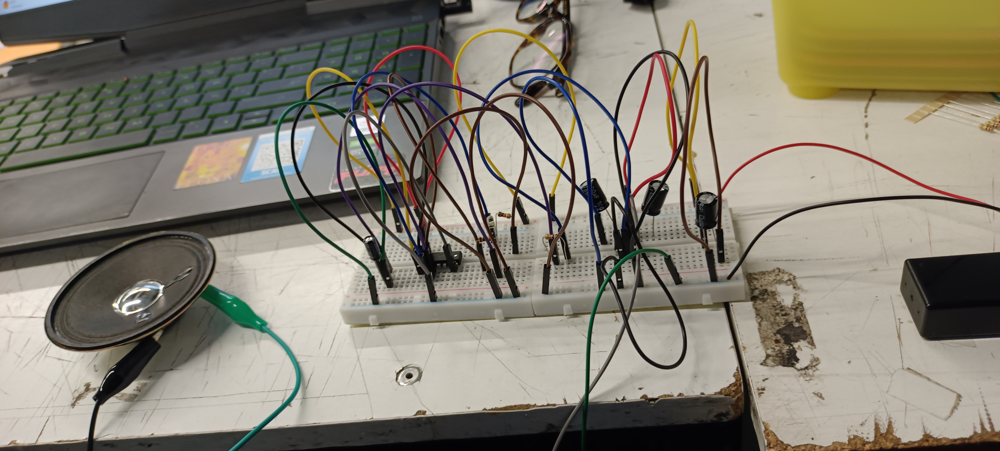
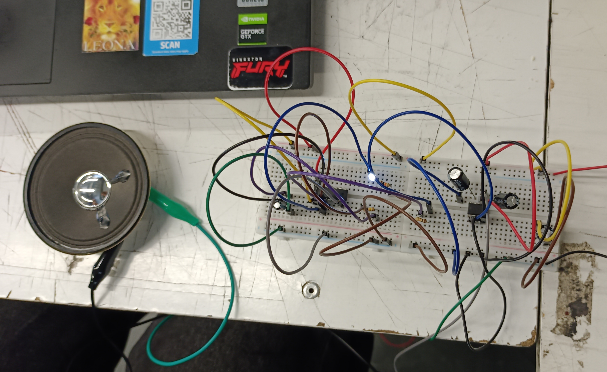

# sesion-05a

# Apuntes 07/04

## Operadores

Durante clases se explicó más a fondo el contenido del meme de android que habíamos visto hace unas clases atrás:

En el meme se puede observar que el único cambio que hay en el monito de Android es la forma de su cabeza, la cual ahora sabemos que representa los distintos tipos de operadores lógicos.

### Operador AND

En el caso del operador AND, para poder entenderlo se utilizó como ejemplo cotidiano el tramo que Emi tiene que tomar para poder llegar a su casa el cual consiste en tener que tomar metro y tren, por lo que si uno de éstos falla, Emi no puede llegar a su hogar ya que no tiene otras alternativas.

| Metro | Tren | ¿Emi llega? |
| --- | --- | --- |
| 0 | 1 | 0 |
| 1 | 0 | 0 |
| 0 | 0 | 0 |
| 1 | 1 | 1 |

Como se puede ver en la tabla, en el sistema AND se necesita que todas las variables coincidan para que éste funcione.

### Operador OR

En el caso del operador OR, se utilizó de ejemplo cotidiano el recorrido de una persona común y corriente que tiene dos opciones para llegar a su hogar: micro o metro.

| Metro | Tren | ¿LLega la persona? |
| --- | --- | --- |
| 0 | 1 | 1 |
| 1 | 0 | 1 |
| 0 | 0 | 0 |
| 1 | 1 | 1 |

Como se puede ver en la tabla, en el sistema OR da lo mismo si las dos opciones funcionan, ya que con tal de que una esté disponible será suficiente para lograr que funcione!

### Operador NAND

Para el operador NAND se nos explicó con tres variables, que en este caso fueron: ``X`` e ``Y``, lo cual da ``Z``, pero éste al ser negado nos genera ``Ž``.

| X | Y | Z | Ž |
| --- | --- | --- | --- |
| 0 | 0 | 0 | 1 |
| 0 | 1 | 0 | 1 |
| 1 | 0 | 0 | 1 |
| 1 | 1 | 1 | 0 |

Como se puede ver en la tabla y en el dibujo en este operador hay un AND, el cual se refleja en el resultado de ``Z``, pero como luego del sistema AND viene un NOT (negación) se invierte el resultado y éste nos genera ``Ž``.

---

## Trabajo en clases

#### Chip 4093

+ Chip grande!! tiene 14 pins en total
+ Tiene cuatro compuertas NAND
+ Pin 7 siempre a ``GND``
+ Pin 14 siempre a ``VCC``

Para poder trabajar con el chip 4093, Misa nos envió el siguiente esquemático para que podamos seguirlo de manera independiente con nuestro grupo de trabajo:

Con mi compañera no se nos ocurrió el probar si funcionaba cada chip de manera independiente, sino que hicimos todo el circuito y recién ahí probamos si funcionaba de manera completa, por lo que cuando los conectamos y no funcionó la verdad no me sorprendió mucho. De igual manera, no entendíamos por qué no pasaba nada ya que ni siquiera se prendía el LED del 4093, así que decidimos llamar a Misa para que nos ayude a ver qué estaba mal.

Cuando vino Misa, nos dijo que no estaba conectado ni el pin 7 ni el pin 14 del 4093, lo cual fue un poco chistoso para nosotros ya que era lo primero que nos dijeron sobre el chip, por lo que procedimos a conectarlo y a probar nuevamente con la batería. Luego de probar con la corrección ya hecha, prendió el LED.

Nos emocionamos de que por lo menos ya habían señales de funcionamiento en el circuito, pero nos dimos cuenta de que no estaba pasando mucho con el parlante ya que éste no estaba emitiendo ningún sonido. Como no logramos identificar cuál era el problema, decidimos hacer la parte del chip LM386 desde cero, y cuando volvimos a probarlo, nuevamente no funcionó pero ésta vez fue peor ya que ni siquiera prendió el LED del 4093, lo cual fue extraño ya que no habíamos hecho ningún cambio en esa parte del circuito, por lo que cambiamos el LED pensando en que tal vez el otro se había quemado y volvimos a intentar rehacer el lado del chip LM386. Cuando volvimos a intentarlo por tercera vez, decidimos preguntar a otros compañeros que ya lo habían logrado para que nos pudieran guiar, pero cuando revisaron no encontraron ningún problema, por lo que llamaron a Aarón. Cuando llegó Aarón, nos revisó el circuito y nos puso a prueba nuestro conocimiento haciéndonos creer que habíamos puesto el chip al revés lo cual fue entretenido, pero no logramos identificar el problema ya que estábamos llegando al final de la clase y Misa tenía que decir unas cosas.

Al final, no logramos completar el desafío lo que fue un poco (muy) triste, pero de igual manera volveremos a intentarlo cuando estemos el grupo completo! tres cabezas siempre piensan mejor que dos (mucho mejor que dos que cometieron el error de no conectar el chip a GND y VCC dos veces seguidas LOL).
