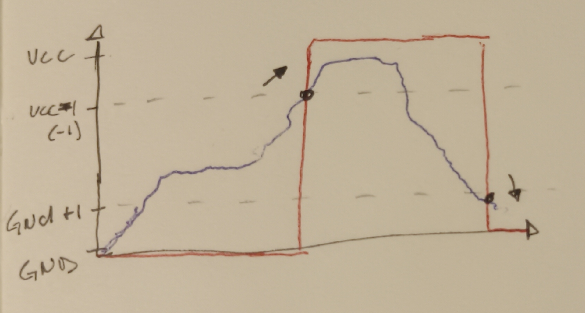
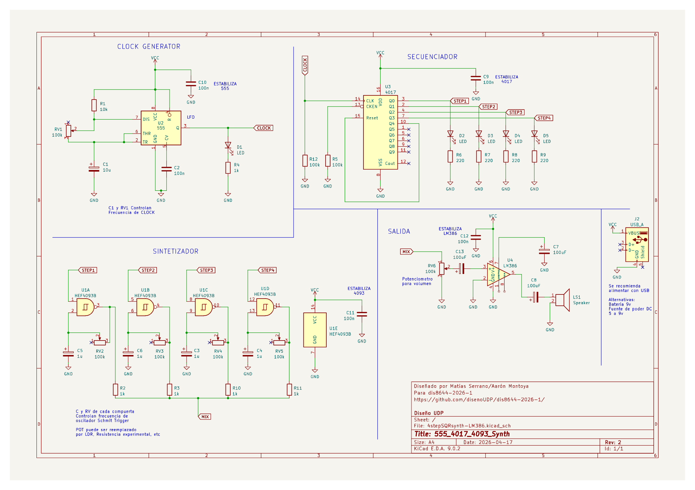
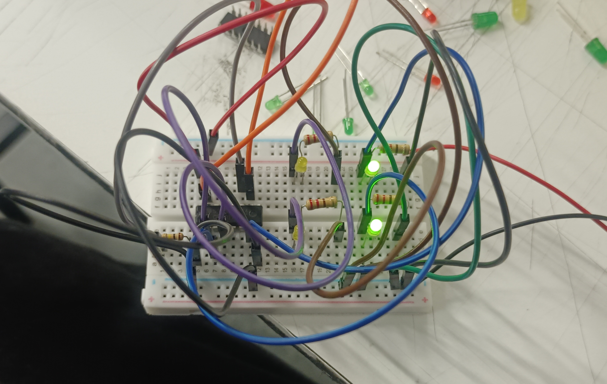
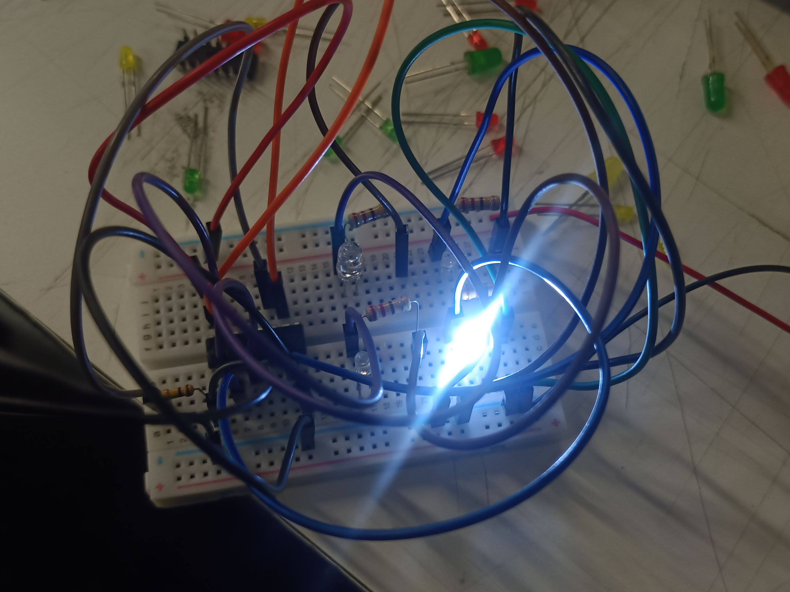
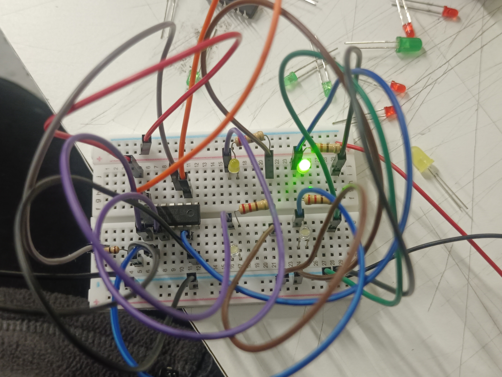
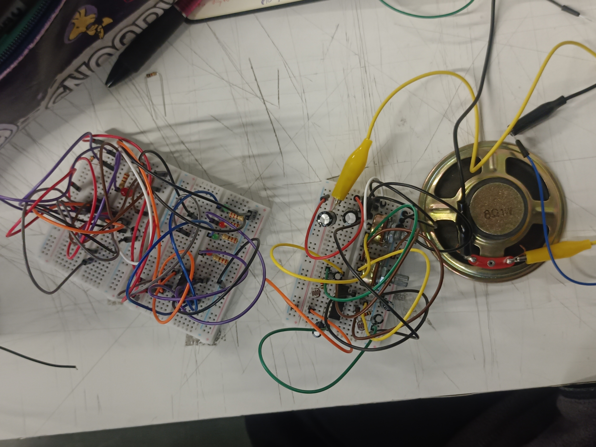

# sesion-06a

# Apuntes 14/04

### Schmitt Trigger

Como casi nadie logró entender muy bien lo que era el Schmitt Trigger, nos lo explicaron de manera más sencilla. En resumen, el Schmitt Trigger es un comparador que utiliza histéresis para poder convertir señales ruidosas e inconsistentes en ondas cuadradas, lo cual se ve algo así:

Como se puede ver en el gráfico, el Schmitt Trigger utiliza histéresis de dos umbrales, los cuales le ayudan a poder poner el límite para lograr identificar cuándo la onda temblorosa e inconsistente sube y baja, por lo que cuando sobrepasa el límite superior el Schmitt Trigger lo identifica como que llegó al punto más alto, mientras que cuando pasa por debajo del mínimo asume que está en el punto más bajo, creando así la forma cuadrada que se puede ver en la imagen.

> Dato: El chip 4011 no tiene Schmitt Trigger, por lo que nos permite escuchar ese ruido que el comparador nos oculta.

---

### Four Step

Durante la clase Misa nos envió un esquemático más grande ésta vez, ya que ahora tendremos que utilizar cuatro chips distintos (555, 4017, 4093, 386) para crear una secuencia de cuatro pasos.

Cuando empecé a armar el circuito del CLOCK (555), me di cuenta de que probablemente iba a tener problemas con la cantidad de protoboards ya que teníamos que armar muchas cosas, pero decidí no preocuparme ya que eso era un problema para el Nicolás del futuro, por lo que seguí con mi trabajo. Logré armar el 555 con éxito, pero no me sorprendió porque lo hemos estado viendo todo lo que llevamos de semestre por lo que siento que ya nos sale natural como sección el armar el 555. Cuando llegó el momento de armar el 4017, me preocupé ya que recordaba que la vez pasada con mi grupo nos "funcionó" pero de una manera distinta al resto de nuestros compañeros, y me dio un poco de miedo que pasara de nuevo, pero cuando terminé de armarlo y lo conecté a la batería mi sorpresa fue otra:

Al conectarlo con la batería de manera independiente, solo se prendían dos LEDs lo cual se me hizo raro ya que estaba seguro de que lo había hecho bien, pero como pude ver que ese no era el caso decidí volver a armarlo desde cero y sucedió lo siguiente:

Cuando volví a armarlo, sucedió lo mismo pero ahora prendía solo un LED lo cual se me hizo aún más extraño, pero como asumí que había hecho mal alguna conexión decidí volver a hacerlo desde cero y sucedió esto:

Volvió a pasar lo mismo!! y en este punto ya estaba muy confundido, por lo que en vez de hacer el circuito de nuevo empecé a cambiar los LEDs para ver si alguno estaba quemado, pero cada vez que intercambiaba los componentes se prendían y se apagaban distintos LEDs, por lo que decidí pedir ayuda a mis compañeros y me dijeron que pruebe conectando el 4017 al 555 y no de manera independiente, y cuando lo hice pasó ésto:

Mis compañeros tenían toda la razón!! no sabía que para poder comprobar si el circuito del 4017 estaba bueno tenía que utilizar el 555, sino que asumí que se podía probar de manera independiente como éste último.

Luego de lograr esa victoria, seguí con la parte del chip 4093, la cual me confundió un poco en la parte del MIX pero solo por el hecho de que no encontraba una manera en la cual esa parte se viera ordenada, por lo que tuve que abandonar mis sueños y seguir con el trabajo. Cuando iba por el tercer potenciómetro, me di cuenta de que yo solo tenía dos, por lo que decidí hacerlo con dos potenciómetros y dos LDR, pero como un potenciómetro ya estaba en el circuito del 555, tuve que abandonar esa idea e intenté hacerlo con dos LDR y un potenciómetro. Cuando ya había "terminado" la parte del 4093, intenté hacer el circuito del 386 en la misma protoboard en donde estaba el 4093 ya que no tenía más, lo cual fue un poco difícil. Luego de creer tener todo terminado, llegó el momento de la verdad por lo que conecté la batería y no me sorprendí cuando se prendieron los LEDs por un segundo, el parlante hizo una vibración corta y todo dejó de funcionar. En ésta clase lamentablemente sufrí una derrota, pero me recuperaré eventualmente!! Aquí una foto de lo que quedó de mi intento.

