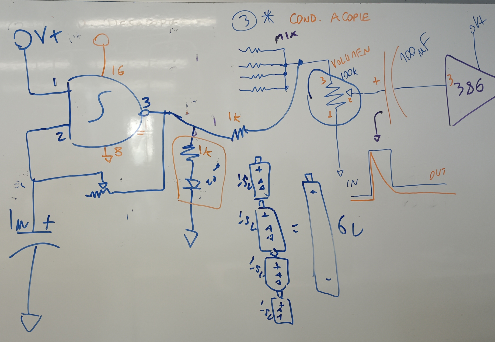

# sesion-06b

# Apuntes 17/04

## Fe de Erratas!!

Misa hizo las siguientes modificaciones en el esquemático que vimos la clase pasada ya que habían unos problemas:

1. Estabilizador de CLOCK (555): Se añadió un ``R Pull Down`` de 100k entre el pin 3 del 555 y el pin 14 del 4017 (ojo, éste debe estar cerca del 14).
2. Condensador de desacople: Se agrega un 104 en cada pin de alimentación de todos los chips (cerca de éste).
3. Condensador de acople: En el potenciómetro que está entre el MIX y el 386, se añade un condensador de 100 µF que va conectado al pin 2 del potenciómetro.
4. Buscar fuentes de ``Va`` alternativas: En el caso de 12V, sirven las baterías de autos y los paneles solares. En el caso de 9V, sirven nuestras baterías. En el caso de 5V, sirven los USB-A (podemos conectarnos a una micro roja jiji).

Luego de informarnos sobre los cambios que hubieron, nos dieron la clase para poder trabajar en lograr sonar, por lo que con mi grupo nos fuimos al LID con toda la intención de finalmente poder hacer ruido, es decir, lograr que funcione el circuito entero. Cuando llegamos al LID, empezamos a trabajar de manera inmediata y aplicamos los cambios que se nos mencionaron.

Cuando ya creíamos tener todo listo, conectamos todo a la batería y no sucedió nada aparte de prenderse los LEDs del 555 y del 4017 que ya sabíamos que funcionaban, hasta que nos dimos cuenta de que estábamos esperando sonido siendo que ni siquiera teníamos conectado el parlante, lo cual fue chistoso.

Como nos dimos cuenta de que no funcionaba y sabíamos que la parte del 555 y del 4017 estaban funcionando de manera correcta, nos dedicamos a hacer de cero la parte del chip 4093 y luego la del 386 que encontrábamos que era la más complicada. Cuando volvimos a intentarlo, volvió a pasar que no había sonido (revisar en carpeta de imagenes el video mp4 "sintetizador-no-suena.mp4") y ya era hora de bajar a la sala para cerrar la clase. Antes de que termine la clase, Misa nos mostró una manera en la cual podíamos comprobar si el amplificador estaba amplificando, lo cual se hacía de la siguiente manera:

Cuando volvimos de almorzar, volvimos al LID a trabajar en comprobar si los circuitos de últimos dos chips estaban bien hechos o no, y cuando volvimos a probar y no nos funcionó, pedimos ayuda a compañeros que estaban junto a nosotros en la sala. Nuestro compañero Nicolás estuvo con nosotros guiándonos chip por chip para que tuviera la certeza de que estaba todo conectado de manera correcta, y el hecho de que lo hicimos así fue mucho mejor ya que se formó un orden claro en la protoboard gracias a nuestro compañero. Estuvimos horas trabajando en ésto, ya que cuando finalmente pudimos conectar el parlante éste no sonó y no entendíamos por qué, hasta que nuestro compañero se dio cuenta de que el parlante si estaba sonando solo que de manera muy callada y no podíamos subirle el volumen, por lo que teníamos que pegarnos el parlante a la oreja para poder escuchar un pequeño zumbido.

Cuando ya habíamos pasado horas trabajando en ésto y no sabíamos cuál era el problema ya que el grupo de nuestro compañero lo había hecho de la misma manera en la que él lo hizo con nosotros y a ellos si les sonaba el parlante, decidimos comparar lado las conexiónes del chip 4093 nuestro y el de ellos. Cuando ya hicimos los últimos cambios, empezamos a mover el potenciómetro del chip 386 y lo teníamos que dejar en un punto exacto para que emitiese sonidos, por lo que no lo volvimos a mover de ahí y solo cambiábamos las variables de los potenciómetros que estaban en el chip 4017 o en el del 555.

Para poder ver nuestra victoria gracias a nuestro compañero, revisar en imagenes el archivo mp4 llamado "sintetizador-funcionando.mp4".
