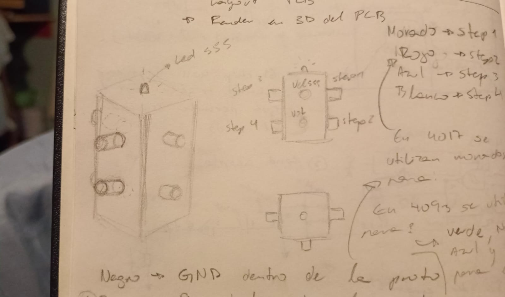

# sesion-07a

# Apuntes 21/04

Durante clases nos dedicamos a seguir trabajando en la entrega de éste viernes, por lo que Aarón nos entregó una base en la cual debemos de rellenar con nuestra información de manera grupal. Mientras unos se dedicaban a avanzar en el trabajo, una persona por grupo debía de ir co Misa al LID para que les enseñaran a soldar, por lo que mi compañera Carla Núñez decidió ir mientras con mi otra compañera nos quedamos haciendo el archivo de corte láser par poder conseguir la carcasa de nuestro sintetizador de manera más rápida.

Como ya teníamos el sintetizador funcionando gracias a nuestros compañeros Vania y Nicolás, nos enfocamos principalmente en conseguir tener la carcasa lista para ese mismo día, por lo que surgieron ideas para hacer la carcasa del sintetizador y ésto fue lo que se me ocurrió:

Mi idea era lograr tener una base en donde se pudieran interactuar con los potenciómetros mediante distintas caras, sin necesariamente tener que poner todo en un mismo lugar y así poder lograr algo más entretenido con lo cual interactuar. Luego de hablar con mi grupo, llegamos a la conclusión de que era mejor hacer una carcasa con una forma simple como un lo es una caja de zapatos, pero queríamos lograr que se viera como algo fino y que al momento de escuchar cómo suena el sintetizador se logra ver el contraste de algo que no necesariamente tiene que sonar como algo agradable como puede fingir ser la carcasa. Luego de trabajar por unas horas en eso, me tuve que ir ya que tenía clases en otra facultad pero mis compañeras lograron comprar un cartón corrugado simple y hacer el corte láser.

Como salía tarde de mi clase, no pudimos vernos por lo que no pude ver cuál fue el resultado de la caja que habían cortado en láser pero eso solo lo hizo más emocionante ya que al siguiente día nos íbamos a juntar nuevamente para poder probar cómo quedaban las protoboards dentro de su carcasa. Debido a que nos dedicmos a trabajar en ésto, la verdad no tengo mucho que contar en ésta bitácora y que no se esté escribiendo ahora en la bitácora grupal, por lo que recomiendo revisar nuestro avance en la carpeta de proyecto 01, grupo 04!!
