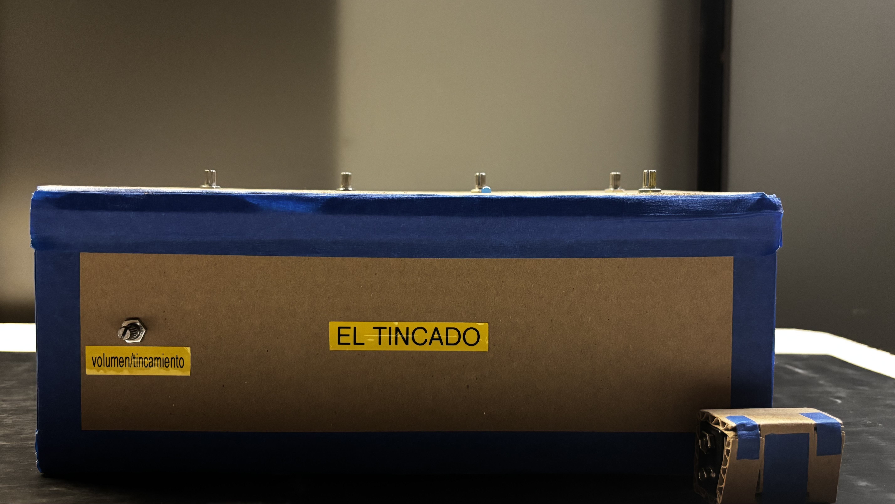

# sesion-07b

# Apuntes 24/04

Hoy cumplimos dos días seguidos quedándonos hasta muy tarde en el LID, por lo que cuando llegó le profesore Aarón y nos preguntó si siquiera nos fuimos a nuestras casas lo encontré la cúspide del humor. Dejando de lado que no sabemos soltar el LID debido a la comodidad que nos brinda, hoy nos dedicamos a sellar las esquinas de nuestra carcasa con masking tape de color azul, ya que decidimos que el ambiente de nuestro sintetizador (aka "el tincado" ya que hace lo que le tinca nomás) es la línea 4, por ende usamos un poco del color de ésta línea del metro y cambiamos el color del LED para que esté de acorde a éste también (de rojo pasamos a azul).

Cuando ya nos estábamos relajando, bajé por un momento a intentar ayudar a unas compañeras y cuando volví a ver al tincado ya no estaba funcionando el 555, es decir, éste no estaba generando las ondas cuadradas que se supone que debía estar haciando y yo justo tenía clases lo cual fue horrible tanto para mi como para mis compañeras, por lo que me tuve que retirar para no perder asistencia, pero volví de inmediato ya que me preocupó el hecho de que no estuviese funcionando lo más básico de todo el sintetizador, pero cuando llegué mis compañeras me dijeron que lograron solucionarlo y que en realidad se había soltado un cable que hacía la conexión entre el pin 3 del 555 y el pin 14 del 4017, razón por la cuál no estaba llegando la información. Como éstos últimos días han sido de trabajo grupal, todo lo que es respecto al sintetizador está en nuestra carpeta de proyecto 01, grupo 04, asi que por favor revisar ahí para más contenido!!
